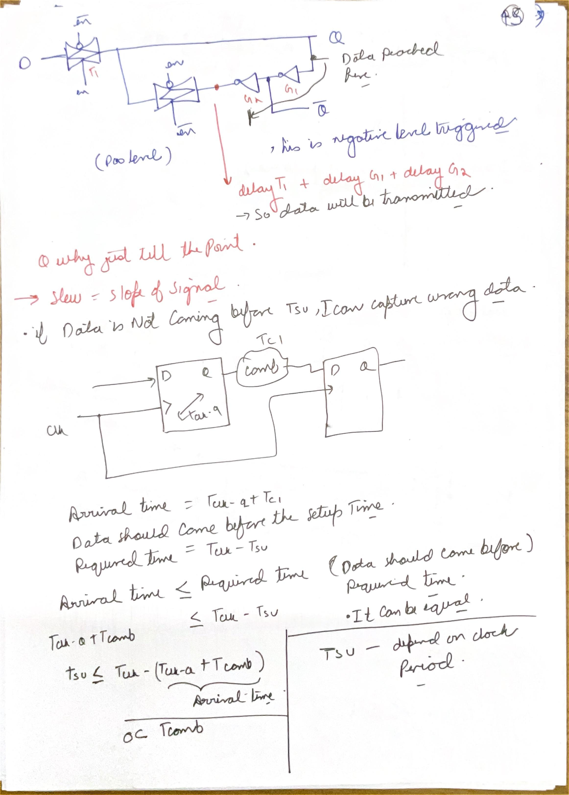
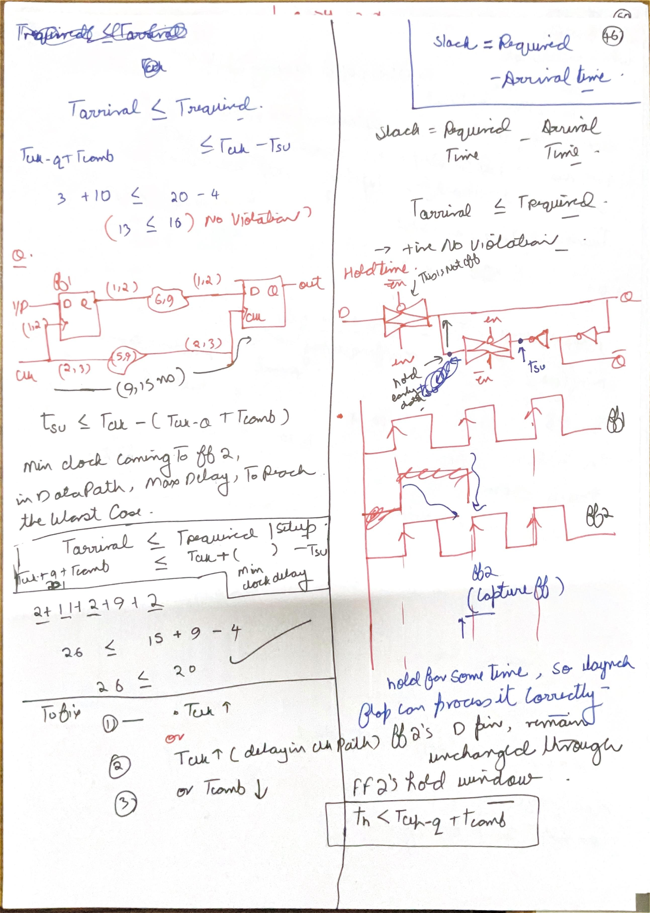
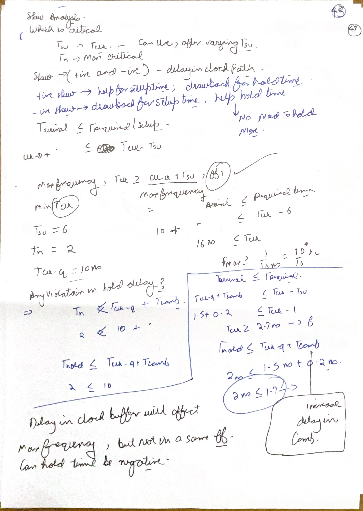
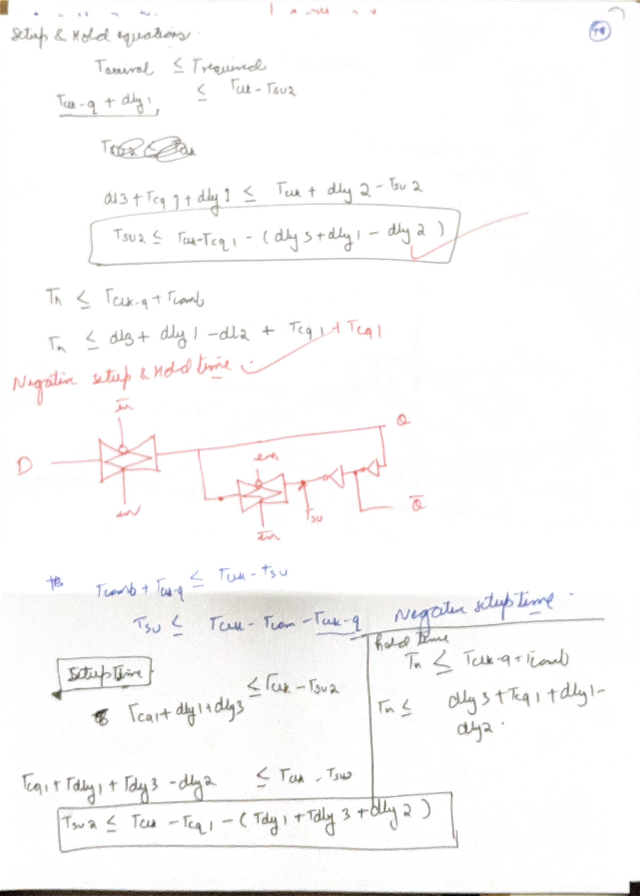
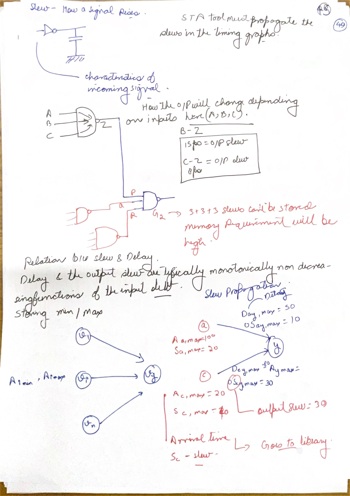
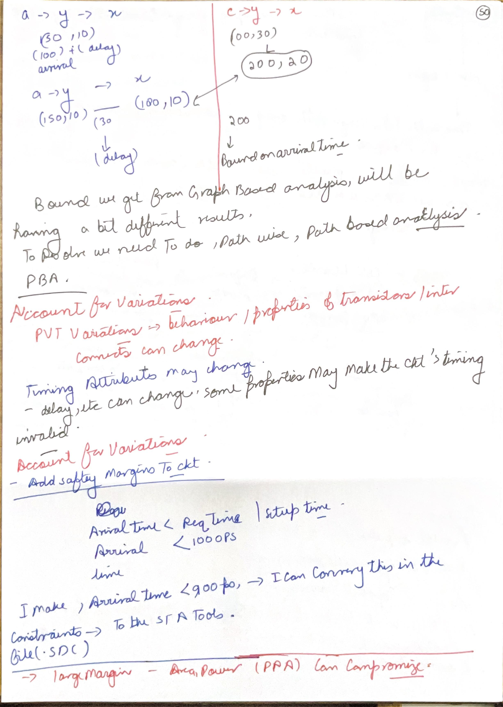
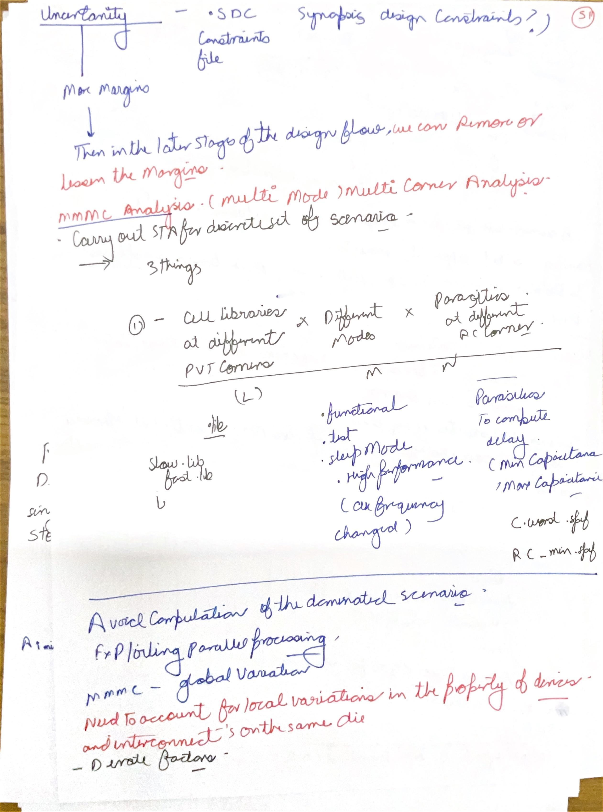
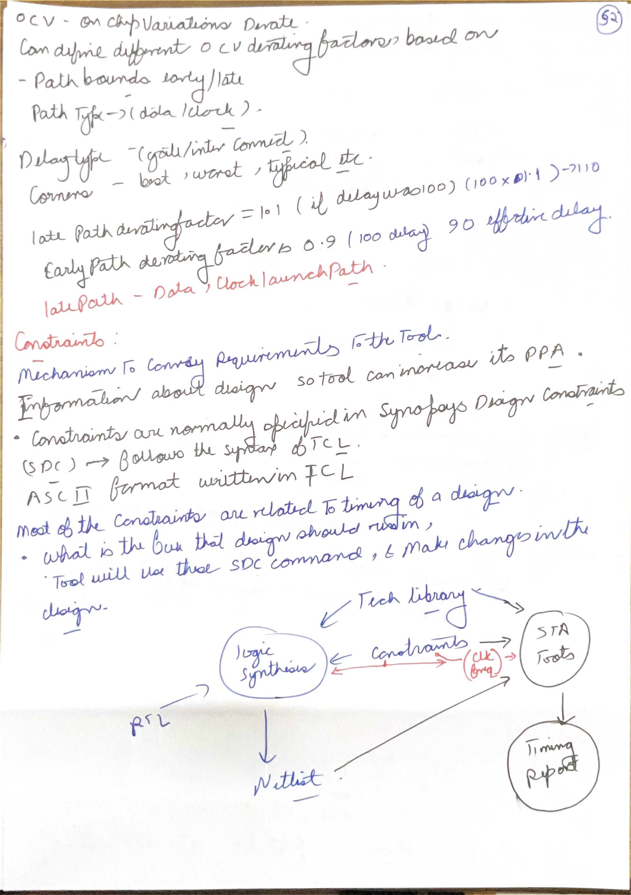

# Day 05: Equivalence, libraries and static timing analysis

Lessons 25–30. Six-lesson study blocks; Day 06 remains partial through Constraints I.

## Day 05 index

- [Lesson 25: Formal Verification - IV](#lesson-25-formal-verification---iv)

- [Lesson 26: Technology Library](#lesson-26-technology-library)

- [Lesson 27: Logic Optimization using Yosys](#lesson-27-logic-optimization-using-yosys)

- [Lesson 28: Static Timing Analysis - I](#lesson-28-static-timing-analysis---i)

- [Lesson 29: Static Timing Analysis - II](#lesson-29-static-timing-analysis---ii)

- [Lesson 30: Static Timing Analysis - III](#lesson-30-static-timing-analysis---iii)


[Master index](../README.md) · [Handwritten page index](../Resources/Handwritten%20Index.md) · [Glossary](../Resources/Glossary.md)


Figures link to the day index. Source page identifiers refer to the original scans.


## Lesson 25: Formal Verification - IV


Week 6 · [Lecture video](https://www.youtube.com/watch?v=uQ-xAc7SxEc&t=1080s) · [Back to day index](#day-05-index)


[](#day-05-index)


*Lecture: [Lecture at 18:00](https://www.youtube.com/watch?v=uQ-xAc7SxEc&t=1080s).*


### Sequential and combinational equivalence

Equivalence checking compares two representations of a design. A sequential equivalence check (SEC) must relate their initial states and compare output sequences under the same legal input sequences. A combinational equivalence check (CEC) compares corresponding combinational functions; in a sequential design it often uses matched registers as boundaries. These are different proof obligations, even when both use a SAT solver.

Register and port matching identifies correspondence between the reference and implementation. Names, structural similarity or user guidance can help. A renamed register may still be equivalent; identical names do not establish equivalence. Reset polarity, enable conditions, initial values and bit widths must remain part of the modeled relationship. Retiming or changed state encoding can require a sequential relation that a simple one-to-one register match cannot express.

### Constructing and interpreting a miter

For corresponding outputs, form XOR differences and OR them:

$$
Z = (y_1 \oplus \widehat{y}_1) + (y_2 \oplus \widehat{y}_2)
$$

Under common inputs, Z=1 means at least one output differs. Ask whether Z=1 is satisfiable. SAT returns a mismatching input assignment; UNSAT proves equality for all assignments included in this combinational model. For `f=AB+ABC+BC` and `g=AB+BC`, the XOR is zero for all eight input assignments. Comparing either to `h=AB` yields a counterexample at ABC=011.

Breaking a sequential circuit into combinational cones at register cutpoints can enlarge the set of considered internal combinations. A mismatch caused only by unreachable cutpoint combinations may be a conservative false failure, requiring better correspondence or reachable-state reasoning. Conversely, a claim of sequential equivalence still needs the appropriate reset/initial-state and boundary assumptions. Do not treat a bare “CEC passed” as proof of every possible unmodeled sequential feature.

#### A counterexample created by unconstrained cutpoints

Let reset establish $(q,r)=(0,1)$ and let both registers complement their old values on every active clock edge. The reachable pairs alternate between 01 and 10, preserving $r=\overline{q}$. A reference output $y=q\oplus r$ therefore always equals one in this reset-reachable model, matching an implementation output tied to one.

If a combinational cutpoint check treats q and r as unrelated free inputs, it also considers 00 and 11. At 00, the reference output is zero while the constant implementation output is one, producing a valid mismatch for that enlarged combinational problem. The mismatch does not contradict reset-reachable equivalence. A sequential proof must establish the invariant and corresponding initial states; without the reset restriction, a starting state 00 makes the mismatch real. This example distinguishes a proof assumption from a constraint added merely to hide a failure.

Source: NPTEL Formal Verification IV, lecture-material pages 4–13. Prerequisites: Boolean proof, BDDs and SAT in Lessons 21 and 23.


[Back to day index](#day-05-index)


## Lesson 26: Technology Library


Week 6 · [Lecture video](https://www.youtube.com/watch?v=tcfwuloB-zM&t=2700s) · [Back to day index](#day-05-index)


[](#day-05-index)


*Lecture: [Lecture at 45:00](https://www.youtube.com/watch?v=tcfwuloB-zM&t=2700s).*


### Technology library versus physical library

A Liberty technology library (`.lib`) contains cell functions, pins, timing, area and power models with units and operating conditions. A LEF physical library (`.lef`) provides abstract physical information such as cell dimensions, routing pins and obstructions. Synthesis and STA need function and timing information; placement and routing also need geometry. A Boolean netlist alone does not supply either view.

Library characterization designs and verifies each cell, applies transistor models and operating conditions, performs SPICE simulations, and extracts reusable models. It separates the expensive transistor-level characterization from repeated cell-level analysis of larger designs. The model's validity depends on its characterized conditions and range. A fast lookup is an approximation of cell behavior, rather than a fresh transistor simulation for each netlist arc.

### Read the hierarchy and timing arcs

The organization is library → cell → pin → timing or power groups. A cell declares area and pins; an input pin can declare capacitance; an output pin declares its Boolean function and timing arcs. The timing group is attached to an end pin and identifies its start pin using `related_pin`. Delay arcs and constraint arcs have different jobs: an A-to-Y arc propagates timing, while a D-to-clock relationship specifies setup or hold requirements.

NLDM means **Nonlinear Delay Model**. Delay and output transition are separate functions of input transition and output load. Rise and fall tables may differ. Slew is commonly stored as transition time between specified voltage thresholds, for example 10% to 90%; it is not itself an arrival time. Propagation delay is measured between specified input/output threshold crossings. Read the library thresholds and units before comparing numbers from different models.

#### Follow transition polarity through a timing arc

Unateness describes how an input transition relates to an output transition when the relevant arc is sensitized. Positive-unate behavior preserves direction; negative-unate behavior reverses it. The term describes logical polarity, not the sign of propagation delay. A negative-unate arc still has a positive elapsed delay in an ordinary propagation example.

| Cell function | Condition on the other input | Output response to an input rise |
|---|---|---|
| Inverter | No other input | Output falls |
| Two-input NAND | Other input is 1 | Output falls |
| Two-input NAND | Other input is 0 | Output remains 1; this input change is masked |
| Two-input XOR | Other input is 0 | Output rises |
| Two-input XOR | Other input is 1 | Output falls |

The XOR's direction depends on its other input, so the function is non-unate in this input. [OpenSTA's combinational-arc construction](https://github.com/The-OpenROAD-Project/OpenSTA/blob/master/liberty/LibertyBuilder.cc) distinguishes these senses and associates the appropriate output rise/fall model with each arc.

For a sensitized NAND followed by an inverter, suppose an input rise arrives at 0.80 ns. Illustrative NAND output-fall delay 0.18 ns gives an internal fall at 0.98 ns; inverter output-rise delay 0.08 ns gives a final rise at 1.06 ns. For a separate input-fall case arriving at 0.60 ns, NAND output-rise delay 0.25 ns followed by inverter output-fall delay 0.05 ns gives a final fall at 0.90 ns. These assumed delays illustrate arc selection and addition. A real lookup also uses the appropriate input slew, output load and corner at each stage.

The two inversions restore the original transition direction, but they do not remove either stage's delay. A timing trace must keep the event polarity as well as the arrival value; selecting a rising-output table simply because the original input rose can query the wrong model.

### A small interpolation example

Assume this authored delay table is in picoseconds, with input transition in ps and load in fF:

| Input transition | Load 1 fF | Load 3 fF |
|---|---|---|
| 10 ps | 20 ps | 30 ps |
| 30 ps | 40 ps | 60 ps |

At transition 20 ps and load 2 fF, both coordinates are midway between tabulated values. Interpolate along load: 25 ps in the first row and 50 ps in the second. Interpolate along transition: `(25+50)/2=37.5 ps`. This demonstrates bilinear interpolation within a table rectangle. It does not mean every tool uses that value outside the characterized range or that an output-slew table has the same numbers.

For a transition s between 10 and 30 ps and load c between 1 and 3 fF, define $\alpha=(s-10)/20$ and $\beta=(c-1)/2$. The interpolated delay is the weighted sum $(1-\alpha)(1-\beta)20+(1-\alpha)\beta30+\alpha(1-\beta)40+\alpha\beta60$ ps. The four weights sum to one and remain nonnegative inside the rectangle. At $s=15$ ps and $c=2.5$ fF, $\alpha=0.25$ and $\beta=0.75$, giving 34.375 ps. Outside the rectangle, these weights need not remain nonnegative; that is extrapolation, whose treatment must follow the analyzer and model rather than this in-range derivation.

Setup and hold models can depend on both data and clock transition. Thus a cell's setup time is not chosen from the clock period alone, correcting the interpretation noted on B-01. The required arrival deadline depends on period; the cell's setup requirement comes from its timing model at the relevant conditions. B-04 also raises negative setup/hold values: use the characterized signed value with the same timing inequality rather than replacing it with an invented positive value.

The lecture introduces CCS (Composite Current Source) and ECSM (Effective Current Source Model) as more detailed models. Keep these separate from NLDM tables. The [OpenSTA input overview](https://openroad.readthedocs.io/en/latest/main/src/sta/README.html) shows how timing libraries are used alongside netlists and constraints. B-05's slew-propagation page is reproduced in Lesson 29, where those library values become graph-analysis inputs.


[Back to day index](#day-05-index)


## Lesson 27: Logic Optimization using Yosys


Week 6 · [Lecture video](https://www.youtube.com/watch?v=Phcq_iDo3ss&t=531s) · [Back to day index](#day-05-index)


[](#day-05-index)


*Lecture: [Lecture at 8:51](https://www.youtube.com/watch?v=Phcq_iDo3ss&t=531s).*


### Resource sharing under fixed functional and library assumptions

The tutorial implements two mutually exclusive multiplications, `if (!sel) z=a*b; else z=x*y;`, and compares Yosys scripts with and without optimization. Input muxes and one multiplier can implement this behavior. Two multipliers plus an output mux also implement it. The experiment asks how resource sharing changes the mapped design, rather than whether the two arithmetic functions are identical to each other.

Use the same RTL, library, widths and mapping settings in both runs. Change the intended optimization sequence, then inspect operator counts before mapping and cell/area reports after mapping. A different library or a truncated product can make a comparison look favorable without measuring the transformation under study.

```verilog
module multiply_choice(
  input [7:0] a, b, x, y,
  input sel,
  output [15:0] z
);
  assign z = sel ? x*y : a*b;
endmodule
```

The 16-bit result preserves the full unsigned 8-by-8 product. When sel=0, the shared operands must be a and b; when sel=1, x and y. Verify both selections and extreme values such as 255×255=65025. Inspect the synthesized structure because whether a particular sharing pass recognizes this form depends on the representation and pass order.

The course supplies `opt.tcl`, `not_opt.tcl`, `top.v` and `toy.lib`. Area results depend on the actual implementation and mapping run. Reduced arithmetic duplication can lower area, while added muxes and load affect delay and switching activity. The [Yosys synthesis overview](https://yosyshq.readthedocs.io/projects/yosys/en/v0.66/using_yosys/synthesis/) explains why optimization is applied at multiple abstraction levels.

An operator-level area estimate makes the tradeoff explicit. With multiplier area $A_M$, 8-bit operand-mux area $A_8$ and 16-bit output-mux area $A_{16}$, the duplicated architecture costs $2A_M+A_{16}$ while the shared architecture costs $A_M+2A_8$. Estimated saving is $A_M+A_{16}-2A_8$. Illustrative values 100, 8 and 16 give costs 216 and 116 area units. This estimate excludes control, buffering and physical interconnect. The shared select-to-result dependency passes through an operand mux and multiplier, whereas the duplicated architecture can select after both products are ready. Area and timing must therefore be evaluated separately under identical functional assumptions.


[Back to day index](#day-05-index)


## Lesson 28: Static Timing Analysis - I


Week 7 · [Lecture video](https://www.youtube.com/watch?v=qC5ZPVaOgTI&t=1700s) · [Back to day index](#day-05-index)


[](#day-05-index)  
[](#day-05-index)


*Lecture: [28:20](https://www.youtube.com/watch?v=qC5ZPVaOgTI&t=1700s) · Source: B-01.*

[](#day-05-index)

*Lecture: [28:20](https://www.youtube.com/watch?v=qC5ZPVaOgTI&t=1700s).*


### B-01: The sampling window and the basic setup equation

[](#day-05-index)

*Source: Scan B, PDF page 1.*

#### Setup and hold refer to different data transitions

Let T be the clock period, L the launch clock latency, C the capture clock latency, tCQ the launch flip-flop clock-to-Q delay, d the combinational and interconnect data delay, tSU the capture setup requirement and tH its hold requirement. Use late/max data for setup and early/min data for hold. These symbols distinguish clock arrivals from data-path propagation.

The top transmission-gate sketch explains why a sampling element has a timing window. “Negative level triggered” should be read carefully: a level-sensitive latch is transparent during its active level, while an edge-triggered flip-flop samples around an edge. A sketch of one internal latch should not by itself be labeled a complete edge-triggered flip-flop.

The lower two-register path supplies the setup check. With zero relative clock latency and uncertainty, new data launched at time zero arrives at the capture D pin at `tCQ_max+d_max`. It must arrive by `T-tSU` for capture at the next active edge. Therefore:

$$
t_{CQ,max}+d_{max} \leq T-t_{SU}
$$

The maximum allowed data propagation budget is `T-tSU-tCQ_max`. The flip-flop's setup time is a characterized cell property at the relevant data/clock transitions and operating condition. It does not become a larger cell setup requirement just because T is increased. Instead, increasing T moves the next capture edge and increases the available path budget.

The slew annotation belongs to the shape of a transition. In library and STA usage, slew usually means a measured transition duration, even though the handwriting calls it a slope. A slower voltage transition generally has a larger transition-time value. It can affect both propagation delay and setup/hold requirements; it is distinct from the absolute time at which the signal arrives.

### B-02: Setup slack, skewed clocks and the hold window

[](#day-05-index)

*Source: Scan B, PDF page 2.*

The first example has `tCQ=3`, data delay 10, T=20 and setup 4 in one consistent time unit. Arrival is 13, required arrival is 16, and setup slack is `16-13=3`, so that check passes. Equality is the mathematical boundary; a real signoff margin is supplied by the modeled requirements and uncertainty.

The lower-left example lists an early/late clock range and data-path delay ranges. Reading the written sum gives latest launch latency 2, clock-to-Q 11, wire 2, logic 9 and wire 2: latest arrival is 26. Earliest capture latency is 9, period is 15 and setup is 4, so required arrival is `15+9-4=20`. The resulting setup slack is **-6**, and `26≤20` is false. The check mark beside that inequality must not be interpreted as a passing timing result.

The right-hand hold drawing asks whether newly launched data can disturb the value sampled on the current capture edge. For equal clock latencies and no uncertainty, the earliest change must satisfy `tCQ_min+d_min≥tH`. It is the earliest path, rather than the maximum delay used for setup, that can violate this check.

Increasing the period can help an ordinary next-cycle setup check, but it does not separate launch and capture edges in the same-edge hold check. Adding capture-clock delay may help setup yet hurt hold. Adding data-path delay may help hold yet hurt setup. Always identify which path receives a proposed delay before stating that “adding delay fixes timing.”

### B-03: Maximum frequency, hold repair and signed requirements

[](#day-05-index)

*Source: Scan B, PDF page 3.*

The example lists setup 6 ns and clock-to-Q 10 ns with no additional data-path delay. The minimum period is 16 ns under the zero-skew, zero-uncertainty assumptions. Therefore maximum frequency is `1/(16 ns)=62.5 MHz`, correcting the frequency arithmetic. If a combinational delay is present, add it before taking the reciprocal.

The lower-right example gives clock-to-Q 1.5 ns, data delay 0.2 ns, setup 1 ns and hold 2 ns. Under the simple constant-delay model, setup requires `T≥1.5+0.2+1=2.7 ns`. Hold instead compares 1.7 ns to 2 ns and has slack `1.7-2=-0.3 ns`. At least 0.3 ns of additional earliest data delay would reach equality in this toy model. A real repair uses characterized min/max effects and rechecks setup.

Hold slack is **arrival minus required**, the reverse of the setup-slack subtraction. Both conventions make a nonnegative slack mean that the corresponding inequality is satisfied. Keeping this sign convention prevents the setup formula on B-02 from being copied incorrectly into a hold calculation.

Setup and hold requirements may be negative in characterized cells because internal data and clock paths define the sampling behavior relative to external pin thresholds. A negative value is not permission to ignore the check. Substitute its signed value into the appropriate inequality. Increasing an identical common clock delay at both registers does not change their relative skew; unequal clock-path changes do.

**Recall check:** if T increases from 3 to 4 ns in the 1.7-versus-2 ns example, what happens? The setup margin increases by 1 ns; the same-edge hold violation remains -0.3 ns under the stated assumptions.


[Back to day index](#day-05-index)


## Lesson 29: Static Timing Analysis - II


Week 7 · [Lecture video](https://www.youtube.com/watch?v=ftkMDGJY6cg&t=2000s) · [Back to day index](#day-05-index)


[](#day-05-index)  
[](#day-05-index)


*Lecture: [33:20](https://www.youtube.com/watch?v=ftkMDGJY6cg&t=2000s) · Source: B-05.*

[](#day-05-index)

*Lecture: [33:20](https://www.youtube.com/watch?v=ftkMDGJY6cg&t=2000s).*


### Clock skew and graph propagation

Define skew as `C-L`, capture latency minus launch latency. This sign convention must accompany every statement that positive skew helps setup and hurts hold. Cell and net delays then propagate through a timing graph whose vertices represent timing points and whose arcs represent propagation or checks. The lecture frame identifies the input waveform, driver model, interconnect and receiver load as the components of delay calculation. Liberty supplies driver/receiver cell information; extracted resistance and capacitance can be carried in SPEF (Standard Parasitic Exchange Format). Topological propagation follows the acyclic combinational dependencies, using one stage’s output waveform as the next stage’s input. An Elmore model estimates RC delay, while more detailed waveform models can retain more information; the selected model determines what approximation the report represents.

### B-04: Derive the skew signs before memorizing them

[](#day-05-index)

*Source: Scan B, PDF page 4.*

The absolute late data arrival for setup is `L+tCQ_max+d_max`. The next-cycle capture deadline is `T+C-tSU`. Subtracting launch latency gives:

$$
T \geq t_{CQ,max}+d_{max}+t_{SU}+L-C
$$

Thus positive `C-L` increases the available setup budget. For hold, compare the earliest new-data arrival with the current capture edge plus its hold window:

$$
t_{CQ,min}+d_{min} \geq t_H+C-L
$$

Positive `C-L` increases the hold requirement relative to launch, making hold harder. The bottom setup box in the page appears to add the capture-clock delay; the correct rearrangement subtracts it. Label the drawn delays first: if d1 is launch clock delay, d2 capture clock delay and d3 data delay, the setup budget is `T-tCQ-d1-d3+d2`, not `T-tCQ-d1-d3-d2`.

For example, launch latency 1 ns and capture latency 3 ns give skew +2 ns. With tCQ_max=1, d_max=6 and setup=1, setup requires T≥6 ns. With tCQ_min=0.5, d_min=1 and hold=0.5, hold requires 1.5≥2.5 ns and fails by 1 ns. This demonstrates both effects with the same sign convention.

The negative setup/hold discussion below the sketch does not change these signs. Library requirements may be signed; L and C remain absolute clock-path arrival contributions. Deriving from those absolute arrivals is the reliable way to avoid mixing the two ideas.

To interpret the internal sampling sketch, consider a deliberately simplified cell model. Let the external clock edge be at zero, its internal sampling edge occur at delay c, and an external data transition reach that internal node after delay d. Let the internal node need stability for s before sampling and h afterward. An external data transition at time t meets setup if `t+d≤c-s`, so the external setup requirement is `s+d-c`. The earliest following transition meets hold if `t+d≥c+h`, giving an external hold requirement of `c+h-d`. For s=h=0.1 ns, c=0.3 ns and d=0.1 ns, these are -0.1 ns setup and +0.3 ns hold. Swapping c and d produces +0.3 ns setup and -0.1 ns hold. This explains how a pin-relative requirement can be negative without allowing the internal sampled value to be unstable. These constant delays are a teaching model; use the actual library's characterized timing tables for a real cell, whose setup and hold behavior can be interdependent.

### B-05: Arrival time and slew are separate propagated quantities

[](#day-05-index)

*Source: Scan B, PDF page 5.*

At a cell output, candidate arrival is input arrival plus the delay of the relevant input-to-output arc and its associated net delay. The arc delay is looked up using the input slew, output loading and operating condition. Each input pin can have a different timing arc, and rising/falling transitions must be distinguished for an inverting gate.

The example gives one input an arrival of 100 and another an arrival of 20. With respective arc delays 50 and 80, their output arrival candidates are 150 and 100. The latest output arrival is 150. If the corresponding output-slew candidates are 10 and 30, the largest slew is 30 and comes from the other path. The worst arrival and worst slew need not belong to one realizable path.

Keeping a late-arrival envelope and a large-slew envelope can make downstream graph analysis conservative: a later cell may use the large slew when evaluating a delay associated with the late arrival. This is why the note says storing every combination can be expensive. It is a representation tradeoff, not a rule that a timing tool must literally keep only one scalar per vertex.

The relationship between transition and delay is generally modeled by library tables and is often monotonic over a useful range, but it is not a universal linear law. Do not add slew duration directly to arrival time as if it were a separate propagation delay. Use slew to query the proper cell model, then add the resulting delay.

**Recall check:** if a larger fanout increases output load, which quantities can change? Arc propagation delay and output transition can both change; downstream delays can then change because their input transition changed.

#### Propagate earliest and latest arrivals separately

For a particular eligible output transition, suppose a gate has two input arrival ranges. Input A can arrive from 0.17 to 1.10 ns and input B from 0.24 to 0.90 ns. Assume each relevant arc adds 0.06 ns in the minimum-delay analysis and 0.25 ns in the maximum-delay analysis. The candidates are:

| Input route | Earliest output candidate | Latest output candidate |
|---|---|---|
| Via A | 0.17 + 0.06 = 0.23 ns | 1.10 + 0.25 = 1.35 ns |
| Via B | 0.24 + 0.06 = 0.30 ns | 0.90 + 0.25 = 1.15 ns |

The latest output bound is the maximum candidate, 1.35 ns. The earliest bound is the minimum candidate, 0.23 ns. These are separate analyses, not the two ends of a delay added to one chosen scalar arrival. The inputs and arc delays here are assumed graph bounds; the example does not claim that a single stimulus realizes every extremum simultaneously.

With a latest acceptable setup arrival of 1.90 ns, setup slack is $1.90-1.35=+0.55$ ns. With an earliest permitted new-data arrival of 0.30 ns for hold, hold slack is $0.23-0.30=-0.07$ ns. Using the latest arrival in the hold calculation would incorrectly report $1.35-0.30=+1.05$ ns and hide the fast-path failure.

This is the operational reason for the max/min distinction in B-04 and B-05. Setup protects the old result's arrival before a deadline; hold protects it from being replaced too soon. Increasing the clock period can relax a next-edge setup deadline, but it does not necessarily change the same-edge hold boundary. Both arrival envelopes and their matching requirements must remain visible when reviewing a timing repair.

### B-06: Graph-based versus path-based analysis and timing margins

[](#day-05-index)

*Source: Scan B, PDF page 6.*

The upper path sketches continue the arrival/slew issue. Graph-based analysis (GBA) propagates bounds through shared timing vertices, while path-based analysis (PBA) can recompute selected paths using path-consistent transition information. PBA can reduce pessimism caused by combining a bound from one path with a bound from another. It does not guarantee that every negative slack disappears or that an invalid path becomes valid.

An authored continuation of B-05 makes the arithmetic explicit. Suppose the next cell's delay is 30 for slew 10 and 100 for slew 30. The two consistent path arrivals are `150+30=180` and `100+100=200`. Their latest actual candidate is 200. Combining the envelope arrival 150 with the envelope slew 30 instead gives 250. The extra 50 is analysis pessimism in this illustrative model, rather than a real delay inserted into the circuit.

The lower section introduces process, voltage and temperature (PVT) variation. A nominally positive slack can disappear when cells or wires change speed. Margins communicate reserved budget, but they must correspond to justified uncertainty or variation modeling. For a nominal 1000 ps arrival limit, reserving 100 ps makes the effective design budget 900 ps. The tool may need larger or faster cells to meet it, with area and power consequences.

Do not arbitrarily remove a margin to make a report pass. As physical implementation improves the clock and parasitic models, replace estimates with the corresponding justified analysis assumptions. The next lesson distinguishes global corners from on-chip early/late variation.


[Back to day index](#day-05-index)


## Lesson 30: Static Timing Analysis - III


Week 7 · [Lecture video](https://www.youtube.com/watch?v=NOOXX3OIvj4&t=2600s) · [Back to day index](#day-05-index)


[](#day-05-index)  
[](#day-05-index)


*Lecture: [43:20](https://www.youtube.com/watch?v=NOOXX3OIvj4&t=2600s) · Source: B-08.*

[](#day-05-index)

*Lecture: [43:20](https://www.youtube.com/watch?v=NOOXX3OIvj4&t=2600s).*


### Analyze operating scenarios and variation

### B-07: MMMC scenarios and the role of uncertainty

[](#day-05-index)

*Source: Scan B, PDF page 7.*

**MMMC means Multi-Mode Multi-Corner.** A timing scenario combines a mode's constraints with suitable cell-library conditions and interconnect/parasitic conditions. Functional operation, scan/test operation and performance modes can use different clocks or case assumptions. Process, supply voltage, temperature and RC corners change the timing models. The handwritten library×mode×parasitic expression describes candidate combinations; a practical signoff set is a justified selection of required scenarios rather than necessarily every Cartesian-product combination.

A scenario that looks dominated can be omitted only if its coverage is established for the relevant checks. The worst setup scenario is not automatically the worst hold scenario, and worst capacitance alone is not necessarily worst total interconnect delay. Mode coverage also matters: a slow functional corner does not validate an unrelated test clock configuration.

Clock uncertainty can reserve budget for jitter and other explicitly modeled effects. Before clock-tree implementation, it may also include estimated skew. After propagated clock latencies are known, revise the skew estimate to avoid double counting, while retaining uncertainty that is still real. The “remove or lower margins later” statement needs this condition; it is not a general permission to reduce a signoff requirement.

Global corner analysis captures coherent changes of the modeled operating condition. Local differences between cells and nets on the same die require on-chip variation modeling as well. Parallel execution of independent scenarios may reduce runtime, but it does not alter the checks or their required coverage.

### B-08: Early/late derating and the inputs to STA

[](#day-05-index)

*Source: Scan B, PDF page 8.*

**OCV means On-Chip Variation.** A simple derating model scales modeled delays: the 100-unit example becomes 110 under a late factor of 1.1, and 90 under an early factor of 0.9. These are illustrative margins. Actual factors and their scope are technology and flow inputs, not universal recommendations.

For a worst-case setup comparison, make launch/data arrival late and the capture deadline early. For worst-case hold, make launch/data arrival early and capture late. The page's “late path = data, clock launch path” describes the setup side; it should not be applied unchanged to hold. Cell versus net delays and clock versus data paths can have different derate scopes.

If a shared clock segment belongs to both launch and capture paths, treating it as simultaneously late on one path and early on the other can add artificial pessimism. Timing tools can account for that common-path correlation. More detailed variation models refine constant factors, but the core lesson remains: apply early/late choices to the appropriate sides of the timing inequality.

#### Quantifying common-clock-path pessimism

Assume the same clock edge traverses a common segment of nominal delay 2 ns, then separate launch and capture branches of 1 and 1.5 ns. Apply illustrative late/early factors 1.1 and 0.9. Independent extreme propagation gives launch latency 3.3 ns and capture latency 3.15 ns, apparently producing skew -0.15 ns. Of that difference, $2(1.1-0.9)=0.4$ ns comes from assigning two inconsistent extremes to the same shared segment.

With that common contribution treated consistently, the branch difference is $1.5(0.9)-1(1.1)=+0.25$ ns. For a 10 ns period, a late clock-to-Q plus data delay of 6.6 ns and setup requirement 0.5 ns, the independent-extreme setup slack is $10+3.15-0.5-(3.3+6.6)=2.75$ ns. Removing the specified 0.4 ns artificial difference gives 3.15 ns. No data path became physically faster. This is a simplified same-edge common-segment calculation; real common-path removal follows the analyzer's edge, transition and variation rules.

The lower diagram identifies the STA inputs: a linked netlist for topology, timing libraries for functions and arcs, and constraints for clock and environment requirements. Parasitics are also needed when interconnect is modeled from physical extraction. STA reports timing; a separate synthesis or implementation tool changes the circuit. Therefore the sentence “the tool uses SDC and makes changes” applies to an optimization tool using analysis, not to a standalone analyzer automatically editing the netlist.

**SDC means Synopsys Design Constraints** here. It is a Tcl-based command format commonly used to convey timing requirements. A missing clock or an unresolved cell is missing analysis information, not evidence of zero delay or a passing design. See the [OpenSTA input overview](https://openroad.readthedocs.io/en/latest/main/src/sta/README.html) for the netlist, library and constraint roles.


[Back to day index](#day-05-index)
