# Day 06: Constraints, mapping and timing optimization

Lessons 31–36. This completed study block continues through the Week 8 tutorial.

## Day 06 index

- [Lesson 31: Static Timing Analysis using OpenSTA](#lesson-31-static-timing-analysis-using-opensta)

- [Lesson 32: Constraints I](#lesson-32-constraints-i)
- [Lesson 33: Constraints II](#lesson-33-constraints-ii)
- [Lesson 34: Technology Mapping](#lesson-34-technology-mapping)
- [Lesson 35: Timing-driven Optimizations](#lesson-35-timing-driven-optimizations)
- [Lesson 36: Technology Library and Constraints](#lesson-36-technology-library-and-constraints)


[Master index](../README.md) · [Handwritten page index](../Resources/Handwritten%20Index.md) · [Glossary](../Resources/Glossary.md)


Figures link to the day index. Source page identifiers refer to the original scans.


## Lesson 31: Static Timing Analysis using OpenSTA


Week 7 · [Lecture video](https://www.youtube.com/watch?v=fKKuQGoirfM&t=500s) · [Back to day index](#day-06-index)


[](#day-06-index)


*Lecture: [Lecture at 8:20](https://www.youtube.com/watch?v=fKKuQGoirfM&t=500s).*


### Read a timing report as a calculation

OpenSTA is a static timing analyzer. The tutorial loads timing models and a netlist, establishes design and constraints, and reports paths. It analyzes permitted transitions using timing models rather than running one input-vector waveform. Its result is conditional on the supplied clock, environment, cell and wire assumptions.

```tcl
read_liberty toy.lib
read_verilog mapped.v
link_design top
read_sdc top.sdc
report_units
check_setup
report_checks -path_delay max -format full_clock_expanded
report_checks -path_delay min -format full_clock_expanded
```

This script assumes a matching mapped netlist, Liberty file and SDC file in its working directory. `link_design` resolves instantiated cell references. `report_units` identifies the numeric scale; `check_setup` diagnoses missing analysis requirements. The max-path report is read for setup, and the min-path report for hold. Consult the [OpenSTA commands](https://opensta.readthedocs.io/en/latest/Commands/) for options supported by the installed version. 

For each reported path, identify the startpoint, endpoint, launch/capture clocks and edges, clock-path contributions, clock-to-Q, every cell/net increment, data arrival, data required time, uncertainty and slack. Recompute the final subtraction. An increment is the contribution of one step; the path column is the accumulated arrival. A hold report's slack uses the earliest arrival minus the hold requirement, so its arithmetic differs from setup.

### A report-shaped example

Assume all numbers below are ns, with T=10, launch latency 1, capture latency 1.5, tCQ_max=0.8, data delay=5.2, setup=0.7 and setup uncertainty=0.3. Latest arrival is `1+0.8+5.2=7.0`; required arrival is `10+1.5-0.7-0.3=10.5`; setup slack is 3.5. For tCQ_min=0.2, d_min=0.4, hold=0.25 and hold uncertainty=0.1, earliest arrival is 1.6, required hold arrival is `1.5+0.25+0.1=1.85`, and hold slack is -0.25.

The same path therefore passes this setup check and fails this hold check. Reading only the worst max-path report would miss the violation. A lower clock frequency would increase setup margin but would leave this same-edge hold comparison unchanged.

| Setup-report contribution | Increment or operation (ns) | Accumulated time (ns) |
|---|---|---:|
| Launch clock at the register | +1.0 | 1.0 |
| Clock-to-Q | +0.8 | 1.8 |
| Data cells and nets | +5.2 | 7.0 arrival |
| Next capture edge plus capture latency | 10.0 + 1.5 | 11.5 |
| Setup requirement and uncertainty | -0.7 - 0.3 | 10.5 required |
| Setup slack | 10.5 - 7.0 | +3.5 |

The required-time calculation starts a separate clock-side accumulation; it is not another data-path increment added to 7.0. A report's labels determine which column and check each contribution belongs to. The hold calculation separately uses minimum clock-to-Q and data increments and forms arrival minus required time.

The absence of a path from a report can mean it is unconstrained, disconnected, excluded by a justified exception, or outside the selected reporting filter. It does not automatically mean it has no timing problem. Missing parasitics also change what the result represents: an early estimated-wire analysis should not be presented as extracted post-route signoff.


[Back to day index](#day-06-index)


## Lesson 32: Constraints I


Week 8 · [Lecture video](https://www.youtube.com/watch?v=rLhnmyGYsuQ&t=2300s) · [Back to day index](#day-06-index)


[](#day-06-index)  
[](#day-06-index)


*Lecture: [38:20](https://www.youtube.com/watch?v=rLhnmyGYsuQ&t=2300s) · Source: B-10.*

[](#day-06-index)

*Lecture: [38:20](https://www.youtube.com/watch?v=rLhnmyGYsuQ&t=2300s).*


### B-09: Constraint categories and primary-clock definitions

[](#day-06-index)

*Source: Scan B, PDF page 9.*

#### Requirements, analysis and the clock model

| Concept | Technical interpretation |
|---|---|
| Constraints describe the requirements under which synthesis and STA operate. | B-09 distinguishes clocks, environment, functionality and design rules. A standalone timing analyzer reports behavior; synthesis or physical optimization may modify the circuit. |
| Primary and generated clocks preserve different timing relationships. | B-10 records the source and target of a generated clock. A clock command defines a model; it does not build a clock generator. |
| Latency, transition and uncertainty have separate roles. | B-10 and B-11 distinguish clock arrival, waveform shape and margin. Setup and hold consume uncertainty on opposite sides of their inequalities. |

Constraints convey design requirements and environmental assumptions to tools. They may be written manually or generated from higher-level requirements, but consistency still needs review. A constraint that refers to a nonexistent port or the wrong clock describes the wrong analysis, even if the file parses successfully.

The four categories have distinct meanings. Clock constraints describe sources, periods, waveforms and clock properties. Environment constraints describe influences such as input drive or transition and output loading. Functionality constraints describe operational assumptions or mode choices. Design rules constrain properties such as maximum transition and capacitance. A timing slack can pass while a transition or capacitance rule fails; the rule checks are separate.

The clock-generator diagram distinguishes a primary clock from a derived clock. A primary clock waveform is specified independently. A generated clock derives its waveform relationship from an existing master clock. It can be divided, multiplied, inverted or otherwise related through supported definitions. Merely declaring two independent primary clocks with matching periods does not express a generated relationship.

```tcl
current_design MyComp
create_clock -name EXT_CLK -period 10 \
  -waveform {0 4} [get_ports clk_in]
```

The waveform has a rising edge at zero and falling edge at four in every ten-unit period, so its duty cycle is 40%. It is not a 4-unit period. Square brackets perform Tcl command substitution: `get_ports` returns the design objects to which the outer command applies. `get_pins`, `get_cells`, `get_nets` and `get_clocks` select different object kinds. Their spellings use underscores, correcting the hyphenated handwritten command forms.

The numbers are in the tool's active time units. Read the library and command-unit setup rather than assuming “10” always means 10 ns. Hierarchical pin names such as `CS1/clk_g` must match the linked design. The [OpenSTA command reference](https://opensta.readthedocs.io/en/latest/Commands/#create_clock) documents clock creation and object selection.

#### Waveform edges determine the available interval

For the specified waveform, rising edges occur at 0, 10 and 20 time units; falling edges occur at 4, 14 and 24. A rising-edge launch at zero followed by a falling-edge capture at four has four units of nominal setup separation. A falling-edge launch at four followed by a rising-edge capture at ten has six. Neither mixed-edge path automatically receives the full ten-unit period, and a 40% duty cycle does not produce two equal half-period budgets.

For the first pair, assume launch latency 0.2, capture latency 0.4, maximum clock-to-Q 0.3, data delay 2.5, setup 0.5 and setup uncertainty 0.2 in the same time unit. Arrival is $0.2+0.3+2.5=3.0$; required time is $4+0.4-0.5-0.2=3.7$; slack is +0.7. Substituting the period 10 for the actual capture edge would overstate the slack by six units. Edge selection comes before the usual arrival/deadline subtraction.

#### A period alone does not specify pulse widths

The same waveform has a four-unit high interval and six-unit low interval. Suppose a destination cell requires a minimum high pulse of 4.5 and a minimum low pulse of 3.0 in these units. The modeled high-pulse margin is $4-4.5=-0.5$, while the low-pulse margin is $6-3=+3$. Passing setup and hold alone does not establish that this separate clock requirement passes.

A waveform with edges at 0 and 5 would have the same period but different high/low durations and mixed-edge setup budgets. Such a model is valid only if it represents the intended clock. Altering a waveform declaration to improve a report does not change the physical pulse delivered to a register. The clock definition in B-09 supplies event locations; the characterized destination requirements determine whether those events and pulse durations are acceptable.

#### Derive the hold pairing for the same mixed-edge paths

For the existing ten-unit clock with rising edges at 0 and 10 and falling edges at 4 and 14, a rising-to-falling path launches old data at 0 for capture at 4. Hold asks whether the next data launched at 10 can reach that destination too soon after its capture at 4. The source and destination edges are separated by six units for this hold comparison. Equivalently, translate both edges back one period and compare launch at 0 with the preceding falling capture at -6.

For a falling-to-rising path, old data launches at 4 for capture at 10. The next falling launch at 14 is four units after that capture, giving the complementary hold separation. The same edge schedule must be used consistently; substituting the setup separation into the hold comparison swaps these two gaps.

To include latency and uncertainty, let $E_{L,next}$ be the nominal next-data launch edge and $E_C$ the nominal capture edge. Let $L$ and $C$ be their respective clock latencies and $u_H$ the positive hold uncertainty. Then:

$$
A_{new,min}=E_{L,next}+L+t_{CQ,min}+d_{min}
$$

$$
R_{hold}=E_C+C+t_H+u_H
$$

Hold slack is $A_{new,min}-R_{hold}$. The new data must arrive at or after the protected boundary. Positive $C-L$ moves capture later relative to launch and reduces this margin; increasing $u_H$ extends the protected interval and also reduces it. Both signs follow from the absolute event times.

For a numerical comparison, assume ideal zero-latency clocks, no uncertainty, maximum clock-to-Q 0.20, maximum data delay 2.90, setup 0.30, minimum clock-to-Q 0.08, minimum data delay 0.12 and hold 0.10, all in the same arbitrary time unit. These assumptions differ from the preceding skewed-clock example and isolate edge geometry.

| Path | Setup separation | Setup slack | Next-launch gap after capture | Hold slack |
|---|---|---|---|---|
| Rising to falling | 4 | 4 - 0.20 - 2.90 - 0.30 = +0.60 | 6 | 6 + 0.08 + 0.12 - 0.10 = +6.10 |
| Falling to rising | 6 | 6 - 0.20 - 2.90 - 0.30 = +2.60 | 4 | 4 + 0.08 + 0.12 - 0.10 = +4.10 |

The hold margins are large because the next launching edge is several units later than capture, not because the combinational path is intrinsically slow.

Draw the old-data launch, capture and next-data launch before substituting numbers. Setup uses the latest old-data arrival before capture; hold uses the earliest new-data arrival after capture. A report's edge pairing and data-event identity are part of the calculation, rather than labels that can be omitted once the delays are known.

### B-10: Generated clocks, latency and model versus hardware

[](#day-06-index)

*Source: Scan B, PDF page 10.*

The top command declares an internal primary clock at an output pin of CS1; the following command describes a clock derived from a master. In the course example:

```tcl
create_clock -name CLK -period 10 [get_pins CS1/CLK]
create_generated_clock -name GCLK -divide_by 2 \
  -source [get_pins CS1/CLK] [get_pins CS2/GCLK]
```

GCLK has a period of 20 active time units, maintaining its relationship to the CLK source. `-source` names the master waveform reference point; the final object collection names the generated clock's target. The command does not instantiate a divider. A real divider must already be described or implemented, and the timing model must match its actual behavior.

#### A generated period is not every path's setup budget

Consider a phase-aligned divide-by-two implementation with master rising edges at 0, 10, 20 and 30, and generated rising edges at 0, 20 and 40. This is an explicit waveform assumption for the example. For a master-clocked source register feeding a generated-clocked destination, the master can launch new data at 10 before capture at 20. That edge pair has ten units of nominal separation, even though GCLK's period is twenty.

With clock-to-Q plus data delay 7 and setup requirement 1, under zero latency and uncertainty, the latest data from launch 10 arrives at 17 and must arrive by 19, leaving slack +2. Granting a twenty-unit budget would incorrectly add ten units of margin. A new master launch at 20 also coincides with the generated capture edge, requiring the corresponding earliest-data hold check. The generated-clock relationship supplies these related edges; the timing model and chosen divider phase must agree with the implemented clock behavior. The [generated-clock reference](https://opensta.readthedocs.io/en/latest/Commands/#create_generated_clock) specifies source and waveform relationships.

The lower drawing separates source latency from network latency. Source latency is the delay from the original clock source to the defined clock point; network latency is from that definition point through the clock distribution to a sequential clock pin. In the illustrated estimates, source is 5 and network is 10, giving 15 units from original source to the clock pin.

```tcl
create_clock -name clk -period 200 [get_ports clk_port]
set_clock_latency -source 5 [get_clocks clk]
set_clock_latency 10 [get_clocks clk]
```

These are ideal-clock latency estimates. Once a real clock network is propagated, its modeled delay replaces the corresponding network estimate under the tool's clock-analysis rules. Avoid adding an estimate again to an already propagated path. Common source latency may cancel in some same-clock register comparisons, but absolute source timing and inter-clock relationships still require correct modeling.

For a same-clock path with common source latency S and network contributions $N_L$ and $N_C$, launch and capture latencies are $L=S+N_L$ and $C=S+N_C$. Their skew is $C-L=N_C-N_L$. With $S=5$, $N_L=10$ and $N_C=12$, the absolute arrivals are 15 and 17 but the relative skew is two units. Raising S to eight changes those arrivals to 18 and 20 while leaving skew at two. This cancellation assumes a genuinely common source contribution; unrelated clocks, different modeled edge effects or distinct source paths cannot be collapsed by the same argument.

The handwritten “set_unit” is not a universal SDC command. Verify the selected analyzer's supported unit commands; for OpenSTA, inspect `report_units` and its documented command-unit controls. The important principle is that the library/header and active tool units give numeric meaning, rather than a guessed suffix absent from the SDC file.

### B-11: Jitter, skew, uncertainty and transition

[](#day-06-index)

*Lecture: [Clock uncertainty at 49:20](https://www.youtube.com/watch?v=rLhnmyGYsuQ&t=2960s). Jitter, skew estimates and explicit margins have different physical origins.*

[](#day-06-index)

*Source: Scan B, PDF page 11.*

Jitter describes variation of clock edge timing relative to its intended timing; skew is the difference in arrival of a related clock edge at different points. They are separate phenomena. Clock uncertainty is a timing margin that may model jitter and explicitly reserved effects. It does not shift the nominal waveform in the same way as latency.

The course uses a 200-unit period with different uncertainty for setup and hold:

```tcl
create_clock -name clk -period 200 [get_ports clk_port]
set_clock_uncertainty -hold 15 [get_clocks clk]
set_clock_uncertainty -setup 20 [get_clocks clk]
```

For the same-edge/next-edge relationships used in these notes, setup requires `L+tCQ_max+d_max≤T+C-tSU-Usetup`. Hold requires `L+tCQ_min+d_min≥C+tH+Uhold`. A positive uncertainty tightens both checks: it reduces the setup deadline and raises the earliest permitted hold arrival. The isolated A≤R box in the handwriting applies to setup; hold uses A≥R.

For zero latency and tCQ_max=10, d_max=150, tSU=10, setup uncertainty 20, the setup arrival is 160 and deadline 170, giving slack +10. Without the uncertainty, the slack would be +30. For tCQ_min=5, d_min=12, tH=3 and hold uncertainty 15, earliest arrival is 17 and the hold threshold is 18, giving slack -1. Both examples use the same arbitrary time unit as the 200-unit period.

The transition annotation specifies an estimated clock rise/fall duration, not a period or edge-location margin. A separate lecture example uses a 2000-unit period and transition 10. Keep that scale separate from the 200-unit uncertainty example. For an ideal clock model, the transition helps select library requirements; a propagated clock obtains transitions from its modeled distribution.

**Recall check:** changing `set_clock_transition` does not add a buffer to the netlist, and changing `set_clock_uncertainty` does not create physical jitter. They change the analysis model. Explain the actual source of any margin before treating its removal as a design improvement.

### Scope of Constraints I

Constraints I covers the clock model. Constraints II below completes the external timing environment and exceptions.

The clock definitions and properties establish the reference edges against which the following input and output requirements are measured.


[Back to day index](#day-06-index)

## Lesson 33: Constraints II

Week 8 · [Lecture video](https://www.youtube.com/watch?v=psrHHK7GFiY) · [Back to day index](#day-06-index)

<!-- wrapup-frame-33 -->

[](#day-06-index)

*Lecture: [20:01 — Translate the external receiver into an output requirement](https://www.youtube.com/watch?v=psrHHK7GFiY&t=1201s).*

The frame compares the physical receiver with its virtual analysis counterpart. The 400 ps wire plus 30 ps setup, less the 20 ps later capture clock, gives 410 ps of maximum output delay. The receiving flop is absent from the block netlist, so the SDC transfers its requirement to the output boundary. C-03 derives the signs and treats hold separately.

### C-01: Input delay describes the circuit outside the block

[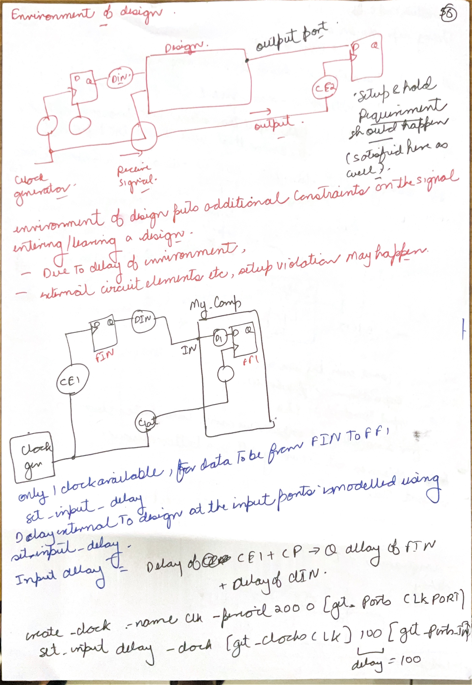](#day-06-index)

*Source: Scan C, PDF page 1.*

The launching flip-flop drawn outside the design produces the signal that eventually reaches the input port. Its clock-to-Q delay and the board/interconnect delay have already elapsed before timing propagation enters the block. `set_input_delay` supplies that arrival information; it does not insert a delay element. The internal input-to-register path must fit into the remaining time before the receiving register's setup deadline.

For a common clock reference, write the input arrival as external launch-clock arrival plus external clock-to-Q plus external data-wire delay. State separately which clock latencies are modeled by clock constraints; including the same latency in both places counts it twice. Maximum input delay represents the latest arrival relevant to setup. Minimum input delay represents the earliest arrival relevant to hold. One number cannot safely stand for both physical extremes.

As a teaching example in ps, let the period be 2000, latest external arrival 100, internal maximum delay 1700, internal capture latency 20, setup 30 and setup uncertainty 20. Data arrives at 1800; its deadline is 1970; slack is +170. For minimum external arrival 15, minimum internal delay 10, capture latency 20, hold 15 and hold uncertainty 5, the earliest arrival is 25 and the hold threshold is 40: slack is -15. The block passes setup and fails hold despite its generous period.

```tcl
create_clock -name SYS_CLOCK -period 2000 [get_ports CLK]
set_input_delay -clock SYS_CLOCK -max 100 [get_ports DATA_IN]
set_input_delay -clock SYS_CLOCK -min 15 [get_ports DATA_IN]
```

These values assume the library time unit is ps. Check `report_units` before interpreting them. Real constraints come from the interface specification, including earliest/latest external clocks and data, rather than from guesses intended to make slack positive.

### C-02: Input slew and output capacitance are different boundary conditions

[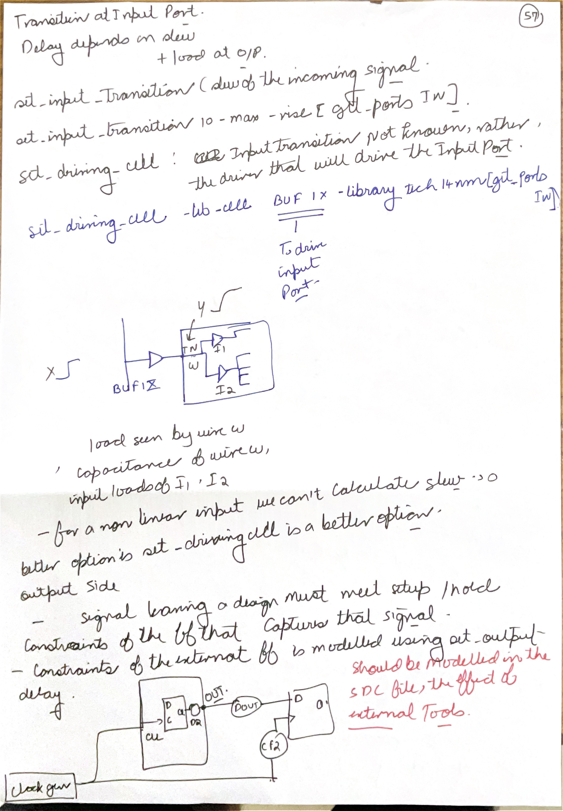](#day-06-index)

*Source: Scan C, PDF page 2.*

An arrival time answers **when the transition starts to matter**. Slew answers **how quickly the voltage changes**. The receiving cell's delay depends on both input slew and output load, so even a port with the correct arrival time can yield unrealistic timing if its transition is left unspecified.

`set_input_transition` supplies a fixed slew at the port. `set_driving_cell` instead describes a characterized external driver; its library behavior lets the analyzer derive a transition appropriate to the connected load and the specified driver conditions. The distinction is a fixed boundary value versus a driver model. It is not a distinction between linear and nonlinear timing analysis: internal cells may use nonlinear delay tables in either case. Use the intended model rather than accidentally leaving conflicting annotations.

On the output side, the driver charges its own internal capacitances, the interconnect and downstream input-pin capacitances. `set_load` supplies the external capacitive load missing from the block netlist. If an output drives four 3 fF pins and 8 fF of outside wiring, its external load is 20 fF. The internal wire capacitance should still come from the block's parasitic model; do not add it twice.

The handwritten `BUF1X` and technology name identify an example driver, not a portable cell name. A driving-cell constraint must resolve to an actual cell and output pin in the loaded Liberty library. The next page's output-delay requirement is separate again: capacitance affects the output driver's delay, while output delay sets the time at which the external receiver needs the signal.

### C-03: Derive the 410 ps output delay from the external receiver

[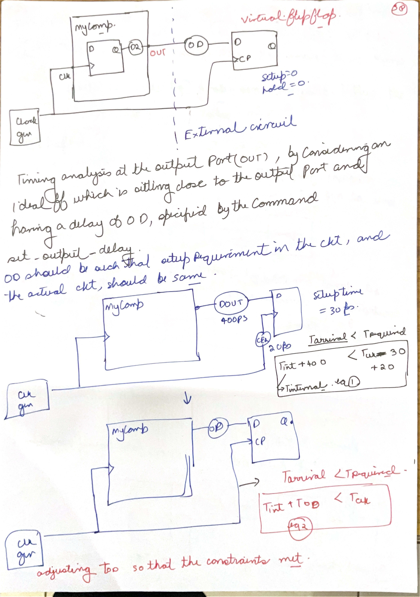](#day-06-index)

*Source: Scan C, PDF page 3.*

Let $s$ be the external capture-clock arrival relative to the chosen clock reference, $d_{ext,max}$ the maximum delay from the block output to the receiver, and $t_{su}$ its setup requirement. The output must leave the block early enough that it reaches the receiver before the next capture edge minus setup:

$$
t_{out,max}+d_{ext,max}\le T+s-t_{su}.
$$

Consequently, the maximum output-delay value is $d_{ext,max}+t_{su}-s$. For the page's 400 ps external wire delay, 30 ps setup and 20 ps later capture clock, this is $400+30-20=410$ ps. At a 2000 ps period the block-output deadline is 1590 ps. A later external capture clock relaxes setup, which explains the subtraction of 20 rather than its addition.

Hold must be derived separately. The earliest output transition must satisfy $t_{out,min}+d_{ext,min}\ge s+t_h$. With the usual output-delay sign convention, the minimum annotation is $d_{ext,min}-t_h-s$. It can be negative. For zero external wire delay, zero skew and a 20 ps hold requirement, `-min -20` tells the analyzer that the output must remain stable for 20 ps after the reference edge. Setting `-min 410` by copying the setup value would describe a different and generally incorrect hold requirement.

The zero-setup/zero-hold virtual register in the drawing is an analysis abstraction: the external receiver's requirements have been transferred into the boundary constraint. The physical receiver still has setup and hold behavior. This translation is useful because the block analyzer need not contain the actual board or receiving chip.

### C-04: Output timing, load and false paths

[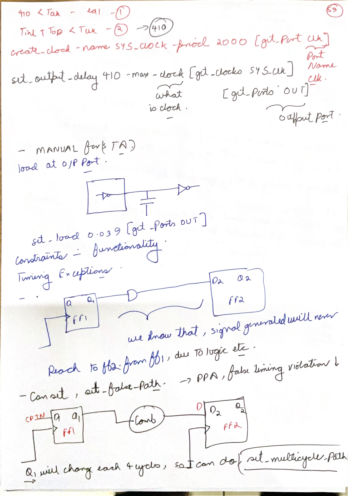](#day-06-index)

*Source: Scan C, PDF page 4.*

```tcl
set_output_delay -clock SYS_CLOCK -max 410 [get_ports DATA_OUT]
set_load 0.039 [get_ports DATA_OUT]
```

The first line sets a deadline. The second describes an electrical load. Its 0.039 is meaningful only in the capacitance unit reported by the loaded library; if that unit is pF, it means 39 fF. Increasing load can increase the driver's delay without changing the required time. Tightening output delay changes the required time without directly changing the cell's electrical delay.

A false-path exception removes a particular path from specified timing checks because the design's operation does not require that launch-to-capture transfer. In the page's blocked logic, ask whether one legal input/state assignment can simultaneously activate the path and make the endpoint capture its result. Contradictory sensitization conditions can make a combinational path impossible. A scan-only path excluded in functional mode is another mode-dependent example, provided the mode restriction is real.

An exception must identify the intended startpoints, endpoints, clocks or through-pins precisely. A broad false-path command can hide a real failure. It does not shorten a wire, remove capacitance or improve silicon performance. Also distinguish an asynchronous clock-domain crossing: disabling an ordinary synchronous check does not establish that the crossing has a safe synchronizer or data-transfer protocol.

The [OpenSTA command reference](https://opensta.readthedocs.io/en/latest/Commands/) documents the available SDC options. Verify both the selected objects and the resulting constrained/unconstrained endpoint report. A report without a negative slack is useful only when the required paths were actually checked.

### C-05: Multicycle checks, case analysis and the mapper's inputs

[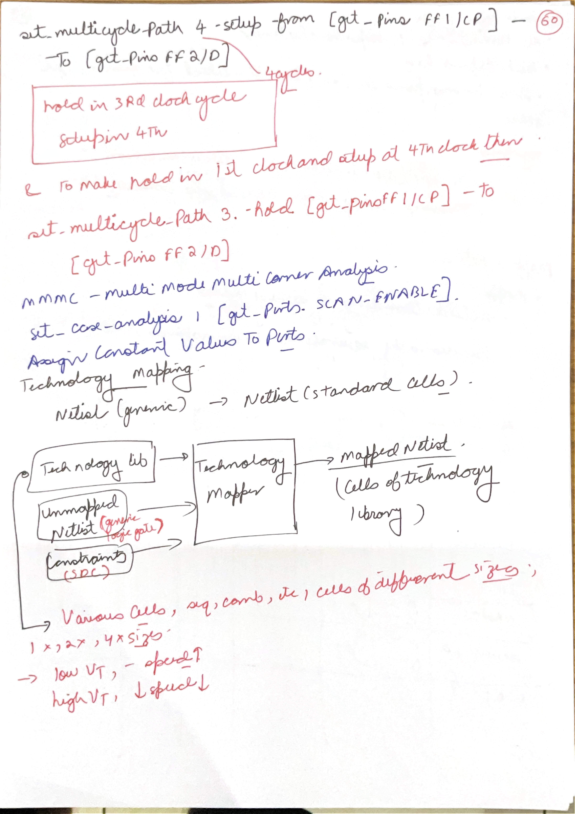](#day-06-index)

*Source: Scan C, PDF page 5. The lower mapping diagram continues in Lesson 34.*

A multicycle path allows a receiving register to capture a launch value after several cycles because the functional protocol permits that delay. For a common same-frequency clock, a four-cycle setup exception moves the setup capture edge from cycle 1 to cycle 4. The familiar accompanying three-cycle hold adjustment restores the intended same-edge hold relationship under that exception convention. It is not a general recipe for unrelated clocks, opposite edges or every `-start`/`-end` variant.

```tcl
set_multicycle_path 4 -setup -from [get_cells launch_reg] -to [get_cells capture_reg]
set_multicycle_path 3 -hold  -from [get_cells launch_reg] -to [get_cells capture_reg]
set_case_analysis 0 [get_ports SCAN_ENABLE]
```

At 2 ns per cycle, a four-cycle setup budget is approximately 8 ns before clock-to-Q, setup, skew and uncertainty are accounted for. The hardware or protocol must keep the required launch value valid until the permitted capture edge and prevent intervening captures from being treated as valid results. A long combinational path alone is not evidence of a multicycle protocol.

Case analysis fixes a control to a mode value and lets the tool propagate constants through the relevant logic. `SCAN_ENABLE=0` can remove scan-selected arcs from functional analysis. Scan-shift mode needs its own constraints and checks. A mode declaration should therefore describe an actual operating condition, including test and power-state conditions where relevant.

The page then switches topic: an unmapped netlist, a cell library and design constraints enter technology mapping. The library provides legal implementations; constraints tell the mapper which tradeoffs matter. Low-threshold-voltage cells often improve speed at greater leakage, while higher-threshold variants often reduce leakage at greater delay. These are library-dependent tradeoffs, not a promise that changing threshold voltage alone fixes every path.

#### Write the functional edge schedule before a multicycle exception

For C-05's four-cycle example, take a 2 ns clock. A launch register emits a transaction at 0 ns, then holds it through the receiving edge at 8 ns. The receiver's functional enable is low at 2,4,6 ns and high at 8 ns. The combinational result must meet the actual setup window around that enabled edge.

| Edge time | Launch value | Receiver enable | Protocol meaning |
|---:|---|---:|---|
| 0 ns | New transaction A | 0 | Begin computation |
| 2,4,6 ns | A still held | 0 | Intermediate values are not accepted |
| 8 ns | A still valid for capture | 1 | Capture A's final result |

If the receiver instead captures and uses the result at 2 ns, or the sender changes A at 2 ns, this table no longer describes the circuit. The exception cannot fix either behavior. A source that changes every cycle may also launch later values for which the selected capture has less than four cycles of settling time.

The companion hold adjustment addresses edge pairing in STA; it does not create the enables or operand stability. Check the setup and hold reports' selected edges, and prove the relevant enable/stability behavior from RTL and protocol assumptions. Keep the exception scoped to the actual register path, so unrelated one-cycle paths retain their intended checks.

[Back to day index](#day-06-index)

## Lesson 34: Technology Mapping

Week 8 · [Lecture video](https://www.youtube.com/watch?v=ooOZagskglo) · [Back to day index](#day-06-index)

<!-- wrapup-frame-34 -->

[](#day-06-index)

*Lecture: [14:11 — Count every mapped cell and every relevant input arc](https://www.youtube.com/watch?v=ooOZagskglo&t=851s).*

The displayed toy mapping uses two NAND1 and two INV1 cells. Their area totals 4+1+4+1=10, and the displayed power measure totals 20+5+20+5=50. A/B cross delays 8+8+4=20, while C crosses 4+8+4=16. These are the slide's arbitrary teaching measures; input arrival and actual load must also enter a real path comparison. The inversions preserve the required complement of AB+C.

### C-06: Replace generic logic with characterized cells

[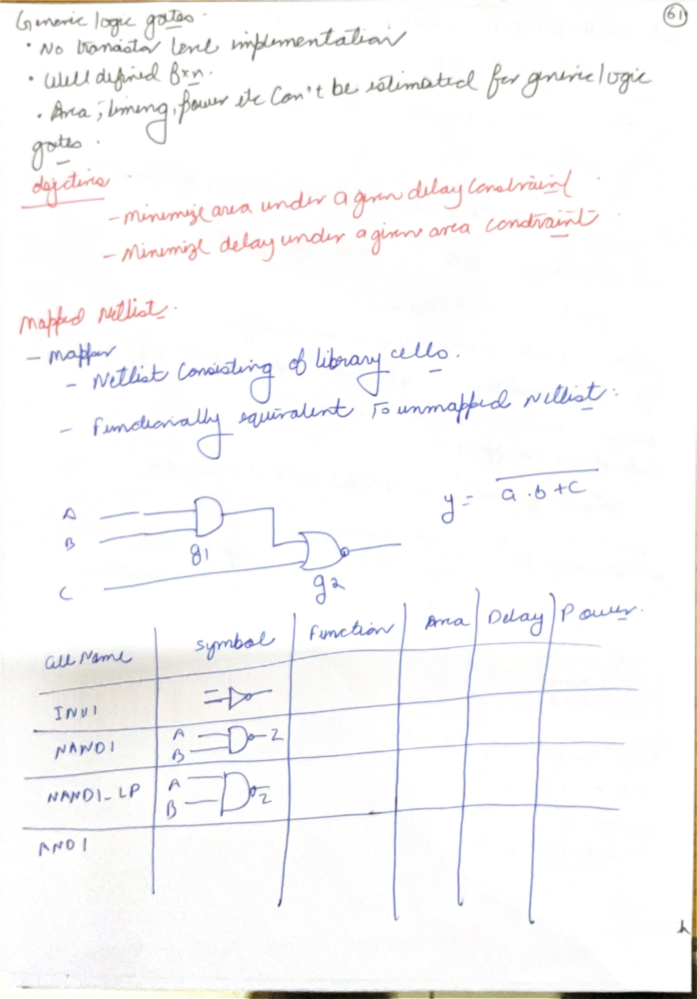](#day-06-index)

*Source: Scan C, PDF page 6.*

An unmapped AND or NOT describes a Boolean function. It does not yet specify a cell's transistor sizing, area, timing arcs, leakage, pin capacitance or physical footprint. Mapping covers the Boolean network with cells from a particular technology library. A mapped instance is therefore both a logical choice and an implementation choice.

For $y=\overline{AB+C}$, one implementation uses an AND followed by a NOR; another uses a single AOI21 cell if the library contains one. Both are logically valid. Their input-pin delays can differ, especially when A, B and C arrive at different times. The smallest cell count is not necessarily the smallest area or shortest critical path. A stronger complex gate can have a larger input capacitance and move the problem into its driver.

Two typical objectives on the page are minimizing area subject to a delay bound, and minimizing delay subject to an area bound. State the constraint as well as the objective. Otherwise, a mapping with excellent area but failing timing can mistakenly be called optimal. Wire estimates, load, transition constraints and cell restrictions also affect the choice.

The NAND/low-power variants in the notes illustrate a menu of legal library cells. Keep their actual characterized values attached to their source library. As an independent teaching example, a 6-unit AOI cell with 70 ps critical delay beats a 7-unit two-cell mapping with 100 ps delay for those stated area/delay measures. At a different load or on a different input arc, the ranking can change.

### C-07: Structural alternatives must preserve the complete function

[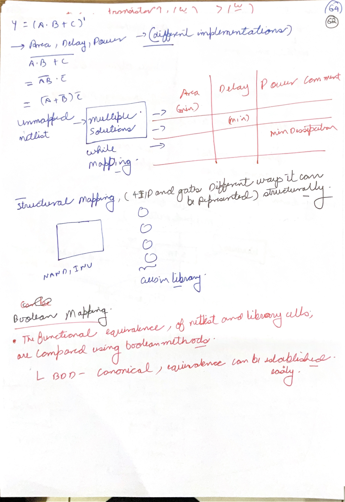](#day-06-index)

*Source: Scan C, PDF page 7.*

De Morgan's law gives $\overline{AB+C}=(\overline{A}+\overline{B})\overline{C}$. This exposes a different gate pattern without changing the truth table. Check C=1 first: both forms force y=0. With C=0, both reduce to the complement of AB. That two-case argument covers all eight input combinations and explains the equivalence instead of merely naming the theorem.

Structural matching recognizes a library cell's pattern in the current network. Functional matching can recognize the same Boolean function even when its present gate decomposition differs. Reduced ordered BDDs are useful for combinational functional comparison when both functions use the same variable order; canonical representations then identify equality. A different variable order can produce a different representation of the same function, so node shape alone is not an order-independent test.

Pin permutations can also matter. A function symmetric in A and B may permit their interchange, while C has a different role. The library's delay arcs, however, can assign different delays to otherwise interchangeable logical pins. Connecting the latest signal to a faster legal pin can improve timing without altering the function.

After mapping, verify the Boolean behavior and recalculate timing using the chosen cells and loads. A functional proof does not prove timing, and a positive timing report does not prove logical equivalence. The mapping step feeds the iterative, timing-aware transformations in the next lesson.

[Back to day index](#day-06-index)

## Lesson 35: Timing-driven Optimizations

Week 8 · [Lecture video](https://www.youtube.com/watch?v=xLw7xAosmtI) · [Back to day index](#day-06-index)

<!-- wrapup-frame-35 -->

[](#day-06-index)

*Lecture: [24:28 — Late-input rewiring changes 220 ps into 180 ps](https://www.youtube.com/watch?v=xLw7xAosmtI&t=1468s).*

In the left chain, late B=70 ps crosses three 50 ps gates: the successive arrivals are 120,170,220 ps. In the right chain, early C=20 and D=30 finish by 80 ps, adding A=40 gives 130 ps, and late B crosses only the final gate to give 180 ps. C-10 matches the restructured handwritten circuit and adds a separately evaluated balanced alternative.

### C-08: Timing optimization is an analysis-and-change loop

[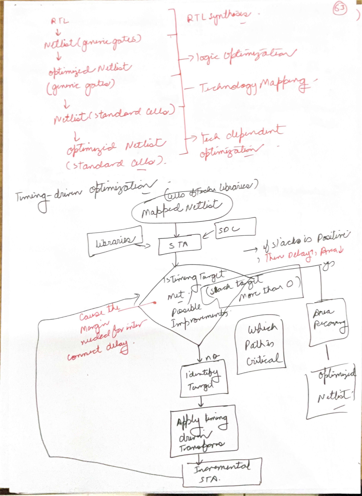](#day-06-index)

*Source: Scan C, PDF page 8.*

The flow first derives generic logic from RTL, applies technology-independent simplifications, maps to cells and performs technology-dependent optimization. Once physical cells and timing arcs exist, the tool can ask which transformation improves the actual worst slack rather than simply reducing the number of Boolean literals.

The loop is: calculate timing, identify a limiting path, choose a legal transformation, update affected timing, and compare the result against constraints. Incremental STA recalculates the changed cone and its downstream effects; it should not assume that an untouched neighboring path stays harmless when its shared driver's load changes. The critical path can migrate after each repair.

For example, suppose endpoint P has slack -40 ps and endpoint Q has +5 ps. Upsizing a shared cell improves P by 30 ps but adds 15 ps of load-induced delay to Q's earlier driver. P now has -10 ps and Q also has -10 ps. The change improves worst slack but creates a second failing endpoint. A repair decision needs the full set of affected paths, area, power and electrical limits.

After setup closure, recovering area or power from slack is reasonable: a slower, smaller or higher-VT cell may fit a noncritical path. Every recovery step must preserve minimum-delay/hold checks, transition and capacitance limits, and other constrained modes. Positive setup slack is not unrestricted permission to simplify the circuit.

### C-09: Upsizing and rewiring move delay between stages

[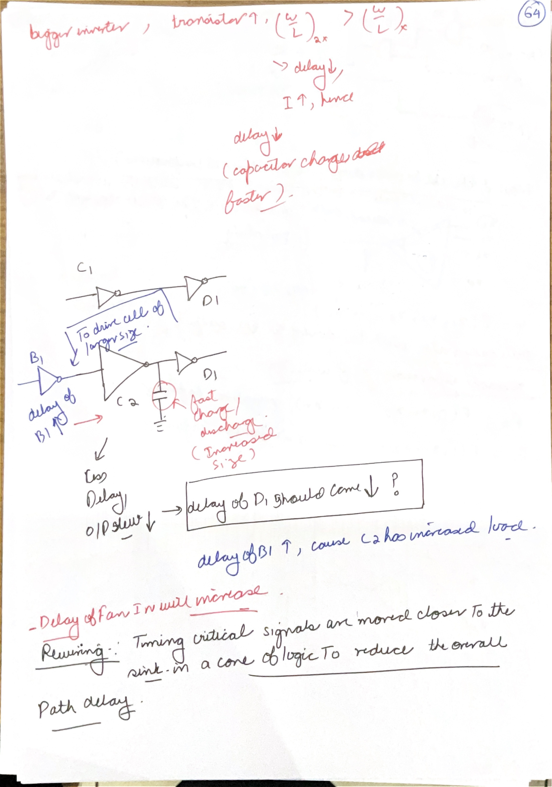](#day-06-index)

*Source: Scan C, PDF page 9.*

Larger effective transistor width can reduce a cell's output resistance, improving its ability to charge a load. It also increases capacitance at its input and often increases internal capacitance, area and switching/leakage power. The upstream driver now sees a heavier load. Thus the path improvement is the delay saved at the resized cell minus any extra delay introduced before it, including changed slew effects.

If a resize saves 35 ps locally but adds 12 ps to the previous stage, the net path gain is 23 ps. If the upstream penalty is 50 ps, the same resize makes the whole path 15 ps slower. These illustrative numbers show why “bigger means faster” is a local tendency rather than a complete optimization rule.

Rewiring changes which signal crosses which gates while preserving the function. A late input should often enter nearer the output so that it crosses fewer stages. Earlier inputs can do more computation before that late signal arrives. The next page gives a numerical example. Rewiring must still respect legal cell inputs and fanout, and a shorter logical depth can be offset by extra physical distance after placement.

#### Include the driver's load in an upsizing estimate

An authored first-order model makes the upstream penalty concrete. Approximate a preceding driver as 1 kΩ charging the resized gate's input. Raising that input capacitance from 5 to 15 fF raises the RC time scale from 5 to 15 ps. If the resized gate saves 25 ps on its own loaded output, the combined two-stage time-scale estimate improves by only 15 ps: 25 saved minus 10 added upstream.

This is an RC illustration, not a Liberty delay calculation: threshold crossing, input waveform, internal capacitance and load distribution affect characterized delay. It nevertheless identifies the missing quantity in a purely local comparison. The same larger input is seen by every path feeding that pin, including an upstream path that was not originally critical.

After resizing, propagate the new slew into downstream table lookups and evaluate all affected min/max paths. A faster transition can improve setup while reducing a minimum delay enough to hurt hold. The mapper's area or slack recovery loop therefore needs whole-path evidence, rather than a cell-size ranking treated as a universal speed order.

### C-10: Reassociate the AND chain around the late input

[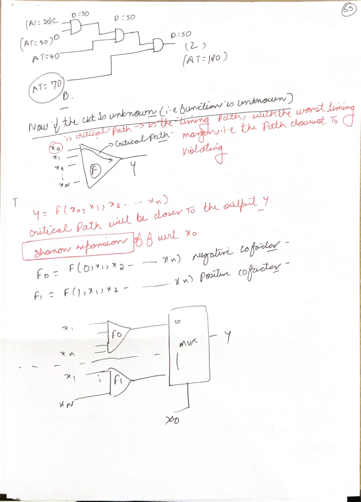](#day-06-index)

*Source: Scan C, PDF page 10.*

The source uses input arrivals C=20, D=30, A=40 and B=70 ps, with each two-input AND taking 50 ps. Its drawn order is the restructured circuit: AND(C,D) finishes at $\max(20,30)+50=80$ ps, AND(that,A) at 130 ps, and AND(that,B) at 180 ps. In the lecture's original chain, AND(A,B) finishes at 120 ps, followed by C at 170 ps and D at 220 ps. Moving late B to the final gate saves 40 ps under these assumptions.

A separate balanced alternative computes AND(C,D)=80 and AND(A,B)=120, then combines them at 170 ps. It does not reach 120 merely because one branch is ready then: the final gate adds another 50 ps. Every branch must be evaluated. Alternatively, AND(A,C)=90, AND(that,D)=140, then B gives 190. Gate count alone cannot predict the ranking.

The lower part introduces Shannon expansion:

$$
f=x_0f|_{x_0=1}+\overline{x_0}f|_{x_0=0}.
$$

It implements the two cofactors in parallel and uses $x_0$ to select between them. If $x_0$ is the late signal, the cofactors may be ready before it arrives; its remaining path is then a mux select arc. The cost is extra/cofactor logic and the mux's characterized delay. Both the data-input arrivals and select arrival matter. The next page works this tradeoff through for a specific function.

### C-11: A late-select mux saves 15 ps in the page's example

[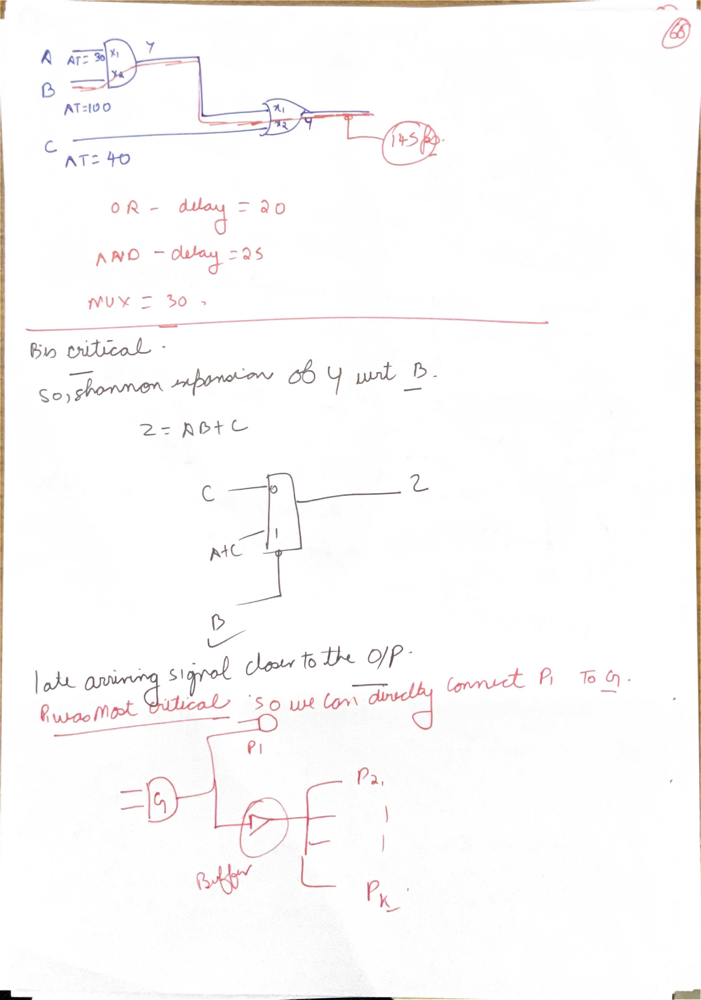](#day-06-index)

*Source: Scan C, PDF page 11.*

For $z=AB+C$, A arrives at 30 ps, B at 100 ps and C at 40 ps. An AND delay of 25 ps followed by an OR delay of 20 ps gives $\max(30,100)+25=125$ ps at AB and $\max(125,40)+20=145$ ps at z.

Expand around the late signal B. When B=0, z=C. When B=1, z=A+C. Compute A+C by 60 ps and feed a mux with data arrivals 40 and 60 ps and select arrival 100 ps. With a teaching assumption of 30 ps for every relevant mux arc, output arrival is $\max(40,60,100)+30=130$ ps. The improvement is 15 ps. Real mux data/select arcs need not have equal delay, so the result must be recalculated from the target library.

The buffered-fanout drawing isolates a critical destination from many noncritical destinations. The original gate can drive the critical branch directly and a buffer feeding the large noncritical group. This reduces the load on the critical branch only if the buffer input plus remaining direct load is substantially smaller than the original total. The noncritical group pays the extra buffer delay, area and power. Moving load is useful because those destinations have spare slack; adding buffers indiscriminately is not the underlying principle.

### C-12: Balance fanout and retime with cycle alignment preserved

[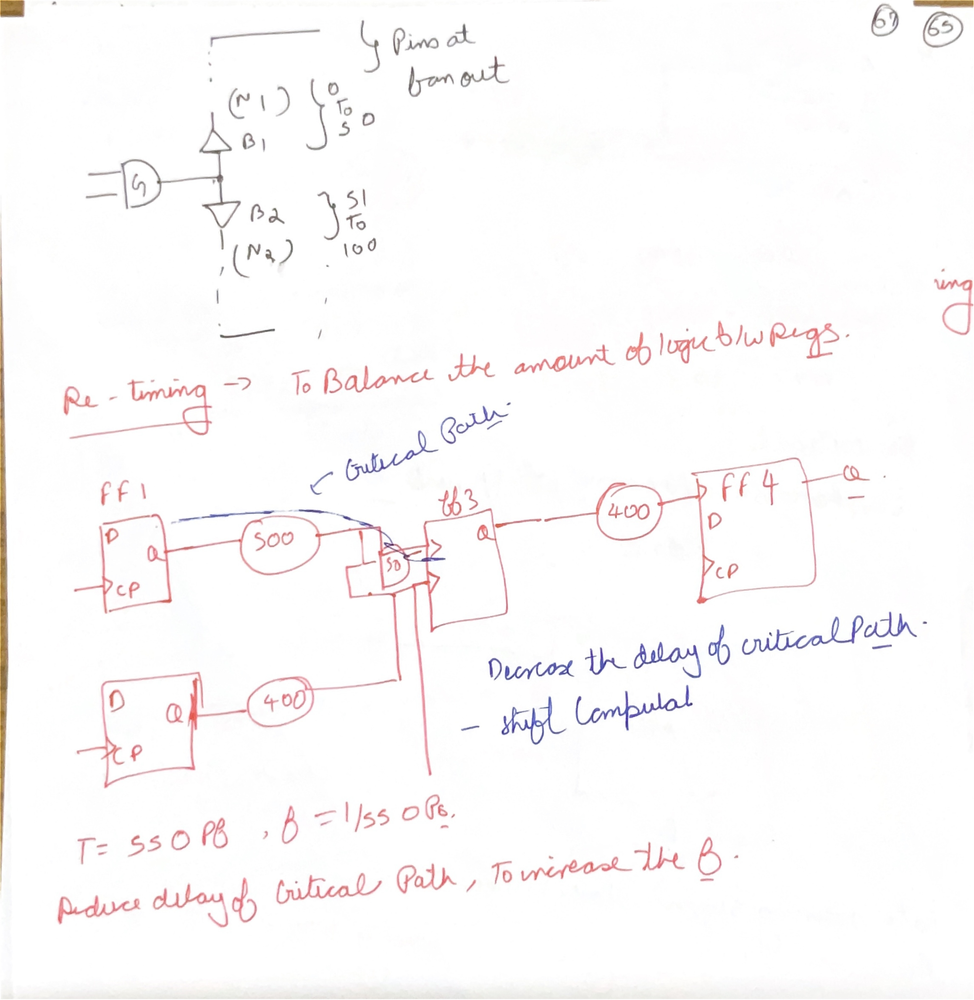](#day-06-index)

*Source: Scan C, PDF page 12.*

The upper drawing splits destinations into groups behind B1 and B2. If one group contains many more pins or longer wire than the other, identical buffers will not necessarily produce equal delay. Group by effective capacitance, geography and timing need; pin count is only a proxy. The driving gate still sees both buffer inputs.

In the lower drawing, FF1-to-FF3 crosses 500 ps of logic and a 50 ps mux; the other mux data branch crosses 400+50 ps. FF3-to-FF4 crosses 400 ps. Ignoring clock-to-Q, setup, wire and skew, the period limit is the largest of 550, 450 and 400 ps: 550 ps, or about 1.82 GHz.

A conceptual backward retiming across the mux moves the FF3 boundary before the mux. Its data-input registers then terminate the 500 ps and 400 ps blocks, while the later stage crosses mux plus 400 ps = 450 ps. The largest data-stage delay becomes 500 ps, or 2 GHz under the same ideal assumptions. **All relevant mux inputs, including its select, must have the correct registered cycle alignment.** Moving only one data register would mix values from different cycles and change behavior.

Retiming can change the number and placement of registers while preserving the intended sequence after a valid state mapping. Reset behavior, initial values, enables, test connectivity and externally visible latency may restrict it. This diagram motivates balancing; it is not permission to move a flip-flop across arbitrary control logic. Recheck sequential equivalence and timing after the transformation.

#### Retiming must align the mux select with its data

Let a mux compute y=s?B:A on transaction-tagged values. At one original sampling edge, transaction 0 has A=10, B=20, s=0, so it produces 10. Transaction 1 has A=30, B=40, s=1, so it produces 40. A retimed design with registered data but an undelayed select can combine transaction 0's stored A/B with transaction 1's current s, producing 20 instead of 10.

The arithmetic blocks still produce their correct values. The changed **cycle association** causes the failure. When moving the boundary backward across the mux, establish a state mapping that brings the select to the same transaction boundary as both data inputs, or demonstrate that the select is already stable for the required interval.

Reset and enable behavior matter too: if one input register stalls while another advances, their tags diverge. A correct timing rebalance needs the appropriate control registers, synchronized enables and permitted initialization, followed by sequential equivalence for the intended interface latency. Equal combinational truth tables alone cannot prove that relationship over time.

[Back to day index](#day-06-index)

## Lesson 36: Technology Library and Constraints

Week 8 tutorial · [Lecture video](https://www.youtube.com/watch?v=u_XXFBwTXRk) · [Back to day index](#day-06-index)

<!-- wrapup-frame-36 -->

[](#day-06-index)

*Lecture: [11:04 — Recompute the actual tutorial timing report](https://www.youtube.com/watch?v=u_XXFBwTXRk&t=664s).*

The native report shows input delay 5 ps, inverter increment 80 ps and arrival 85 ps. Its separate required-time calculation starts from 1000 ps and subtracts output delay 5 ps, giving 995 ps. Slack is therefore 995−85=910 ps. The table below develops the tutorial's slew/load experiments; none of those SDC changes is a physical buffer insertion.

### Tutorial: Predict the report before changing the constraint

The course tutorial uses `test.v`, `test.tcl`, `test.sdc` and `toy.lib` with an inverter. Read its NLDM table by selecting input slew on one axis and output capacitance on the other. The relevant input/output transition polarity determines which arc table to use; a rising inverter input produces a falling output. Intermediate values require interpolation, rather than rounding to whichever table entry is convenient.

In the demonstrated baseline, period is 1000 ps, input delay 5 ps, output delay 5 ps, input slew 0.1 ps and output load 100 fF. The selected cell delay is 80 ps. Output arrival is 85 ps; required time is 995 ps; slack is 910 ps. These are toy-library teaching values, not measured delays of a real process.

| Experiment | Cell delay (ps) | Arrival (ps) | Required (ps) | Slack (ps) |
|---|---:|---:|---:|---:|
| Baseline slew 0.1, load 100 | 80 | 85 | 995 | 910 |
| Increase slew to 100, keep load 100 | 200 | 205 | 995 | 790 |
| Keep slew 100, reduce load to 0.1 | 4 | 9 | 995 | 986 |
| Then increase input delay from 5 to 25 | 4 | 29 | 995 | 966 |

The second change alters the cell delay through the library model. The last change adds 20 ps to input arrival without physically changing the inverter, and reduces slack by exactly 20 ps. The lecture's caption export contains a reversed “200 to 80” sentence around 12:51; the table selection and report arithmetic establish that the increased-slew experiment goes from 80 to 200 ps.

```tcl
read_liberty toy.lib
read_verilog test.v
link_design test
read_sdc test.sdc
report_units
check_setup
report_checks -path_delay max
report_checks -path_delay min
```

Use the actual top module name in `link_design`. Before changing one variable, record the current boundary values, selected arc and initial report. Change one assumption at a time and predict which report column will change. A smaller output load in an SDC file represents a different external environment; it does not remove capacitance from an already built circuit. Likewise, a lower uncertainty represents a revised justified margin, rather than a physical timing repair.

**Day 06 recall:** derive both I/O maximum and minimum constraints; explain the difference between arrival and slew; compare functionally equivalent mappings using complete path arrivals; and distinguish a constraint change from a netlist transformation.

[Back to day index](#day-06-index)
