# Day 07: Power, scan design and ATPG

Lessons 37–42 · Weeks 9–10. Source pages C-13–C-24, D-01–D-04 and N-01.

## Day 07 index

- [Lesson 37: Power Analysis](#lesson-37-power-analysis)
- [Lesson 38: Power Optimizations](#lesson-38-power-optimizations)
- [Lesson 39: Basic Concepts of DFT](#lesson-39-basic-concepts-of-dft)
- [Lesson 40: Scan Design Flow](#lesson-40-scan-design-flow)
- [Lesson 41: Power Analysis using OpenSTA](#lesson-41-power-analysis-using-opensta)
- [Lesson 42: Automatic Test Pattern Generation](#lesson-42-automatic-test-pattern-generation)

[Master index](../README.md) · [Handwritten page index](../Resources/Handwritten%20Index.md) · [Sources](../Resources/Sources.md)

## Lesson 37: Power Analysis

Week 9 · [Lecture video](https://www.youtube.com/watch?v=u3--39QdD2Y) · [Back to day index](#day-07-index)

<!-- wrapup-frame-37 -->

[](#day-07-index)

*Lecture: [14:39 — Charge the wire and every receiving pin](https://www.youtube.com/watch?v=u3--39QdD2Y&t=879s).*

The fanout drawing separates wire and pin capacitances from the driving cell's internals. The charging current supplies a total load, not just one receiving gate. The frame's energy per complete 0→1→0 cycle is CV². C-13 derives that energy and explains why the activity convention determines whether a one-half appears in the average-power formula.

### C-13: Where the energy of a CMOS transition goes

[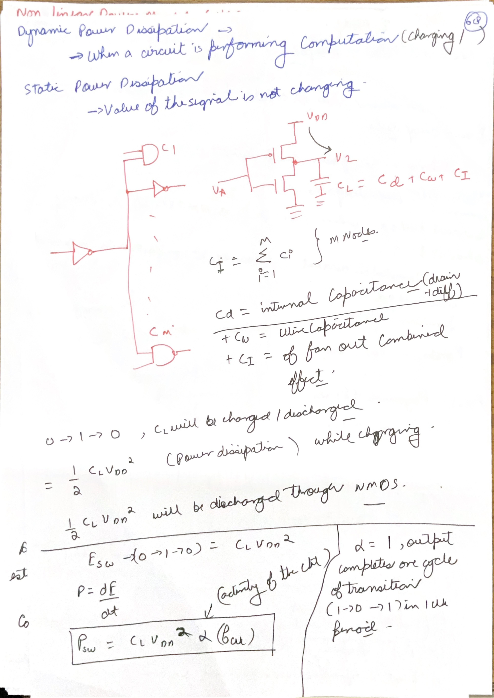](#day-07-index)

*Source: Scan C, PDF page 13.*

The load seen by the driving cell includes wire capacitance and the input capacitances of its fanout. Internal device capacitances also switch, but their energy is often accounted for in the library's internal-power model. Keep those two accounting boundaries clear.

Charging an initially discharged ideal capacitor C from a constant supply V draws charge CV. The supply delivers energy $V(CV)=CV^2$. The capacitor stores $CV^2/2$; the other half is dissipated in the charging path. During discharge, the stored half is dissipated. One complete 0→1→0 cycle therefore dissipates $CV^2$, even though the final stored energy is zero. The supply is the energy source; a capacitor is temporary storage, not an energy generator.

If $\alpha$ counts 0→1 events per reference clock cycle, the average external switching power is:

$$
P_{sw}=\alpha CV^2f.
$$

If activity instead counts **all** rising and falling events, the corresponding expression has a factor of one-half, assuming the usual balanced transitions over the averaging window. Never mix those activity conventions. A continuously toggling clock has one rise and one fall per cycle, so its rise-count activity is one.

For C=20 fF, V=1 V, f=1 GHz and rise-count activity 0.1, power is 2 µW. Doubling capacitance doubles this estimate; reducing V to 0.8 V multiplies it by 0.64. The estimate excludes leakage and internal/short-circuit energy. A glitch can add charge/discharge events even when the final Boolean value for the cycle does not change.

### C-14: Switching, short-circuit and leakage power

[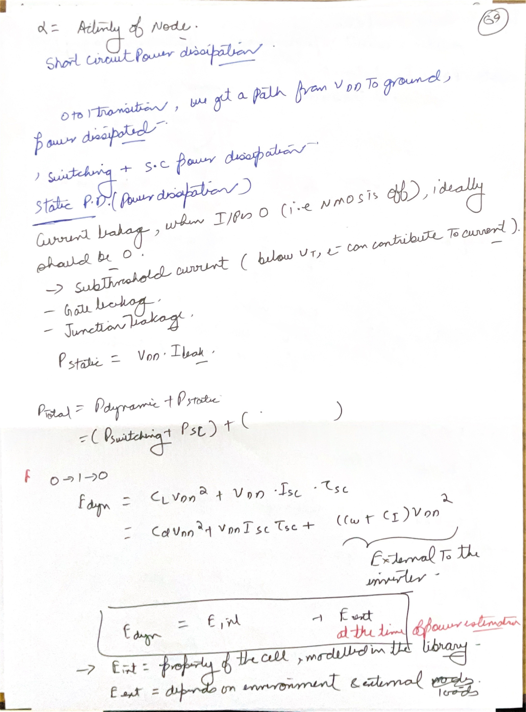](#day-07-index)

*Source: Scan C, PDF page 14.*

During a finite input transition, PMOS and NMOS can conduct simultaneously, creating a temporary path from VDD to ground. Its short-circuit energy is the supply voltage multiplied by the integral of that current over the event. The handwritten approximation $VI_{sc}\tau$ is **energy per event** when $I_{sc}$ is an average current over duration $\tau$. Multiply by the event rate to obtain average power. A slow edge can increase overlap conduction, but the result depends on the cell, waveform and load.

Leakage persists even when a node does not switch. Subthreshold conduction, gate leakage and junction-related leakage have different physical causes. A simple supply estimate is $P_{leak}=VI_{leak}$. The actual leakage can vary strongly with temperature, process and the input state that turns different transistor stacks on or off.

The page divides power into internal, switching and leakage categories. Internal power generally represents energy inside a characterized cell, including relevant internal-node charging and short-circuit effects. Switching power generally concerns the external net load. Do not add a separate internal-capacitance $CV^2f$ term if those same events are already included in the library's internal-energy tables.

For an illustrative cell with 0.4 fJ internal energy per event at 100 million events/s, internal power is 0.04 µW. A 0.2 µA leakage current at 1 V contributes 0.2 µW continuously. At low activity, that leakage can dominate. This explains why stopping clocks and disconnecting power solve different parts of the problem.

### C-15: Power tables need realistic activity and parasitics

[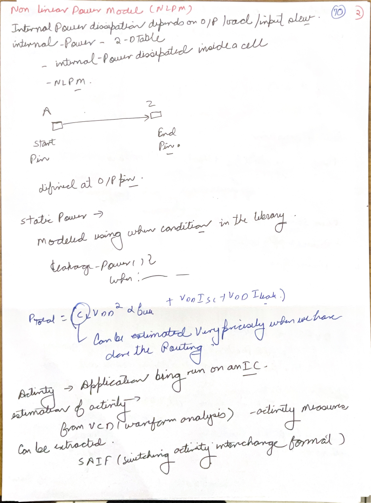](#day-07-index)

*Source: Scan C, PDF page 15.*

A nonlinear power model can tabulate event energy against input slew and output load, with separate rise/fall information and conditions on other pins. Conditional leakage entries describe which input/state conditions apply. Selecting a table requires the correct pin, transition, load and condition, just as delay calculation requires the correct timing arc.

Average dynamic power then needs event frequency. VCD records value changes over time; SAIF summarizes activity and time spent in states. A VCD-to-SAIF conversion is possible in suitable flows, but the formats are not interchangeable and support depends on the tool/version. Correct hierarchy mapping is essential: activity for a testbench signal must annotate the intended design instance, rather than silently leaving most nets at defaults.

Post-route extraction improves the wire-capacitance estimate. It does not establish the application's switching behavior. A beautifully extracted layout can still have an inaccurate power estimate if its activity window contains only reset, misses a high-load mode, or comes from a poorly representative workload.

Record the operating voltage, corner, temperature, library, parasitic source, workload, time window and annotation coverage with the result. Compare internal, switching and leakage components separately. If total power falls after a change, identify whether it came from lower capacitance, fewer events, changed voltage or a different modeling assumption. The probability/activity distinction at the top of C-16 is explained next.

[Back to day index](#day-07-index)

## Lesson 38: Power Optimizations

Week 9 · [Lecture video](https://www.youtube.com/watch?v=-jYtXAHvoZM) · [Back to day index](#day-07-index)

<!-- wrapup-frame-38 -->

[](#day-07-index)

*Lecture: [25:33 — Keep the switch, retention and isolation supplies distinct](https://www.youtube.com/watch?v=-jYtXAHvoZM&t=1533s).*

The diagram places a high-VT sleep switch on the gated supply and keeps retention state on an always-on supply. Isolation clamps an output while the domain cannot drive a valid value. C-17–C-19 explain switch polarity, sequencing and why clock gating addresses a different power component.

### C-16: Signal probability is not transition activity; DVFS changes both power and time

[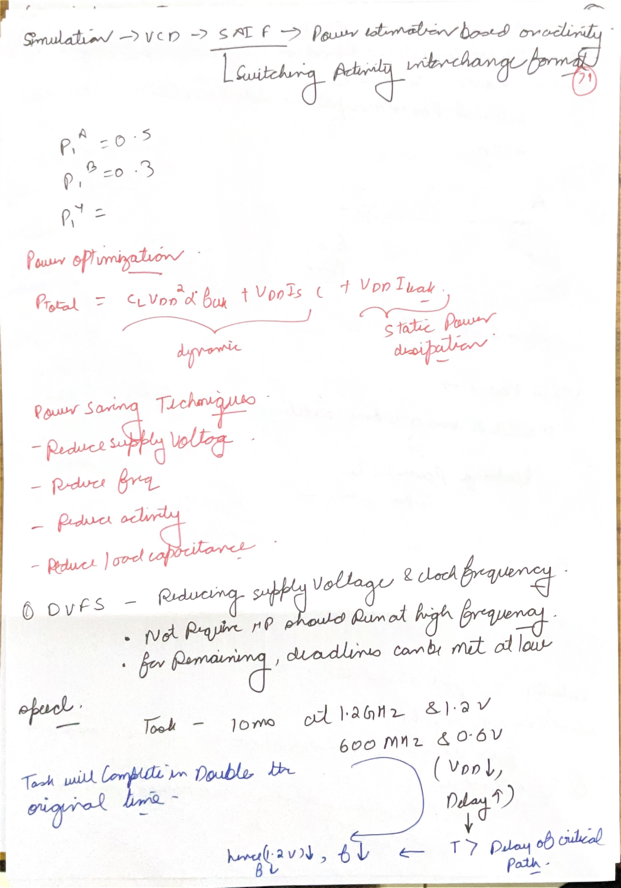](#day-07-index)

*Source: Scan C, PDF page 16.*

The page begins with p(A)=0.5 and p(B)=0.3. These are probabilities of logic one, not numbers of transitions. An output probability also needs the gate function and correlation assumptions. For independent inputs, an AND gives p(Y)=0.15; an OR gives 0.65. Those are explanatory alternatives because the handwritten fragment does not uniquely specify a gate.

Even a known p(Y) does not determine activity unless temporal behavior is specified. A signal that stays one for half a long interval and zero for the other half can have probability 0.5 but almost no transitions. Under the additional assumption of independent values on successive cycles, the probability of a 0→1 transition is $p(1-p)$. Real signals often retain values and share dependencies, making that assumption inaccurate.

Dynamic voltage and frequency scaling (DVFS) changes operating voltage and clock frequency together. The lower example runs a fixed task for 10 ms at 1.2 GHz/1.2 V, then for 20 ms at 600 MHz/0.6 V. Assuming unchanged capacitance/activity and successful operation at both points, frequency halves and voltage halves. Dynamic power becomes $\frac{1}{2}(\frac{1}{2})^2=\frac{1}{8}$ of its original value. Runtime doubles, so dynamic energy becomes one-quarter.

The task contains 12 million clock cycles in either case under the fixed-cycle-count assumption. The large voltage reduction is a teaching assumption; actual maximum frequency versus voltage is nonlinear, and 0.6 V may not support 600 MHz in a particular process. Leakage energy, regulator losses, memory/peripheral power and transition overhead can change the total-energy result.

### C-17: Power gating disconnects an idle domain

[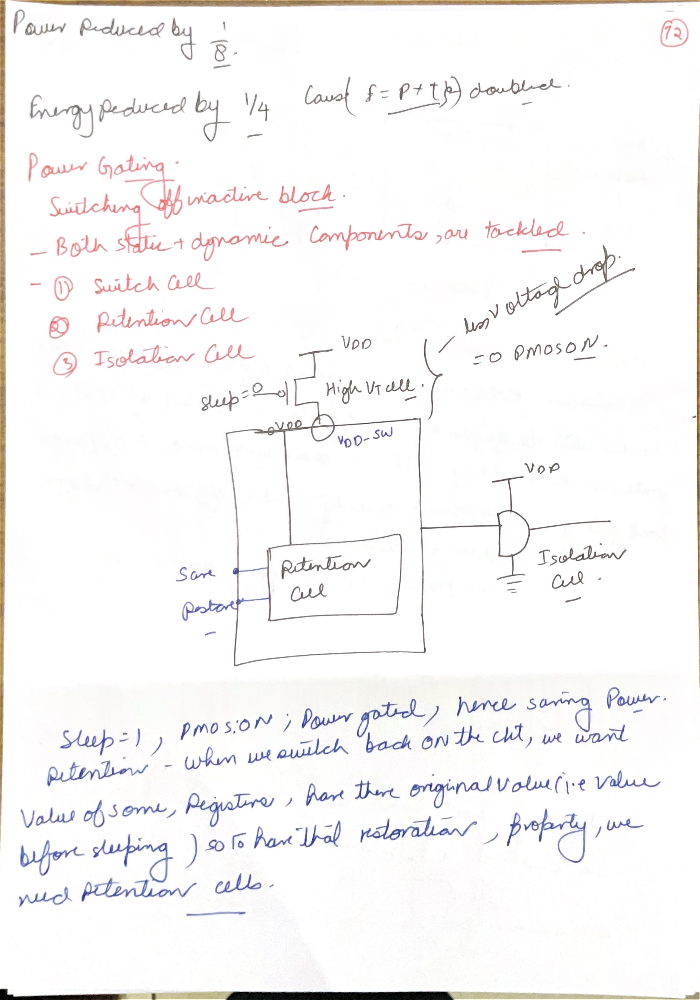](#day-07-index)

*Source: Scan C, PDF page 17.*

The 1/8 power and 1/4 energy ratios follow from C-16's stated ideal assumptions. They concern dynamic switching energy, rather than an automatic eightfold reduction in all chip power.

Power gating uses a sleep switch between a supply rail and the logic domain. A PMOS header connects real VDD to virtual VDD; an NMOS footer can switch the ground side. For a PMOS header, a low gate voltage turns it on and a high gate voltage turns it off. Therefore, if `SLEEP` directly drives its gate and is active high, **SLEEP=1 means asleep/off**, correcting the opposite annotation in the source. An inverted control could use a different external polarity, but that inversion must be shown.

While powered off, the domain's ordinary flip-flops cannot be relied upon to retain state. Its outputs can become invalid and must be isolated from active domains. Wake-up requires charging virtual rails and restoring usable operating conditions before clocks and transactions resume. A finite switch resistance also introduces active-mode voltage drop, so the switch must be sized and distributed for the domain's current.

Power gating saves energy only when idle time is long enough to repay sleep/wake overhead. If entering/exiting costs 2 µJ and reduces idle power by 1 mW, the simple break-even duration is 2 ms. Retention and always-on circuitry reduce the net saving; this example excludes their detailed timing and energy.

### C-18: Retention and isolation preserve system behavior

[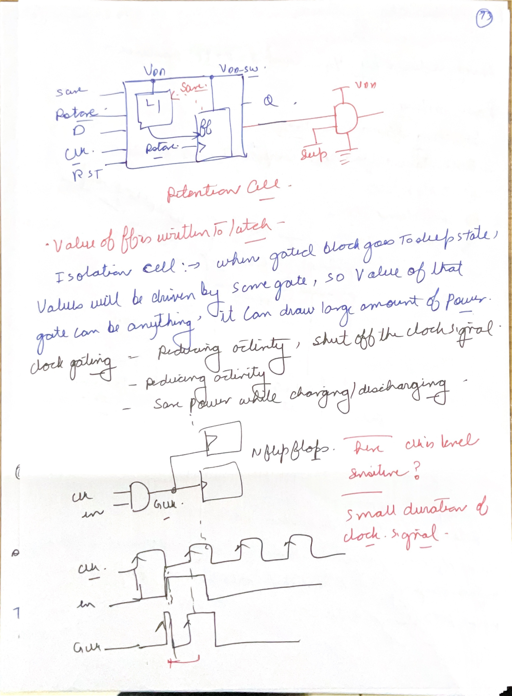](#day-07-index)

*Source: Scan C, PDF page 18.*

A retention element stores selected state using an always-on supply while the main domain is off. It needs a defined save/restore sequence and valid control signals throughout that sequence. Retention is selective: cache contents, combinational outputs or unretained registers do not automatically survive because one retention flop exists.

Isolation prevents an unpowered domain's uncertain output from reaching live logic. A clamp-to-zero or clamp-to-one value must be safe for the receiving protocol. For a valid signal, clamping low may mean “no transaction”; for an active-low reset, clamping low could assert reset. Choose the value from system semantics and place/control the isolation cell so that it remains functional during shutdown.

A representative sequence is quiesce transactions, save required state, assert isolation, stop clocks and turn off power. Wake-up enables power, waits for valid rails, restores/reset state as specified, then releases isolation and resumes activity in a safe order. Actual retention-cell requirements can change this order; the power intent and cell specification govern it.

The lower AND-gate clock example is unsafe if enable changes while the clock is high. A 0→1 enable during that high interval makes a late rising output edge and a shortened pulse; a 1→0 enable truncates an existing high pulse. A glitch on a data signal may be filtered or ignored, but a clock edge can trigger state changes immediately. The latch-based solution is on C-19.

### C-19: A low-level latch makes the clock enable stable during the high pulse

[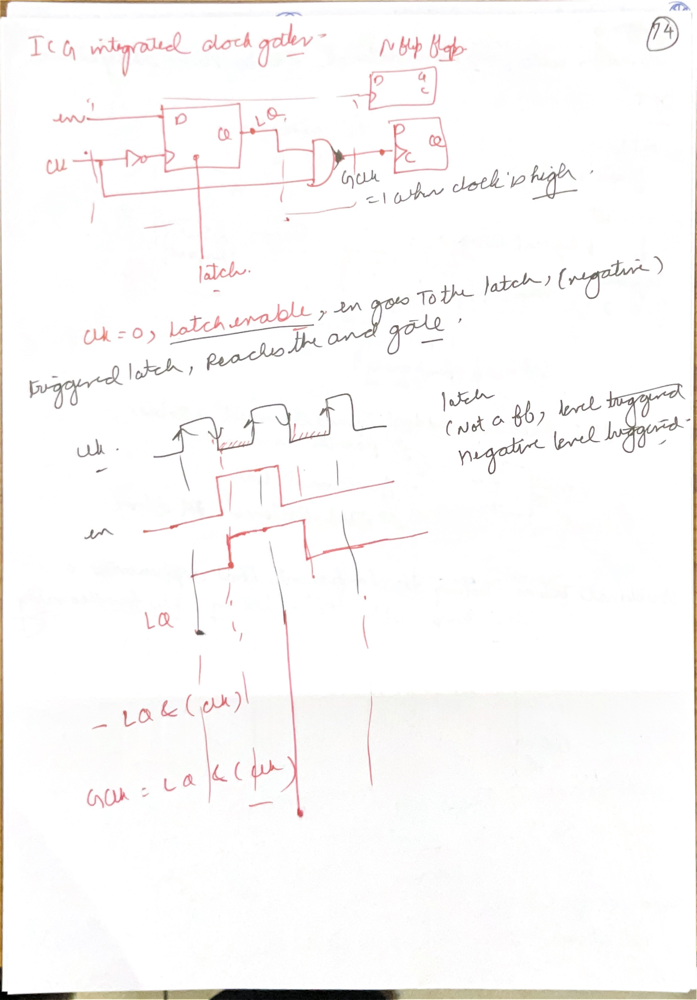](#day-07-index)

*Source: Scan C, PDF page 19.*

For a positive-edge clock followed by an AND gate, a transparent-low latch accepts enable changes while CLK=0. The gated output remains zero during this interval regardless of enable. When CLK rises, the latch closes and holds its output throughout the high interval. The AND therefore passes either a complete high pulse or no pulse, provided the latch's enable timing checks are met.

This latch is not a falling-edge flip-flop: it is transparent over an interval rather than sampling at a single edge. Its transparency lets enable logic use the low phase, but the enable still needs to settle by the latch-closing boundary. Integrated clock-gating cells provide characterized gating checks and a test-enable arrangement. Test controls must follow the cell's intended safe protocol too.

Clock gating reduces clock-tree and register/internal switching in the gated region. It does not cut off supply leakage and does not necessarily stop upstream combinational inputs from toggling. A gated block can therefore retain state while still consuming leakage and some dynamic power. Power gating can reduce that leakage but introduces retention and wake-up obligations.

When analyzing timing, define the master/generated clock relationships and check clock-gating setup/hold and pulse width. RTL simulation of a simple ideal AND expression alone cannot certify a robust physical clock gate.

#### Trace a late enable through the transparent-low latch

Take an ideal 10 ns clock that rises at 0,10,20 ns and falls at 5,15,25 ns. Start with the latched enable zero. Assert the external enable at 3 ns while the clock is already high.

| Time | CLK | External enable | Latched enable | Gated-clock event |
|---:|---:|---:|---:|---|
| 0 ns | Rises | 0 | 0 | No rising edge |
| 3 ns | 1 | Becomes 1 | Remains 0 | No shortened pulse |
| 5 ns | Falls | 1 | Latch opens and accepts 1 | Output remains low |
| 10 ns | Rises | 1 | Holds 1 | Full pulse starts |
| 12 ns | 1 | Becomes 0 | Remains 1 | Pulse continues |
| 15 ns | Falls | 0 | Latch opens and accepts 0 | Pulse ends normally |
| 20 ns | Rises | 0 | Holds 0 | Next pulse suppressed |

A direct AND would create a late edge at 3 ns and truncate the pulse at 12 ns. The latch moves enable changes into the low phase. This ideal trace omits propagation delay and assumes enable changes meet the cell's gating checks; a change at the latch-closing boundary still needs timing analysis. Clock gating adds a controlled response delay, so the wake-up protocol must allow the next eligible full pulse.

### C-20: Spend noncritical slack on power; distinguish design verification from manufacturing test

[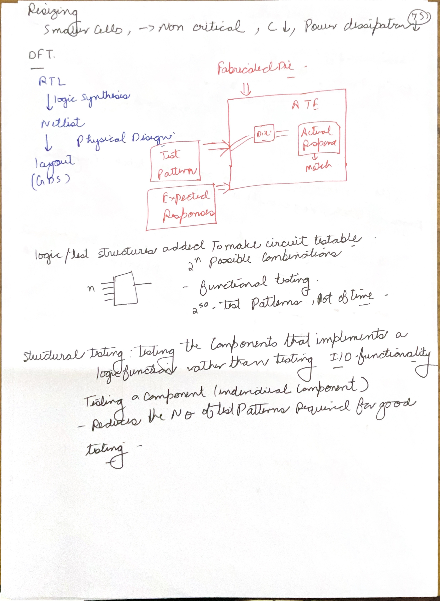](#day-07-index)

*Source: Scan C, PDF page 20. The lower DFT introduction continues in Lesson 39.*

A noncritical cell may be downsized to reduce area and capacitance, or exchanged for a higher-VT variant to reduce leakage. A smaller output driver often becomes slower, but its lower input capacitance can help the upstream stage. Measure the entire affected cone rather than treating area, power and delay as independent labels.

Suppose a path has +90 ps setup slack and a smaller cell adds 25 ps to its total maximum delay. It retains +65 ps under that corner. The replacement still needs checking in other modes/corners, for hold, electrical limits and physical legality. A power improvement evaluated with changed activity or supply conditions is not a controlled comparison.

The lower flow follows RTL through implementation and fabrication to testing by automatic test equipment (ATE). Design verification asks whether the intended design implements its specification. Manufacturing test asks whether a fabricated instance contains detectable defects. Applying input patterns and comparing responses can reject faulty chips even when the logical design was already formally verified.

Exhaustively enumerating $2^N$ input combinations becomes impractical as N grows, and sequential circuits add state/sequence complexity. DFT adds controllability and observability so structural test methods can target modeled defects efficiently. It is a planned part of design, not a final replacement for functional verification.

[Back to day index](#day-07-index)

## Lesson 39: Basic Concepts of DFT

Week 9 · [Lecture video](https://www.youtube.com/watch?v=1OoJG8CeFns) · [Back to day index](#day-07-index)

<!-- wrapup-frame-39 -->

[](#day-07-index)

*Lecture: [19:32 — A physical short becomes a testable logical model](https://www.youtube.com/watch?v=1OoJG8CeFns&t=1172s).*

The upper wire drawing shorts B to ground; the lower logic drawing represents that behavior as B stuck at zero. A=B=1 distinguishes good and faulty AND outputs. This modeling step makes pattern generation tractable, while its coverage remains conditional on how well the selected model represents the defect.

### C-21: Structural tests target a fault model

[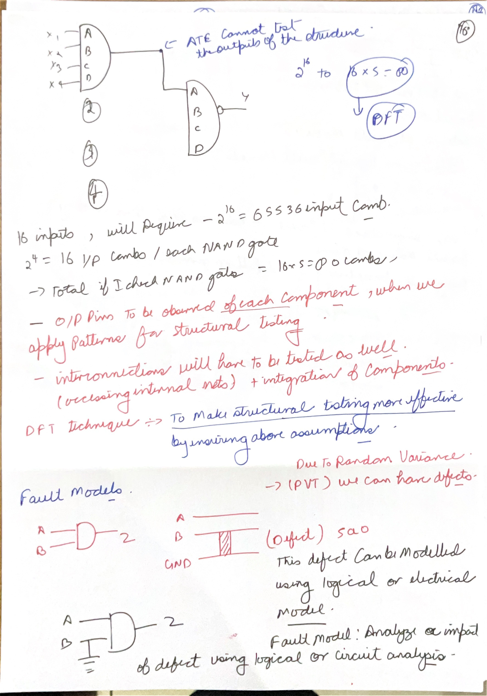](#day-07-index)

*Source: Scan C, PDF page 21.*

The comparison between 65,536 global combinations for 16 inputs and local testing of five four-input NAND gates illustrates why structure can help. A four-input gate has only 16 local input combinations. However, five times 16 is an illustrative amount of local work, not a guaranteed 80-vector test of an arbitrary connected circuit. Internal pins may not be independently controllable, and a gate's response may not be observable at an external output. Interconnect faults also need consideration.

A physical defect, such as a short to ground, can be represented by a logical stuck-at-zero fault when that model describes its observable behavior. The model is an abstraction that lets algorithms reason without solving the full analog device problem for every candidate defect. Opens, bridges and resistive defects may need other models; an open does not universally behave as one fixed Boolean value.

Single stuck-at ATPG assumes one modeled fault at a time. A set of patterns covering those faults does not guarantee detection of every multiple-defect combination or every delay, analog or memory failure. Coverage must always name its fault model and denominator.

Process variation can shift delay or leakage in otherwise connected devices; it should not be equated automatically with a random short/open defect. Manufacturing test may include parametric and at-speed checks alongside structural stuck-at tests. The value of DFT is making useful internal effects accessible to these test methods.

### C-22: Activate the fault and observe the difference

[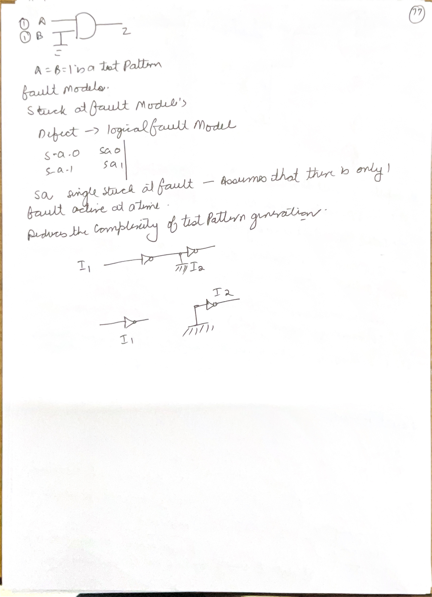](#day-07-index)

*Source: Scan C, PDF page 22.*

For an AND gate with B stuck at zero, set B=1 in the good circuit to activate the fault. Set A=1 so the other input does not mask it. The good output is 1; the faulty output is 0. If A=0, both outputs are zero and the defect remains invisible even though the good B value differs from the faulty B value.

This gives the three operations used throughout ATPG: activation creates a good/faulty difference at the fault site; propagation carries that difference toward an observable endpoint; justification finds primary-input or scan-state values that make the required internal assignments consistent.

Fault location matters. A stuck-at value on a stem affects every downstream branch; a fault on one fanout branch affects only that connection. Treating them as the same can produce an incorrect pattern or redundancy claim. The digital notebook later contains a branch fault, so its B signal remains valid on the other branch.

Controllability means how difficult it is to establish a desired internal value. Observability means how difficult it is to make a difference there influence a measured output. Both are structural properties under a specified test mode; neither is simply a count of input/output pins.

### C-23: Five NAND patterns and the counter-state problem

[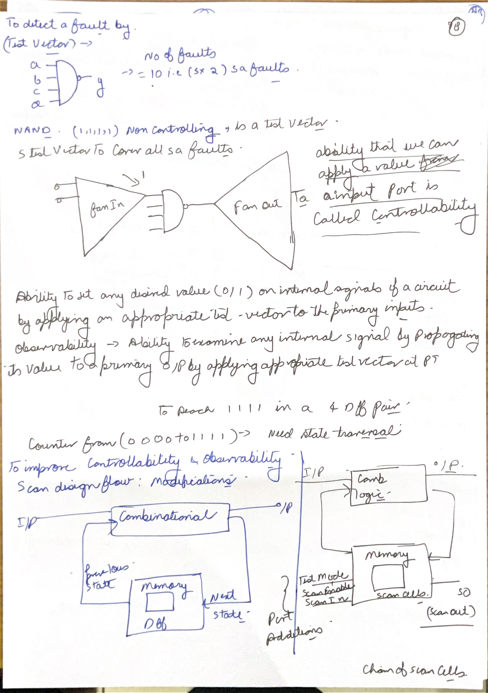](#day-07-index)

*Source: Scan C, PDF page 23.*

For a four-input NAND with faults modeled on its four inputs and output, there are ten single stuck-at faults before any collapsing. The vector 1111 produces output zero: any input stuck at zero or output stuck at one changes that response. Each vector with exactly one zero produces output one and detects that particular input stuck at one; such a vector also detects output stuck at zero. Thus 1111, 0111, 1011, 1101 and 1110 cover these ten modeled pin faults.

This compact set follows from the gate's function, not from testing every combination. In a larger circuit, producing each gate-input combination and observing its output can be difficult. Test points or scan structures address that difficulty.

A reset four-bit binary counter reaches 1111 after 15 increments. If those four storage elements form a scan chain, four shift cycles can directly load the desired state. This comparison illustrates state controllability. It does not imply that scan eliminates the clocks needed to capture the functional response or shift it out.

Full scan replaces eligible state elements with scan-capable versions and connects them into chains. Q pins become controllable pseudo-primary inputs to combinational ATPG; D pins become observable pseudo-primary outputs through capture and later shifting. The underlying combinational nodes remain internal and still require propagation paths.

[Back to day index](#day-07-index)

## Lesson 40: Scan Design Flow

Week 9 · [Lecture video](https://www.youtube.com/watch?v=7fGJto2F8JU) · [Back to day index](#day-07-index)

<!-- wrapup-frame-40 -->

[](#day-07-index)

*Lecture: [11:47 — SE selects the value captured at the next clock edge](https://www.youtube.com/watch?v=7fGJto2F8JU&t=707s).*

The scan mux chooses D in functional/capture mode and SI in shift mode. Q also feeds serial scan-out in this example. Preserving the storage role does not remove mux timing overhead. D-01 follows the old and new register values explicitly so scan loading and response bit order can be reconstructed.

### C-24: The scan mux chooses functional data or serial test data

[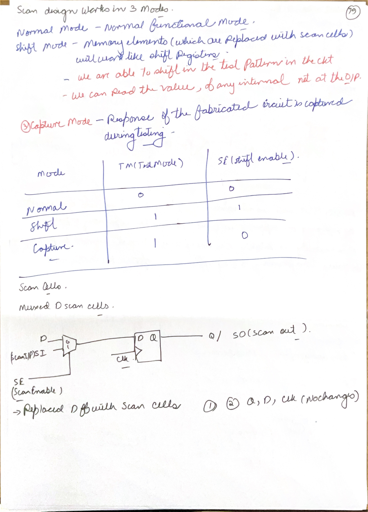](#day-07-index)

*Source: Scan C, PDF page 24.*

A muxed-D scan cell places a two-input selection in front of the storage element. With scan enable SE=0 it samples functional D. With SE=1 it samples scan input SI. CLK and Q still perform their storage roles, while Q commonly also supplies the next cell's scan input. A separate scan-out pin, if present, is cell-specific.

The source's mode table uses normal mode TM=0/SE=0, shift mode TM=1/SE=1 and capture mode TM=1/SE=0. TM represents the wider test-mode environment; SE controls this mux. Their exact behavior comes from the design's DFT architecture, so do not assume every chip uses two independent pins with those names.

Capture must select the functional data and apply the intended functional clock edge or edges. Keeping SE=1 would capture another serial shift, not the combinational response to the test state. Clock gating, resets and power-state controls may also require test overrides.

The functional pins are preserved conceptually, but scan insertion has overhead: additional mux circuitry/pin capacitance, altered cell timing, routing and test-control fanout. Verify functional equivalence in normal mode and test correctness in the scan modes.

#### A controllable scan state still needs an observable known response

Scan loading improves control of the sequential state, but a captured response can contain unknowns from uninitialized memories, unsupported analog behavior or an uncontrolled clock domain. If one response bit is expected to distinguish good=0 from faulty=1 and is instead masked, that bit provides no detection evidence for that pattern.

For example, an eight-bit response may compare seven known bits while masking bit 3. A fault whose only effect is on bit 3 is undetected by that comparison, even if the seven compared bits all match. Masking can prevent false test failures, but coverage analysis must use the same mask. Sending unknowns into an uncompensated XOR signature can also spoil more than one final bit, according to the compactor's recurrence.

Keep three facts separate: the scan pattern was loaded correctly, the fault effect reached a response point, and the tester actually compared that point under the test protocol. The scan mux addresses the first; ATPG and capture timing help establish the second; observation and masking determine the third. A functional simulation with forced known state cannot establish coverage for an uncontrolled production-test state.

### D-01: Follow the serial bits through shift, capture and readout

[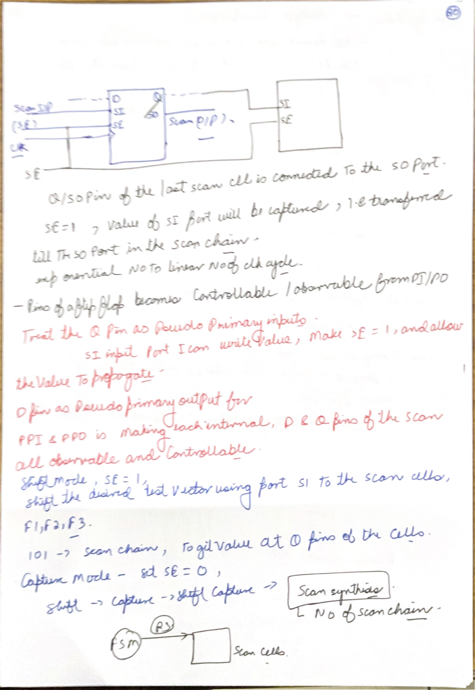](#day-07-index)

*Source: Scan D, PDF page 1.*

For SI→FF1→FF2→FF3→SO, one shift edge updates $Q_1'=SI$, $Q_2'=Q_1$ and $Q_3'=Q_2$ using the **old** register values. Starting from 000, the input sequence 1,0,1 produces states 100,010,101. The first serial bit travels furthest down the chain; a requested final state generally needs loading in reverse register order.

| Shift edge | SI | New Q1 Q2 Q3 |
|---|---:|---|
| Initial | — | 000 |
| 1 | 1 | 100 |
| 2 | 0 | 010 |
| 3 | 1 | 101 |

The palindrome 101 hides the reversal. To load Q1 Q2 Q3=110, use SI bits 0,1,1 instead. Once the desired scan state and primary inputs are established, switch to capture mode and clock the functional responses into the scan registers. Return to shift mode to read them out. The response initially in Q3 appears first at SO, then old Q2, then old Q1, under this chain convention.

Loading a new pattern while shifting out the previous response can overlap the two phases. A chain of N cells still needs approximately N shift edges per load/readout interval, plus capture overhead. Multiple balanced chains reduce the longest serial length but need corresponding tester channels or compression logic.

#### Count the first load and the final readout explicitly

For P patterns, a chain length N, and one capture edge per pattern, an unoverlapped procedure uses N load shifts, one capture, and N unload shifts each time: P(2N+1) edges. With overlap, unloading response i can also load pattern i+1. There are P length-N shift intervals to load all patterns, P capture edges, and a final length-N unload after the last capture:

$$
N_{\text{overlapped}}=(P+1)N+P.
$$

For P=1,000 and N=500, the complete totals are 1,001,000 edges without overlap and 501,500 with overlap. The often-used P(N+1)=501,000 estimate leaves out the final response readout. It is a useful steady-state approximation, but an exact test-time schedule must include the boundary operation.

For K equal parallel chains, replace N by the longest chain length, approximately ceil(total scan cells/K), when all chains shift concurrently. Capture cycles, tester bandwidth, decompression/compaction and unequal chain lengths can change the count. Shift and capture may also use different frequencies, so edge count alone is not elapsed time: multiply each phase's count by its own period.

### D-02: Scan insertion is a logical and physical flow

[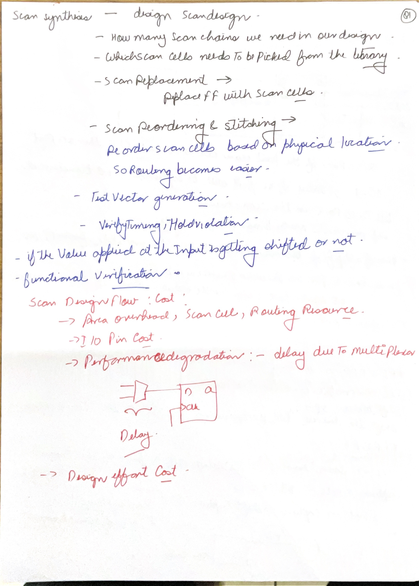](#day-07-index)

*Source: Scan D, PDF page 2.*

The flow checks scan eligibility and test controls, replaces eligible flops, stitches chains, generates patterns and verifies shift/capture operation. Physical placement can later reorder a chain to reduce wire length. The pattern ordering and chain description must be updated after such a reorder; a test sequence generated for the old serial order will load the wrong states.

Functional setup can be affected by the scan mux. Scan-shift hold is a separate concern because nearby flops may have a very short Q-to-SI path while their clock arrivals differ. Clock-domain boundaries, lockup elements and chain partitioning need the DFT flow's rules. A low shift frequency helps setup but does not by itself fix same-edge hold.

The tester cost depends on pattern count, chain length, shift frequency, capture requirements and compression. With 1000 patterns, a longest chain of 500 cells and one capture edge per pattern, overlapping each response's readout with the next pattern's loading gives about 501,000 edges, plus the final response readout and protocol overhead. Loading and unloading every pattern separately instead gives about 1,001,000 edges. Ten chains of roughly 50 cells can reduce serial depth, although tester I/O and test power can limit the benefit.

The added structures should improve modeled-fault access without breaking the normal mode. Functional equivalence, scan-chain integrity, test-mode timing and pattern simulation address distinct obligations.

[Back to day index](#day-07-index)

## Lesson 41: Power Analysis using OpenSTA

Week 9 tutorial · [Lecture video](https://www.youtube.com/watch?v=ZHk9e0KpHUY) · [Back to day index](#day-07-index)

<!-- wrapup-frame-41 -->

[](#day-07-index)

*Lecture: [11:34 — Read the internal-energy table before multiplying by activity](https://www.youtube.com/watch?v=ZHk9e0KpHUY&t=694s).*

The displayed toy table has different rise and fall event energies. At the shown first-row/first-column point, 1 and 2 fJ average to 1.5 fJ only under equal weighting of the two event types. Average power also needs their event rates. The tutorial's electrical/load conditions and its activity assumptions are separate inputs.

### Tutorial: Keep timing assumptions and activity assumptions separate

The tutorial loads a toy inverter library, design and SDC, specifies switching activity and reports power. The library supplies event-energy and leakage information; the SDC supplies electrical conditions such as slew and load; activity supplies how often events occur. Omitting any one of these changes the meaning of the result.

The displayed rise/fall tables have different values. A rising input to an inverter creates a falling output, so use the output-transition and related-pin convention defined by that library entry. Do not multiply a timing delay table by frequency and call it power. Delay entries measure time; internal-power tables characterize the appropriate event-energy/power quantity under the Liberty convention.

The course demonstrates manually specified activity. For a VCD-based extension in a supported current OpenSTA build, a representative sequence after loading/linking the design and constraints is:

```tcl
read_vcd -scope tb/dut activity.vcd
report_activity_annotation -report_unannotated
report_power
```

The [OpenSTA commands](https://opensta.readthedocs.io/en/latest/Commands/) describe `read_vcd`, its scope and optional time window. `tb/dut` must match the simulation hierarchy. A zero or unexpectedly small power result can come from unannotated signals or a reset-only window, rather than an extraordinarily efficient design.

To understand sensitivity, change one factor at a time: activity, load, slew or a justified operating voltage/library condition. Compare switching, internal and leakage contributions and retain the same workload and analysis corner when evaluating a design change. The notes describe and explain the tutorial; they do not claim a new local OpenSTA run or a measured silicon-power result.

[Back to day index](#day-07-index)

## Lesson 42: Automatic Test Pattern Generation

Week 10 · [Lecture video](https://www.youtube.com/watch?v=oOVaTWGkVy8) · [Back to day index](#day-07-index)

<!-- wrapup-frame-42 -->

[](#day-07-index)

*Lecture: [28:22 — Activation alone does not make a complete ATPG vector](https://www.youtube.com/watch?v=oOVaTWGkVy8&t=1702s).*

The highlighted stuck-at-one branch must have good value zero. The NAND producing it therefore needs A=B=1. Passing the difference through the final NAND requires its other input to be one, which the lower OR-plus-inverter path supplies with C=D=0. D-04 completes the vector and compares the final good/faulty outputs.

### D-03: Write both propagation paths and check reconvergence

[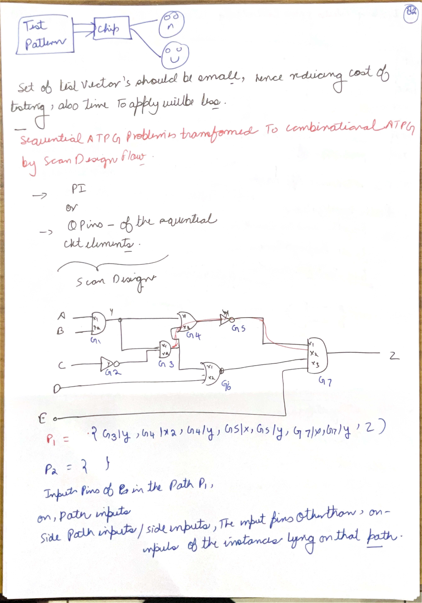](#day-07-index)

*Source: Scan D, PDF page 3.*

Full scan presents stored Q values as controllable inputs and D values as observable capture endpoints, reducing the sequential state-search problem to combinational ATPG for the scanned logic. It still needs an efficient search for consistent test assignments.

In this drawing G1 is AND, G2 is NOT, G3 is AND, G4 is OR, G5 is NOT, G6 is NOR and G7 is AND. Let $y=AB$ and $u=y\overline{C}$. Then G4 produces y+u, G5 produces its complement, G6 produces the complement of u+D, and:

$$
Z=\overline{y+u}\;\overline{u+D}\;E.
$$

The handwritten P1 follows G3/Y→G4/X2→G4/Y→G5/X→G5/Y→G7/X1→G7/Y→Z. P2 follows G3/Y→G6/X1→G6/Y→G7/X2→G7/Y→Z. A side input is every gate input not traversed by the chosen path. P1 needs G4/X1=y=0; P2 needs the other G7 input from G5 to be 1. The E side input must be 1 on either path.

For an **illustrative G3-output stuck-at-zero fault**, activation needs u=1, which requires y=1 and C=0. P1's y=0 side-input condition contradicts activation. P2 also fails: y=1 forces G5=0, masking the difference at G7. Algebra confirms that $u$ implies $y$, so the good function simplifies to $Z=\overline{y}\,\overline{D} E$. Replacing u by zero leaves that same function. The example therefore has a redundant G3-output stuck-at-zero fault under this model.

This fault assignment is an added worked example; the source page principally defines paths and side inputs. A G3-output stuck-at-one fault is different: with y=0, D=0 and E=1, good Z=1 and faulty Z=0. Redundancy is about a specified fault, not a gate being universally irrelevant in every fault model.

### D-04: Controlling values and a complete NAND test

[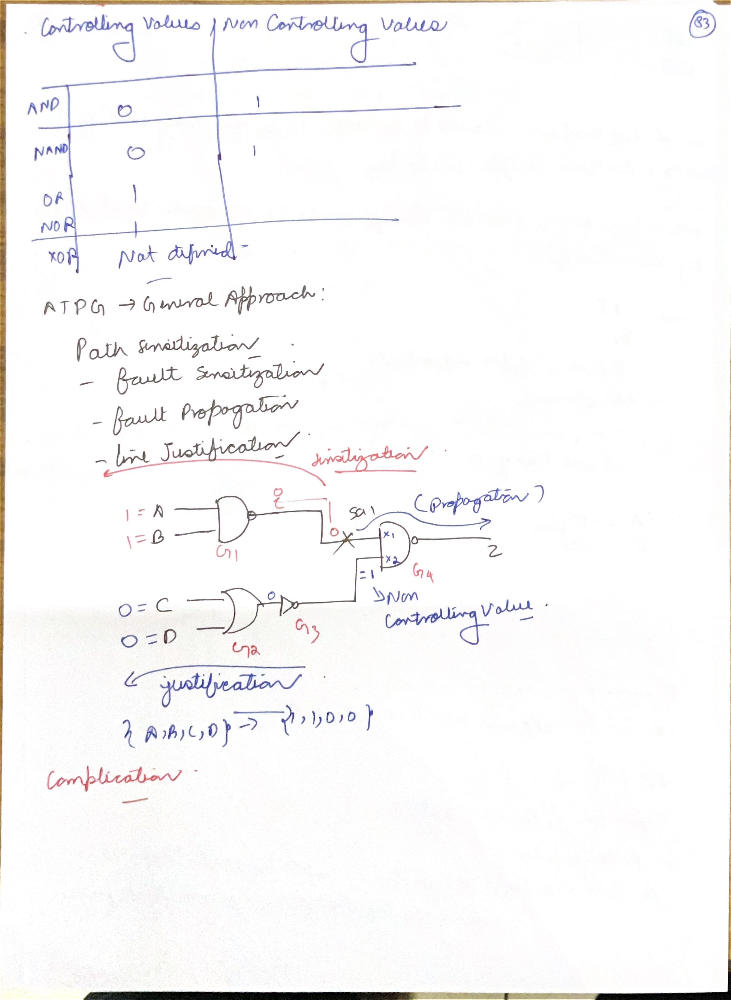](#day-07-index)

*Source: Scan D, PDF page 4.*

| Gate | Controlling input value | Noncontrolling side-input value |
|---|---:|---:|
| AND or NAND | 0 | 1 |
| OR or NOR | 1 | 0 |
| XOR or XNOR | No single controlling value | Either fixed value passes or inverts the difference |

“Controlling” refers to a value that determines the gate output irrespective of its other inputs. NAND has controlling input zero even though the resulting output is one. Propagation uses noncontrolling side inputs so the fault effect can determine the output.

For the page's NAND(A,B) output stuck at one, activation sets A=B=1, making its good value zero and faulty value one. To propagate through the final NAND, its other input must be one. That input is NOR(C,D), so justification sets C=D=0. The complete vector A B C D=1100 gives final good output one and faulty output zero. If either C or D is one, the final NAND's side input becomes zero and masks the fault.

The vector is successful because activation, propagation and justification agree on every assigned signal. An algorithm that finds one contradiction should backtrack a decision and try another legal branch; it cannot declare the fault redundant until it has established that no permitted test exists.

### N-01: Backtrack the failed Y path and detect the fault at Z

[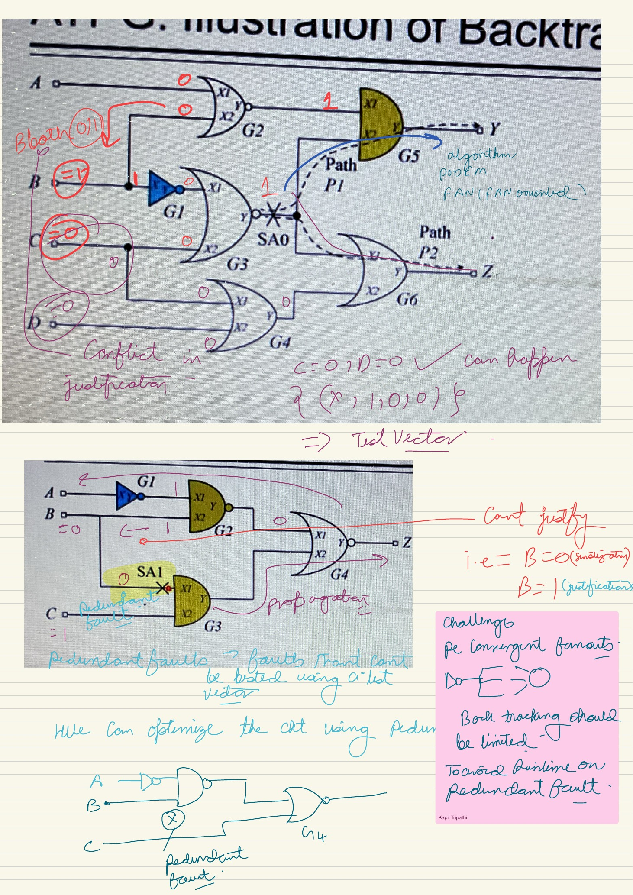](#day-07-index)

*Source: Notebook ATPG, PDF page 1. This additional one-page notebook is preserved independently of Scans C–E.*

In the top network, G1=NOT(B), G2=NOR(A,B), G3=NOR(NOT(B),C), G4=OR(C,D), G5=AND(G2,G3)→Y and G6=OR(G3,G4)→Z. Therefore G3's good output is $B\overline{C}$. Consider its output stuck at zero.

Activation requires B=1 and C=0. Propagation toward Y through an AND requires G2=1, which would require A=0 and B=0. That conflicts with B=1. The Y route fails. It does **not** prove the fault is untestable, because G3 also reaches Z.

For Z, its other OR input G4 must be zero, requiring C=0 and D=0. Those assignments agree with activation. A remains unrestricted. Thus a test cube is A=X, B=1, C=0, D=0. Good G3=1 and good Z=1; faulty G3=0 and faulty Z=0. G2=0 and Y=0 in both circuits, confirming that Y does not carry the effect.

| Requirement | Assignment | Result |
|---|---|---|
| Activate G3-output sa0 | B=1, C=0 | G3 good/faulty = 1/0 |
| Try Y propagation | G2=1 needs B=0 | Conflict; abandon this route |
| Try Z propagation | G4=0 needs C=0, D=0 | Consistent |
| Observe Z | A arbitrary, B=1, C=0, D=0 | Z good/faulty = 1/0 |

In the lower network, G1=NOT(A), G2=NAND(NOT(A),B), G3=AND(B,C), and Z=NOR(G2,G3). The fault is **B's branch into G3 stuck at one**, while the B input of G2 remains unaffected. Activation needs good B=0. Passing the difference through G3 needs C=1. Passing it through the final NOR needs G2=0, which requires NOT(A)=1 and B=1. The required B values conflict, and there is no alternative output route for this branch.

The proof is stronger than one failed search: good $Z=\overline{A} B\overline{C}$; with the faulty G3 input, G3=C and faulty Z still equals $\overline{A} B\overline{C}$. All eight A/B/C assignments produce identical outputs. This particular branch fault is redundant in the specified combinational model.

A proven redundant fault can suggest a logic simplification: replacing that G3 branch input with constant one makes G3=C while preserving Z. Check the complete design and any other observation points before applying such a transformation. An ATPG timeout or exhausted backtrack budget means **aborted/unresolved**, not logically proven redundant. Keep those categories separate when calculating coverage.

**Day 07 recall:** distinguish energy from power; state the activity convention; trace safe clock gating and power-state sequencing; load a nonpalindromic scan pattern; and justify an ATPG result using both good and faulty behavior.

[Back to day index](#day-07-index)
