# Day 08: BIST, physical foundations and chip planning

Lessons 43–48 · Weeks 10–11. Source pages D-05–D-21.

## Day 08 index

- [Lesson 43: Built-in Self-Test](#lesson-43-built-in-self-test)
- [Lesson 44: Basic Concepts of Physical Design I](#lesson-44-basic-concepts-of-physical-design-i)
- [Lesson 45: Basic Concepts of Physical Design II](#lesson-45-basic-concepts-of-physical-design-ii)
- [Lesson 46: Installation of OpenROAD](#lesson-46-installation-of-openroad)
- [Lesson 47: Chip Planning I](#lesson-47-chip-planning-i)
- [Lesson 48: Chip Planning II](#lesson-48-chip-planning-ii)

[Master index](../README.md) · [Handwritten page index](../Resources/Handwritten%20Index.md) · [Sources](../Resources/Sources.md)

## Lesson 43: Built-in Self-Test

Week 10 · [Lecture video](https://www.youtube.com/watch?v=iT_lXRDUdZI) · [Back to day index](#day-08-index)

<!-- wrapup-frame-43 -->

*Lecture: [20:27 — Pseudorandom sequences are repeatable, not independent randomness](https://www.youtube.com/watch?v=iT_lXRDUdZI&t=1227s).*

The LFSR diagram feeds selected state bits back through XOR logic. Its seed, taps, bit order and update convention determine the entire sequence. D-07 enumerates the seven-state handwritten example; D-08 explains why compressing responses into a signature can alias even when the generator is repeatable.

### D-05: Move selected test functions onto the chip

[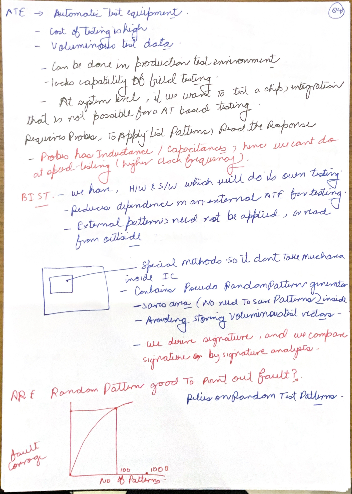](#day-08-index)

*Source: Scan D, PDF page 5.*

BIST adds circuitry that generates stimuli, applies them to the circuit under test and evaluates responses. It can reduce dependence on externally supplied patterns and enable repeatable testing in the field. It does not eliminate every manufacturing-test instrument: supplies, interfaces, analog measurements and unsupported fault classes can still require external equipment.

The ATE comparison concerns cost and access as well as speed. Sending every internal response over package pins can consume bandwidth and tester time. On-chip generation and observation can exercise local paths efficiently, including at-speed operation when the architecture supports it. ATE can also support at-speed tests; probe and interconnect parasitics are a reason to consider on-chip methods, not a universal proof that external testing is incapable of them.

Random or pseudorandom patterns often detect easy faults quickly, followed by a long tail of difficult faults. The coverage curve's early steep rise does not establish 100% coverage. Some faults need rare input conditions or propagation through strongly biased logic. Increase pattern count, modify testability, add weighted patterns or supplement deterministic patterns according to the fault analysis.

Costs include generator/analyzer area, muxes, routing, control and test power. Logic BIST and memory BIST can require different generators and algorithms. Evaluate the intended circuit and fault model rather than treating one LFSR as a complete test strategy for every block.

### D-06: The BIST blocks each have a specific role

[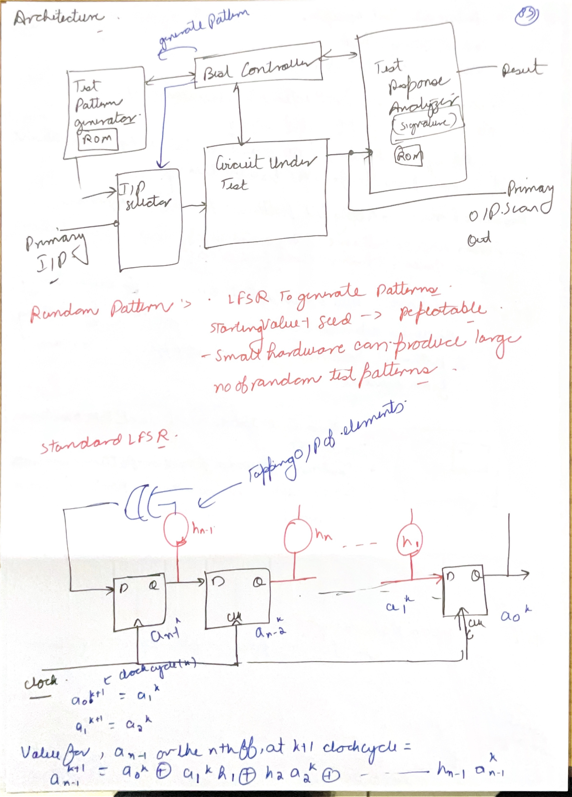](#day-08-index)

*Source: Scan D, PDF page 6.*

The test-pattern generator drives the circuit under test through a selector that separates normal and test sources. The response analyzer compacts observed responses. A controller initializes the generator/analyzer, sequences clocks and modes, counts tests and compares the final signature with an expected fault-free signature.

The golden signature depends on the exact design, initial state, polynomial, bit ordering, response alignment and pattern count. Comparing two signatures from different configurations is meaningless. Unknown/uninitialized responses also need an explicit handling strategy; uncontrolled X values can corrupt a digital signature computation.

A linear feedback shift register (LFSR) shifts stored bits and feeds back an XOR of selected taps. Because it is linear over GF(2), the sequence is deterministic once its state and recurrence are known. GF(2) is the two-element field: addition is XOR and multiplication is AND. The displayed stages illustrate this recurrence, rather than a source of independent random numbers. A primitive feedback polynomial and a valid nonzero seed can produce a maximal-length sequence for the chosen convention; arbitrary taps do not guarantee that property.

Separate reset/seed control from normal operation. With XOR feedback, an all-zero state shifts back to zero and cannot escape on its own. A seed of all zeros would therefore provide no useful changing stimuli in the basic circuit shown.

### D-07: Work out the seven-state LFSR and the rare-pattern problem

[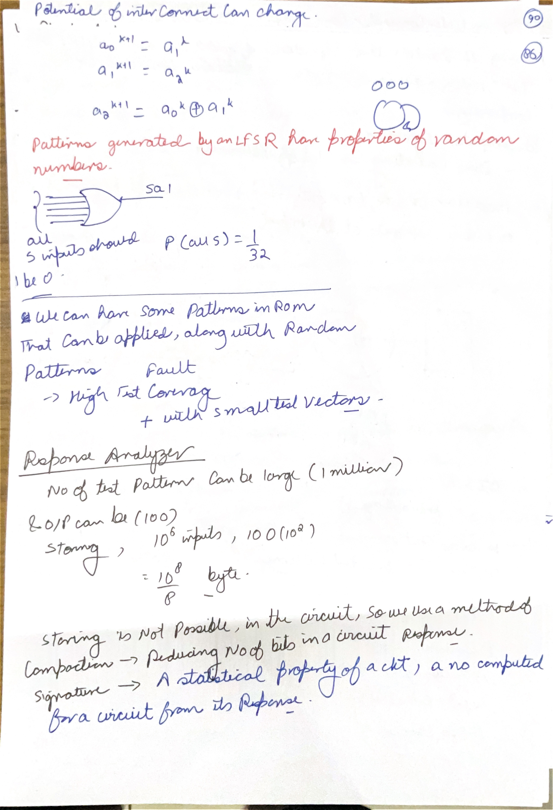](#day-08-index)

*Source: Scan D, PDF page 7.*

Using the page's convention $(q_0',q_1',q_2')=(q_1,q_2,q_0\oplus q_1)$, seed 001 generates:

| Step | q0 q1 q2 |
|---|---|
| 0 | 001 |
| 1 | 010 |
| 2 | 101 |
| 3 | 011 |
| 4 | 111 |
| 5 | 110 |
| 6 | 100 |
| 7 | 001 again |

All seven nonzero states occur before repetition; 000 is absorbing. Reversing the displayed bit order can produce a different-looking sequence, so write the recurrence before checking it.

For a five-input OR output stuck at one, the good output must be zero to activate a difference. That requires 00000. Under independent uniform random input vectors its probability is 1/32, and the probability of missing it after m independent tests is $(31/32)^m$. At m=100, miss probability is about 4.18%; at m=200, about 0.175%. These probabilities describe the stated random model, not independent draws from a deterministic finite LFSR stream.

The response-volume example has one million patterns and 100 observed bits per pattern: $10^8$ bits, or 12.5 MB using decimal bytes. Response compaction reduces stored or transmitted data dramatically, but introduces aliasing. A hybrid strategy can use pseudorandom patterns for broad coverage and deterministic patterns for resistant faults.

### D-08: Signature compression trades data volume for aliasing risk

[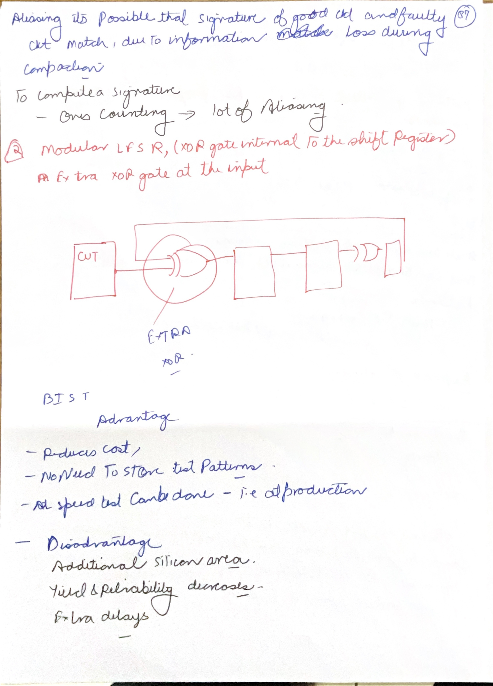](#day-08-index)

*Source: Scan D, PDF page 8.*

Compaction maps many possible response sequences into a small signature space. With an m-bit signature there are only $2^m$ results, so distinct long response streams must sometimes collide. A defective circuit can therefore produce the same final signature as the good circuit: aliasing.

A simple count of ones loses both bit ordering and timing information. Streams 0011 and 1100 have the same count although their sequences differ. An LFSR-based serial analyzer incorporates time/order through its recurrence. A multiple-input signature register (MISR) accepts multiple response bits into different feedback stages, making parallel response compaction possible; its structure and recurrence must be specified rather than assumed identical to a one-input LFSR.

An often-used approximate alias probability is $2^{-m}$ under suitable idealized assumptions about error streams and the compactor. For m=16 this is about 1 in 65,536; for m=32 about 1 in 4.29 billion. It is not a guarantee for every structured error, polynomial or pattern set. Simulating the modeled faults through the actual analyzer establishes more relevant coverage.

DFT logic itself can have defects and needs appropriate test treatment. Area, timing and verification costs do not automatically mean functional reliability is reduced; well-designed BIST can improve fault detection in service. The tradeoff concerns implementation overhead, test coverage, aliasing and system requirements.

#### Construct an actual signature collision

Use a small serial two-bit analyzer to make aliasing visible. This is an authored recurrence, not a transcription of the page's multi-input circuit. Let state (s0,s1) start at (0,0), accept one response bit r per cycle, and update simultaneously as $s_0'=s_1$ and $s_1'=s_0\oplus s_1\oplus r$.

| Response stream | State after bit 1 | After bit 2 | Final state |
|---|---|---|---|
| 000 | 00 | 00 | 00 |
| 001 | 00 | 00 | 01 |
| 111 | 01 | 10 | 00 |

Streams 000 and 111 differ at every response bit but have the same final signature. Order and feedback preserve more information than a ones count, yet two bits cannot uniquely encode all eight three-bit streams.

For this exact linear recurrence, the zero-signature error streams are 000 and 111. Among the seven **nonzero**, equally likely three-bit error streams, one aliases, giving 1/7. If all eight errors are equally likely, including no error, the probability of the zero signature is 2/8=1/4. This distinction explains why a quoted $2^{-m}$ estimate needs a specified distribution and conditioning. Fault-generated errors need not be equally likely. Coverage requires propagating those modeled errors through the actual analyzer and comparison schedule.

[Back to day index](#day-08-index)

## Lesson 44: Basic Concepts of Physical Design I

Week 10 · [Lecture video](https://www.youtube.com/watch?v=r0rianLiAg4) · [Back to day index](#day-08-index)

<!-- wrapup-frame-44 -->

*Lecture: [12:42 — A patterned mask selects where dopants enter](https://www.youtube.com/watch?v=r0rianLiAg4&t=762s).*

The cross-sections show donor and acceptor implantation through exposed regions, with photoresist protecting others. The beam acceleration/filtering and subsequent annealing serve different purposes: place the desired ions, then activate dopants and repair process damage. D-09 relates this device formation to FEOL and distinguishes it from BEOL wiring.

### D-09: FEOL forms devices; BEOL connects them

[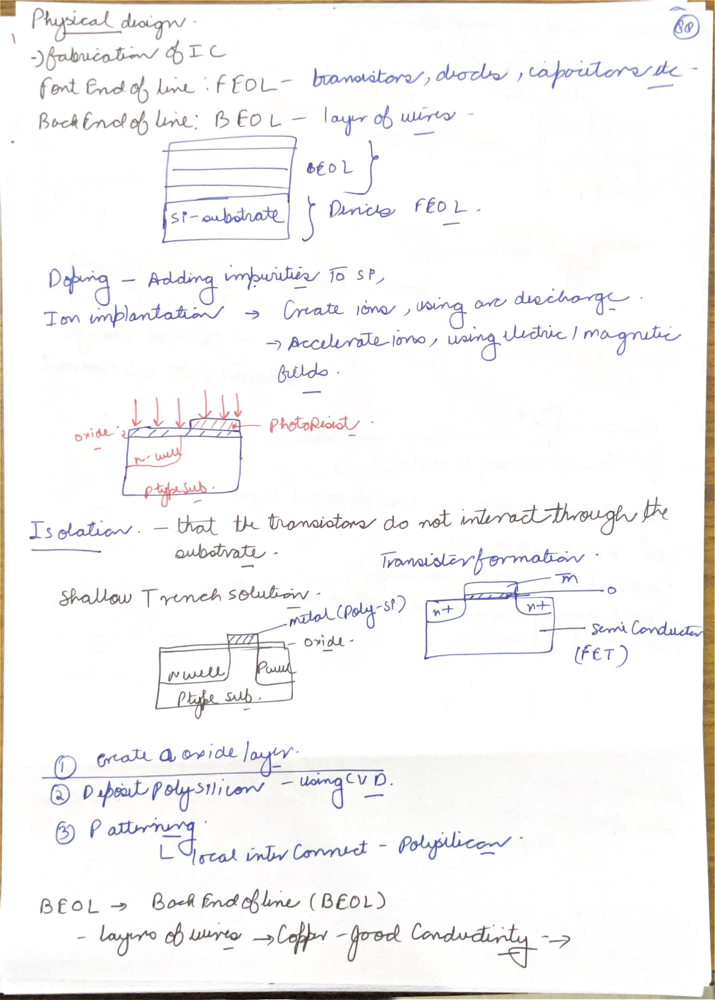](#day-08-index)

*Source: Scan D, PDF page 9.*

Front-end-of-line processing forms transistor structures in and above the semiconductor. Back-end-of-line processing forms the interconnect stack that connects device terminals and cells. The distinction is physical manufacturing sequence, rather than the RTL-versus-layout meaning of “front end” and “back end” used in design teams.

Ion implantation introduces selected dopants by accelerating ions toward exposed regions. Electric fields accelerate charged ions; magnetic mass selection helps choose the desired ion species. A patterned mask controls where implantation can occur, and subsequent thermal processing can activate dopants and repair damage. The desired dopant concentration/profile changes device characteristics.

The page's oxide and polysilicon sequence is a teaching picture of a conventional process. Modern technologies can use high-k dielectrics, metal gates and different device geometries. Preserve the process-specific distinction: not every current chip literally follows the same poly-gate cross-section.

Isolation structures, gate formation, source/drain formation and contacts have geometric constraints that become layout rules. Standard-cell designers encapsulate those detailed structures in verified cells. A digital physical-design flow normally places those cells and connects their pins rather than drawing each transistor from scratch, while signoff still needs the complete manufacturing geometry.

### D-10: Wire dimensions set resistance and manufacturing behavior

[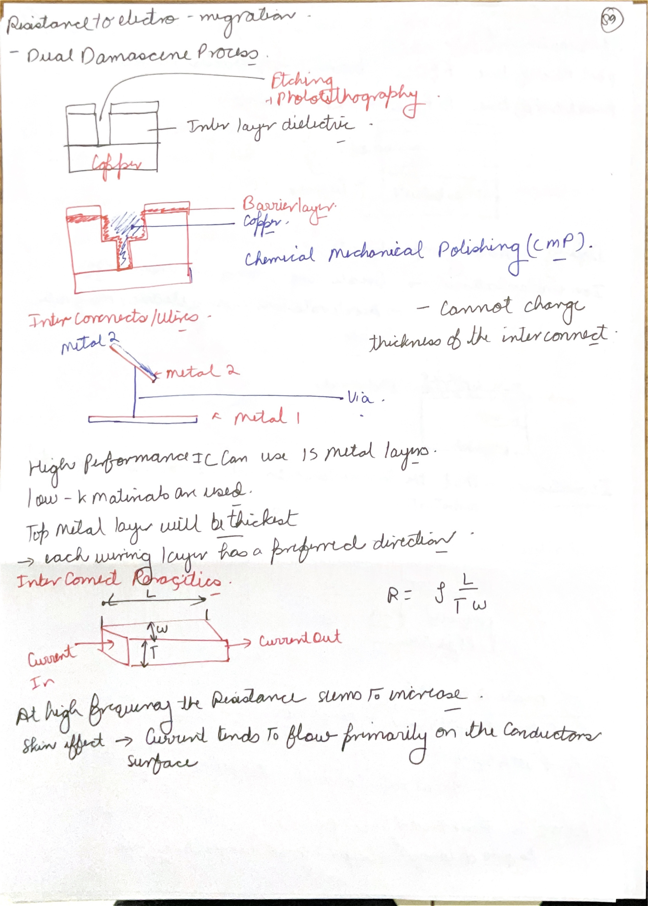](#day-08-index)

*Source: Scan D, PDF page 10.*

Copper damascene processing forms trenches/via openings in dielectric, fills them with conductive material and removes excess material using chemical-mechanical polishing. Barrier/liner materials and process details affect the actual electrical dimensions. Vias connect adjacent metal levels; a logical layer change requires a legal physical via structure.

The basic uniform-wire model is $R=\rho L/(WT)$. Longer wire increases resistance; larger cross-sectional area reduces it. The routing layer's thickness is established by the process. A router can choose an allowed layer and legal width; it does not independently choose an arbitrary thickness for one wire. The notes' many-metal-layer stack is an example, not a fixed count across technologies.

For an illustrative resistivity $2\times10^{-8}$ Ωm, L=100 µm, W=0.2 µm and T=0.4 µm, resistance is 25 Ω. This ideal bulk calculation excludes vias, size effects and liners. Wider wire halves that ideal resistance if thickness remains unchanged, but can consume more routing space and increase capacitance.

Skin effect is frequency-dependent current crowding. Whether it materially affects a particular on-chip net depends on geometry and frequency; it should not replace ordinary RC reasoning by default. The technology's extraction and reliability models govern the implementation.

### D-11: Capacitance comes from several geometric relationships

[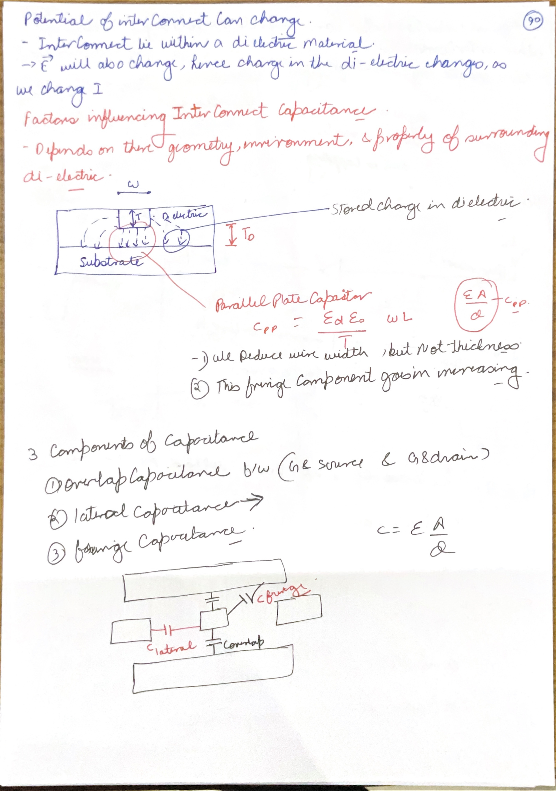](#day-08-index)

*Source: Scan D, PDF page 11.*

The parallel-plate expression $C=\epsilon A/d$ explains why larger facing area, smaller dielectric separation and higher permittivity tend to increase capacitance. Real routed wires also have fringing fields, lateral coupling to neighbors and cross-layer overlap. A single plate model is therefore intuition, not a complete extraction formula.

Two neighboring wires with a small gap can have substantial lateral coupling. A wire passing above another conductor adds overlap and fringe contributions. Changes in width can alter both the absolute capacitance and the fraction attributable to each field component. Narrower does not mean every contribution scales proportionally with width.

Device gate-drain overlap is an internal transistor capacitance. Cross-layer interconnect overlap is a different geometric contribution. They can both appear in a complete circuit's capacitive behavior, but must be accounted for at the correct library-versus-parasitic boundary.

RC delay depends on where resistance and capacitance occur along a distributed network, not only on their totals. Coupling capacitance further depends on neighboring transitions when computing effective timing effects. That is why physical extraction uses geometry-aware models, and why the next lesson treats aggressor/victim behavior separately from a fixed grounded-load estimate.

[Back to day index](#day-08-index)

## Lesson 45: Basic Concepts of Physical Design II

Week 10 · [Lecture video](https://www.youtube.com/watch?v=uIZ7hVuZGHA) · [Back to day index](#day-08-index)

<!-- wrapup-frame-45 -->

*Lecture: [24:47 — Glitch amplitude depends on the electrical environment](https://www.youtube.com/watch?v=uIZ7hVuZGHA&t=1487s).*

The quiet victim is coupled to the switching aggressor through Cc and to a reference through its ground capacitance. Faster aggressor edges and greater coupling tend to increase disturbance; greater victim capacitance or restoring drive can reduce the voltage excursion. D-13 derives a capacitive-divider approximation and states where it stops being sufficient.

### D-12: Coupling acts on the difference between two voltages

[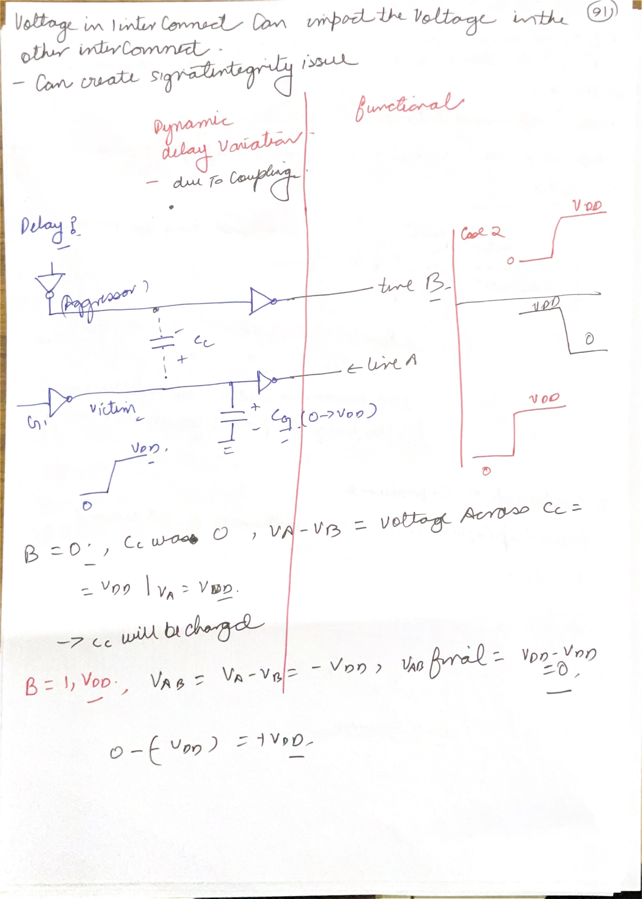](#day-08-index)

*Source: Scan D, PDF page 12.*

For coupling capacitor $C_c$ between victim A and aggressor B, the victim-side current is proportional to $C_c\,d(V_A-V_B)/dt$. The relevant voltage is their difference, not V_A alone. This gives the page's simplified Miller-factor interpretation.

If both lines rise together by the same amount at the same rate, their voltage difference stays approximately constant and that coupling component demands little incremental charge: an effective factor near zero. If the victim rises while the aggressor stays fixed, the difference changes by VDD: factor near one. If the victim rises while the aggressor falls, the difference changes by 2VDD: factor near two, slowing the victim under the simple model.

The **physical capacitance has not changed**. The driver sees a different current demand because the neighbor's waveform changes. Partial temporal overlap, unequal edge rates, different swing and resistive effects produce intermediate or more complex behavior; zero/one/two are teaching limits.

For a victim with 20 fF ground capacitance and 5 fF coupling, the simplified effective capacitive loads are 20, 25 and 30 fF for the three cases. A timing analyzer needs aggressor windows and coupling-aware modeling to evaluate which interaction can occur during a real path transition.

### D-13: A quiet victim can receive a noise pulse

[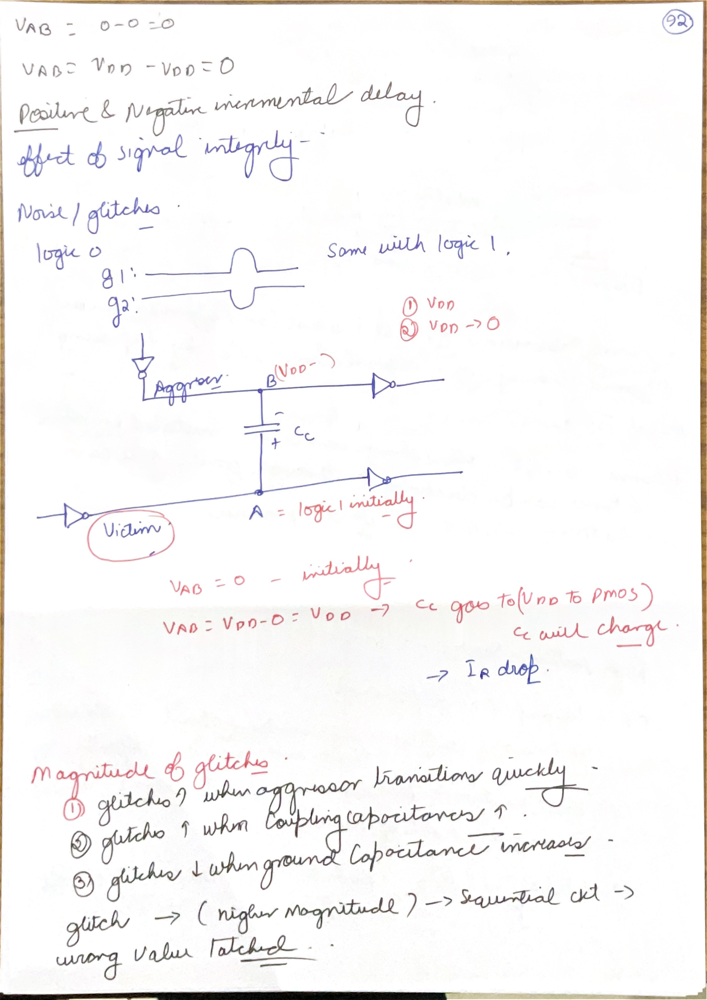](#day-08-index)

*Source: Scan D, PDF page 13.*

When an aggressor switches beside a nominally quiet victim, displacement current through the coupling capacitance can move the victim voltage. A rising aggressor can lift a low victim; a falling aggressor can pull a high victim downward. A receiver can misinterpret the pulse if its amplitude and duration are sufficient in a relevant observation window.

For an initially floating victim with ground capacitance $C_g$, a fast aggressor step gives the capacitive-divider estimate $\Delta V_v\approx C_c\Delta V_a/(C_g+C_c)$. With Cc=5 fF, Cg=20 fF and a 1 V step, the initial shift is about 0.2 V. A real driven net has a restoring conductance, so the peak and decay depend on driver resistance, edge rate and distributed geometry.

A stronger victim driver can reduce the disturbance by restoring voltage faster. Greater spacing reduces coupling; a shield changes the electric-field environment but also adds load and must connect to an appropriate reference. Slowing an aggressor may reduce peak coupling current but can worsen its own timing or short-circuit power. These changes require a timing/noise tradeoff.

Noise and delay are distinct effects of the same coupling mechanism. A switching victim experiences altered delay; a quiet victim experiences an unwanted pulse. Check both, and consider the receiver's threshold and temporal sensitivity rather than declaring any visible glitch a guaranteed functional failure.

#### Separate a noise pulse from a captured logical failure

In a deliberately simplified fast-edge model, a temporarily floating victim with 20 fF ground capacitance and 5 fF coupling receives a step from a 1 V aggressor. Charge sharing gives a victim excursion of $5/(20+5)\times1=0.2$ V. This assumes negligible restoration during the edge; an actively driven victim and distributed wire need a more complete model.

Compare three questions. Did the victim voltage move? Does it cross the receiving cell's relevant threshold long enough to propagate? Does the resulting disturbance overlap a sampling or clock-sensitive interval? A 0.2 V pulse below an assumed 0.5 V switching threshold would not switch that particular ideal receiver. That conclusion is conditional on the threshold/model, not a technology noise limit.

Even a pulse that propagates through combinational logic may disappear before a register's sampling window. Conversely, a pulse on a clock or asynchronous control can affect state without waiting for the ordinary data sampling edge. This is why peak amplitude alone is insufficient. Coupling, slew, driver strength, pulse width, receiver behavior and temporal alignment connect the electrical event to functional risk. The earlier zero/one/two Miller factors concern current demand on a switching victim; this example concerns noise on a quiet victim.

### D-14: Antenna rules and LEF describe different physical obligations

[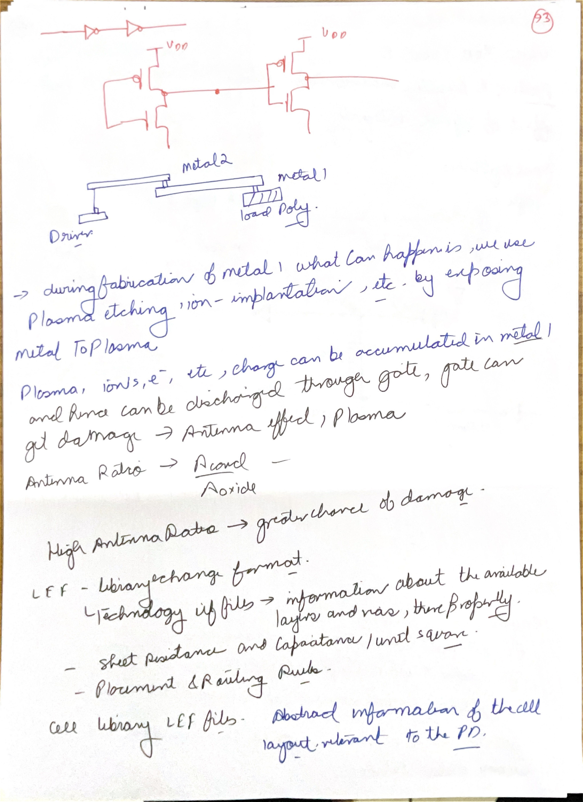](#day-08-index)

*Source: Scan D, PDF page 14.*

During fabrication, a conductor connected to a thin gate oxide can collect plasma-induced charge before later layers complete a discharge path. Excess voltage across the oxide can damage it. The “antenna” is therefore a process-stage charge-collection problem, not an intended radio antenna operating in the finished chip.

Antenna ratios relate specified conductor area/perimeter measures to connected gate-oxide/diffusion measures under foundry rules. They can be layer-specific and cumulative across process stages. A long wire is a warning sign, but length alone is not a complete antenna check.

A jumper to a later metal layer can break up the exposed conductor at an earlier manufacturing stage. An antenna diode can provide a discharge path when the process/model allows it. Either repair must satisfy electrical, geometric and timing constraints; a diode adds capacitance and placement/routing demand.

Technology LEF describes routing layers, vias, sites and abstract rules needed by implementation tools. Cell/macro LEF describes footprints, abstract pin geometry and obstructions. It deliberately omits much transistor-level detail. Liberty supplies logical/electrical cell models; GDS/OASIS supplies detailed manufacturing geometry; DEF describes a design's placement/routing arrangement. Choosing the correct file for a task prevents treating an abstract footprint as a complete cell layout.

[Back to day index](#day-08-index)

## Lesson 46: Installation of OpenROAD

Week 10 tutorial · [Lecture video](https://www.youtube.com/watch?v=FGpM8YYS6ic) · [Back to day index](#day-08-index)

<!-- wrapup-frame-46 -->

*Lecture: [2:48 — The installation tutorial provisions dependencies in WSL](https://www.youtube.com/watch?v=FGpM8YYS6ic&t=168s).*

This actual tutorial frame shows dependency packages being fetched in its Ubuntu/WSL environment. It is evidence of the demonstrated setup stage, not a new install on this computer. Matching a tool revision and its supported dependencies is necessary before checking a sample design; the current official setup documentation is linked below.

### Tutorial: Separate the executable from a runnable design environment

The course tutorial introduces OpenROAD for the physical-design stages and demonstrates a WSL-based setup using the official repository and its dependencies. A recursive checkout includes required submodules; a successful checkout alone is not a successful build. Likewise, a working executable alone does not provide the process libraries, design netlist or flow configuration.

For a reproducible environment, identify the tool revision, supported operating environment, build/install method and technology files. Use the current [official build instructions](https://openroad.readthedocs.io/en/latest/main/README.html) and the [OpenROAD Flow Scripts tutorial](https://openroad-flow-scripts.readthedocs.io/en/latest/tutorials/FlowTutorial.html), because dependencies and command options change. The video is a record of the course environment, not a promise that its historical installation commands work unchanged today.

The practical milestone is loading a known small design with matching Liberty/LEF and inspecting the expected database/report, then saving a checkpoint that can be reopened. This study wrap-up reviews the demonstrated workflow; it does not install a new toolchain or claim a new physical implementation run.

[Back to day index](#day-08-index)

## Lesson 47: Chip Planning I

Week 11 · [Lecture video](https://www.youtube.com/watch?v=37Hf_q6IhAs) · [Back to day index](#day-08-index)

<!-- wrapup-frame-47 -->

*Lecture: [22:11 — Budget one complete cross-block transfer](https://www.youtube.com/watch?v=37Hf_q6IhAs&t=1331s).*

The frame follows FF1 through B1, inter-block logic/wire and B3 to FF2. Block-level SDC must describe the time already spent before an input and needed after an output. D-15 allocates an explicit 2 ns path budget; assigning every block the full period would count available time more than once.

### D-15: Hierarchy needs interface budgets, not just partitions

[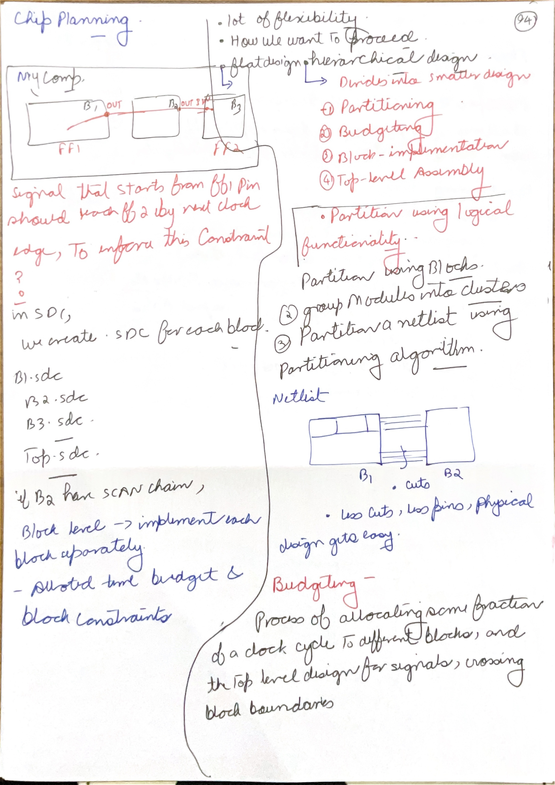](#day-08-index)

*Source: Scan D, PDF page 15.*

A hierarchical flow partitions a large design into blocks that can be implemented with their own constraints and then assembled. Fewer cross-block nets generally reduce interface complexity, but partitioning must also respect critical datapaths, clock domains, power domains and macro placement. Cutting a high-speed path in the wrong place can make independent block closure misleading.

At an interface, an input-delay budget represents the preceding block plus connecting interconnect; an output-delay budget represents the following interconnect and receiver requirement. Include launch/capture clock relationships, clock-to-Q, setup/hold and margins consistently. Assigning each block the full chip period would double-spend the available time.

For a 2 ns register-to-register path with 0.1 ns clock-to-Q, 0.1 ns setup and 0.2 ns uncertainty, the remaining data budget is 1.6 ns before relevant skew adjustments. If inter-block wire consumes 0.3 ns, only 1.3 ns remains for the blocks' combinational logic. A 0.7/0.6 ns division is feasible under those assumptions; giving each block 1.6 ns is not.

Block-level closure is conditional on the agreed interface environment. Recheck top-level timing with actual block models and interconnect after assembly. The interface budgets should evolve when measured implementation conditions replace early estimates.

### D-16: Floorplanning defines the space available for implementation

[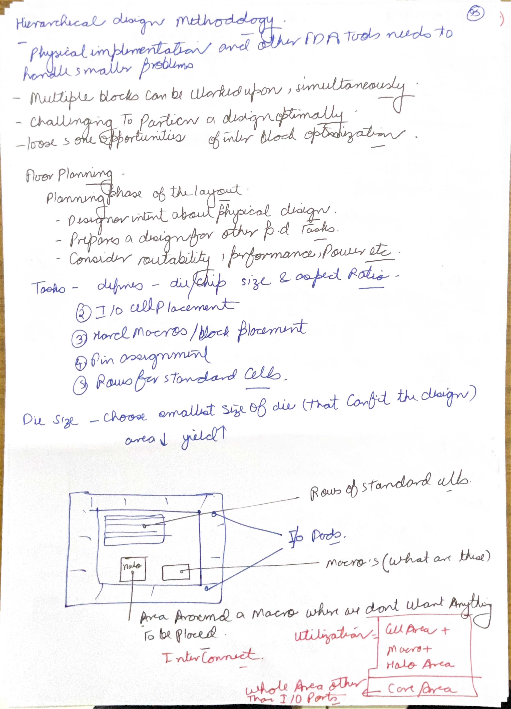](#day-08-index)

*Source: Scan D, PDF page 16.*

Hierarchy supports parallel work and reuse, and makes a large implementation problem more manageable. It can also limit optimization across boundaries and force conservative interface assumptions. Those tradeoffs explain why neither a fully flat nor a deeply partitioned approach is universally best.

Floorplanning sets die/core geometry, large-block positions, I/O relationships, standard-cell rows and available placement regions. Hard macros such as an SRAM have fixed physical footprints/pins for a chosen implementation. Standard cells are subsequently placed in the rows left available around those objects.

Utilization requires a precise denominator. Standard-cell utilization commonly compares standard-cell area with the eligible standard-cell placement area after the relevant macro/blockage exclusions. A raw cell-area/core-area ratio may be a different floorplan summary. State which quantity a tool or report uses.

For an illustrative 10,000 µm² core with 2000 µm² of macros and 500 µm² of excluded halo/blockage area, 4500 µm² of standard cells occupy 60% of the remaining 7500 µm², although they occupy 45% of the total core. The implementation must also leave space for clock buffers, timing repair, fillers/taps where appropriate and routing access. Initial synthesis cell area is not necessarily final placed cell area.

### D-17: Utilization, I/O direction and package access

[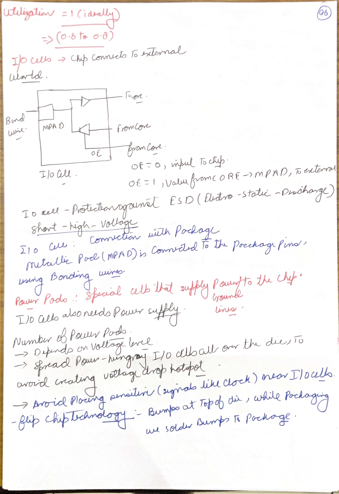](#day-08-index)

*Source: Scan D, PDF page 17.*

At 100% placement utilization, little flexibility remains for legalization, buffer insertion and local congestion repair. That density is not an ideal general target even though compact area is desirable. The source's 60–80% range is an illustrative planning range; macros, pin density, layer resources, cell architecture and timing goals can justify substantially different values.

A bidirectional I/O cell includes an output driver controlled by output enable and an input receiver connected to the pad. In the source's convention OE=1 enables driving and OE=0 allows the input-use condition. Actual polarity and receiver-enable behavior depend on the I/O cell. Driving externally against an enabled on-chip driver can create contention, so the protocol must control both sides.

Pads, bond wires or flip-chip bumps connect the die to its package. Their geometry, ESD structures, voltage domains, power/ground access and current demand influence planning. The core's low-voltage standard cells should not be assumed to connect directly to arbitrary external pad voltages.

Distributing power-hungry I/O and sufficient supply access can reduce local hot spots and voltage drop. This is a physical-current-path concern, not merely an aesthetic desire for evenly spaced pads. Package and die planning must agree on which pins/bumps carry signals and supply currents.

### D-18: Macro location, shape and halos affect routability

[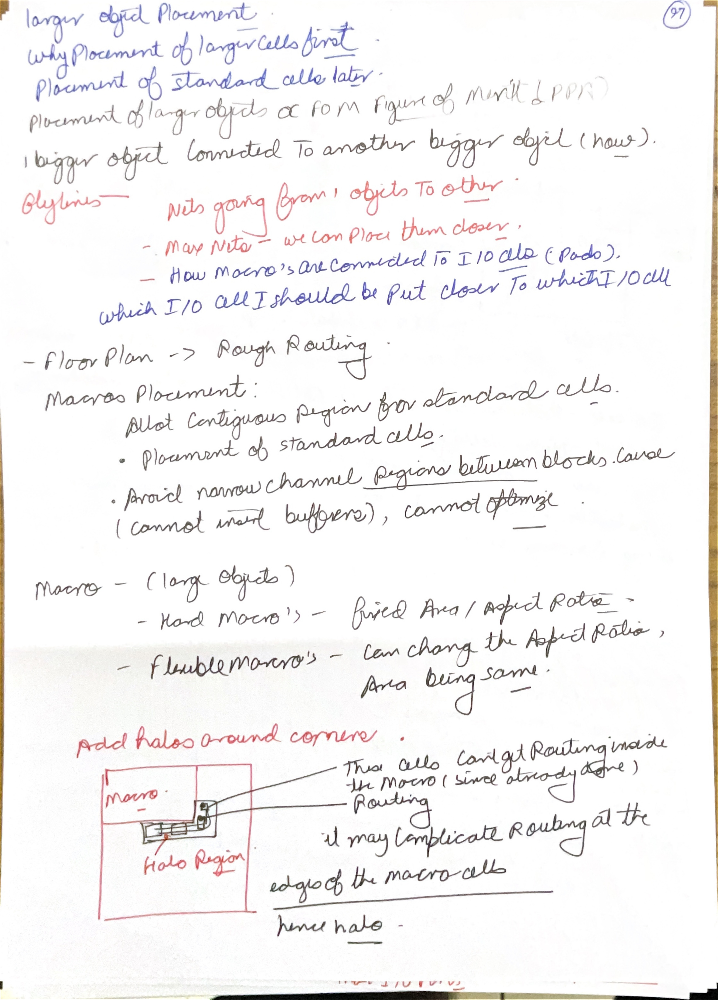](#day-08-index)

*Source: Scan D, PDF page 18.*

Flylines show connectivity before routing. A thick bundle between two macros can motivate putting their communicating pin sides near one another, but timing, congestion and power access also matter. A small gap packed with many facing pins can be harder to route than a somewhat longer open channel.

A hard macro's geometry is fixed for the selected view. A soft block may be implemented with different aspect ratios, but changing its shape can alter timing, whitespace and final area. For a purely geometric fixed-area example with A=10,000 µm² and W/H=2, W≈141.4 µm and H≈70.7 µm. That arithmetic does not guarantee an implementation can achieve exactly the same area in both shapes.

A placement halo reserves space around a macro so ordinary cells do not crowd pin-access regions or corners. It is not automatically a routing blockage on every layer. Routing obstructions describe separate layer-specific restrictions. The distinction matters when deciding whether a wire may pass over a macro on an allowed upper layer.

Check channels for useful standard-cell rows, buffer sites and routing tracks. Fragmenting placement into many narrow pockets can leave nominal area that cannot accommodate the needed cells or connections. A floorplan should be judged by implementable space, not only its unoccupied area total.

#### Budget a macro channel as both space and routing capacity

Suppose two macros leave a 20 µm geometric gap. Each facing edge has a 3 µm placement halo, leaving 14 µm for standard-cell placement under those assumed restrictions. A placement halo excludes cells; a routing blockage excludes particular routing layers. They are different objects and need not cover identical space.

For an illustrative signal-routing layer with 0.5 µm track pitch, a genuinely available 14 µm corridor accommodates approximately 28 track centerlines, subject to its boundary convention. If power geometry and pin/via access reserve eight equivalent tracks, only about 20 remain. A 24-track demand then exceeds that estimate by four. Making the same macros appear closer in a wirelength objective can worsen the bottleneck.

Do not apply a placement halo as an automatic route blockage in this calculation. Use the actual layer obstructions and reservations to determine available routing width. Other usable layers, wrong-way access, via rules and neighboring congestion can alter capacity. The estimate is a floorplanning warning that should be checked by routing analysis, not proof that twenty nets can be legally connected.

[Back to day index](#day-08-index)

## Lesson 48: Chip Planning II

Week 11 · [Lecture video](https://www.youtube.com/watch?v=H2UHFlFTUoo) · [Back to day index](#day-08-index)

<!-- wrapup-frame-48 -->

*Lecture: [22:10 — A halo reserves pin-access space at macro corners](https://www.youtube.com/watch?v=H2UHFlFTUoo&t=1330s).*

The left macro corner is crowded with a standard cell; the right reserves a halo. The halo is a placement restriction, not automatically a routing ban on every layer. Rotating a macro can change which pins face a channel, but its allowed orientations and power connections must remain legal.

### D-19: Legal orientation and the beginning of the power network

[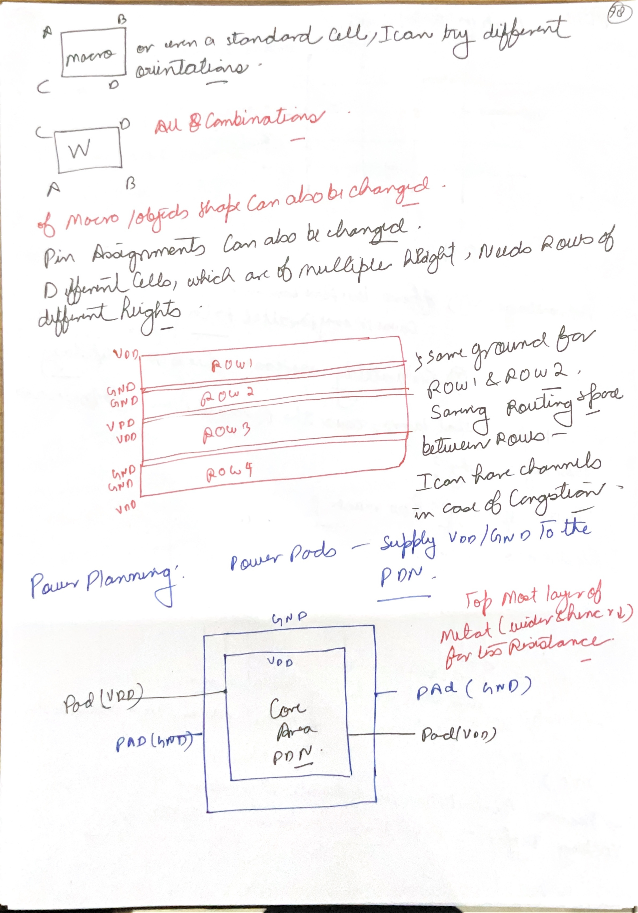](#day-08-index)

*Source: Scan D, PDF page 19.*

Eight rotations/reflections describe the geometric possibilities for a rectangular object. They are not automatically eight legal orientations for every standard cell. LEF symmetry, site definitions, row orientation and power/pin alignment determine legality. Ordinary standard-cell rows often permit a restricted set of orientations so VDD/GND rails abut correctly. Macros can have their own restrictions.

Alternating/mirrored rows can let adjoining cells share compatible supply rails. A multi-height cell spans an integer number of compatible rows/sites and needs legal rail and well alignment. It is not a freely rotated object merely because its outline fits into empty space.

The power-delivery network connects package supply access to rings/straps/meshes and finally local cell rails. Macro power pins need explicit connections too. Upper routing layers often provide wider/thicker conductors with lower resistance, while local rails reach densely spaced standard cells. Layer thickness is process-defined; the designer selects legal layers and widths.

Power geometry consumes routing resources and constrains placement. Planning it early prevents an otherwise attractive signal floorplan from becoming impossible once required supply conductors and via arrays are added.

#### Transform the pin coordinates along with the macro outline

Take a macro with local width W=10 µm, height H=6 µm and a pin at (2,1) µm relative to its lower-left corner. For this rectangular-coordinate convention, a 180-degree rotation followed by translation back into the positive local box maps (x,y) to (W-x,H-y), so the pin becomes (8,5). A 90-degree counterclockwise rotation similarly maps it to (H-y,x)=(5,2), in a box of width 6 and height 10.

If the transformed macro's lower-left placement origin is (100,200), the rotated pin's absolute location is (105,202) for the 90-degree case. Computing wirelength from the old pin offset (2,1) would target the wrong location even though the placed macro rectangle looked correct.

These are geometry demonstrations, not a declaration that a specific LEF macro permits those orientations. Its declared symmetry, sites, supply-pin alignment and implementation rules still govern legality. A hard macro keeps its internal pin relationships through the transform; a flexible block can instead change its designed shape or pin assignment under its own implementation constraints. Keep those two operations distinct.

### D-20: Meshes spread current; electromigration sets reliability limits

[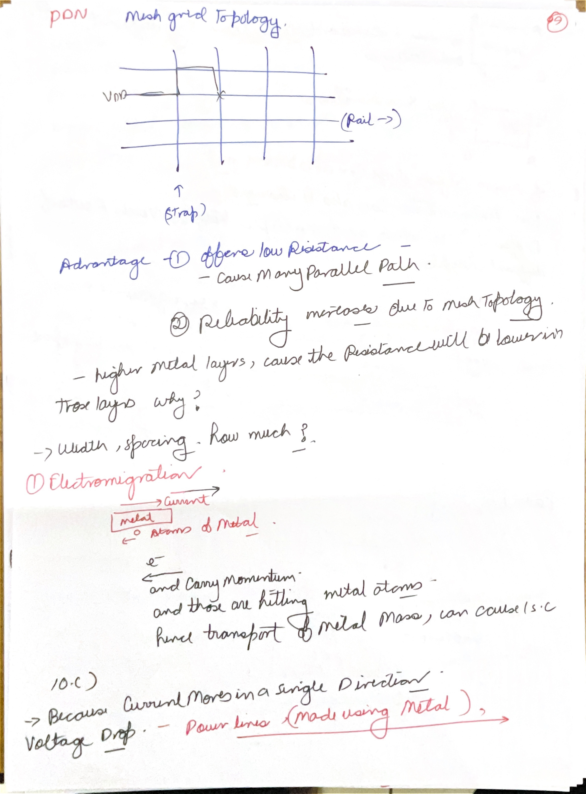](#day-08-index)

*Source: Scan D, PDF page 20.*

A mesh offers multiple current paths between supply sources and loads, reducing effective resistance and sensitivity to a single long narrow path. Vias connect layers; insufficient via arrays can become current bottlenecks even when the metal straps themselves are wide.

Electromigration is current-driven material transport in interconnect. Voids can lead to opens; material accumulation can cause other failures such as shorts. Current density, temperature, geometry and duty profile influence lifetime. A simplified uniform segment has $J=I/(WT)$. Doubling width halves that average density for the same current and thickness, but current crowding near bends/vias can still dominate locally.

For I=0.2 A, W=10 µm and T=2 µm, the average J is $10^{10}$ A/m², or 1 MA/cm². This is an arithmetic example, not an assertion of an allowed process limit. Use foundry reliability rules and the specified lifetime/temperature conditions. AC/RMS and direction-dependent considerations can also apply; “only DC matters” is too broad.

The [OpenROAD PDN documentation](https://openroad.readthedocs.io/en/latest/main/src/pdn/README.html) describes generation of layer-based power grids and connections. Geometry generation does not by itself prove acceptable IR drop or electromigration; those require the current and electrical analysis of the resulting network.

### D-21: Separate steady IR drop from transient droop and decap support

[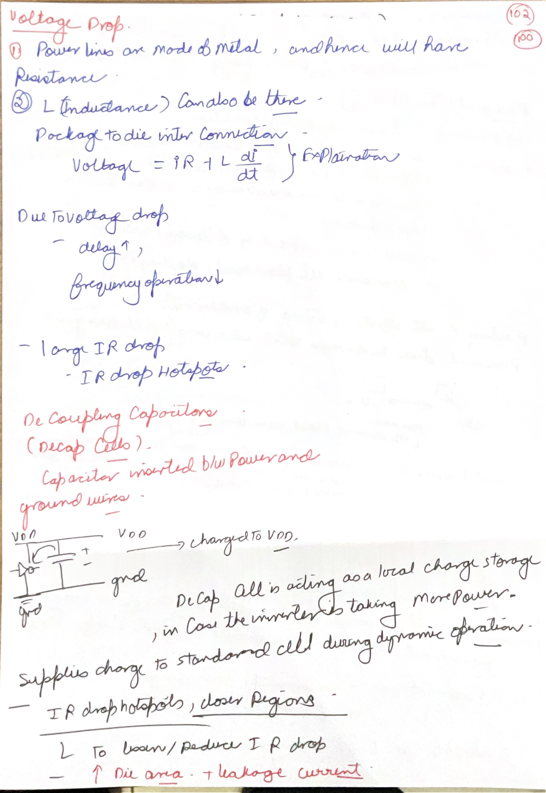](#day-08-index)

*Source: Scan D, PDF page 21.*

Steady resistive drop is $\Delta V=IR$ along the effective supply path. A 50 mA load through 0.4 Ω loses 20 mV; from a nominal 0.8 V supply that is 2.5%. Reduced local voltage can slow cells, and ground rise can reduce the effective VDD-to-ground swing further. Timing must use the appropriate voltage behavior rather than assuming the ideal supply reaches every cell.

Inductance resists a rapid change in current: $\Delta V=L\,di/dt$. A 100 pH path with a 0.1 A/ns current change contributes an illustrative 10 mV. Package inductance, on-chip conductors, regulator response and simultaneous switching interact, so resistive and transient effects should not be merged into one unexplained “IR” number.

A decoupling capacitor supplies local charge briefly. Using $I=C\,\Delta V/\Delta t$, sustaining 10 mA for 100 ps with at most 20 mV change requires 50 pF in the ideal isolated-capacitor approximation. Real behavior includes connection resistance/inductance, equivalent series resistance (ESR), equivalent series inductance (ESL) and voltage dependence. Physical proximity and connection quality matter because a distant capacitor's charge must cross the intervening network.

Decap helps transient droop; it cannot supply a continuous DC current indefinitely. The upstream supply must replenish its charge. It also costs area and may add leakage. A robust PDN combines appropriate conductor/via geometry, supply access and strategically connected decap, checked using realistic current scenarios.

**Day 08 recall:** generate the LFSR sequence from its recurrence; name aliasing assumptions; distinguish fixed capacitance from coupling-induced current; choose the correct LEF/Liberty/GDS role; calculate a clearly defined utilization; and separate IR, inductive droop and decap energy storage.

#### Check what a decap can supply before the network replenishes it

The ideal 50 pF capacitor calculated above can supply 10 mA for 100 ps with 20 mV droop. For a 1 ns pulse at the same current, its isolated-capacitor droop would be 200 mV. Ten times the duration demands ten times the charge; choosing a capacitor from peak current alone misses that dependence.

Now add illustrative ESR=0.1 Ω. A 10 mA step contributes an immediate 1 mV resistive drop, in addition to the later charge-related change. With connection inductance 100 pH and a 10 mA rise in 20 ps, $L\,di/dt$ contributes 50 mV during the edge. Thus the 20 mV charge budget does not establish a 20 mV total-droop budget.

These terms describe different phases of the response: connection inductance matters during rapid current change, ESR while current flows, and charge depletion over time. They should not be summed as constant penalties over every interval. The actual regulator, package and on-chip mesh share current and replenish charge. Local placement and low-inductance connections can matter as much as nominal capacitance. Analyze the relevant waveform and network, rather than treating decap as a permanent replacement for a DC supply path.

[Back to day index](#day-08-index)
