# Day 09: Placement, clocks, routing and signoff

Lessons 49–54 · Weeks 11–12. Source pages D-22–D-24 and E-01–E-19. The final-week sections explain the diagrams, timing arithmetic and connections between stages in detail.

## Day 09 index

- [Lesson 49: Placement](#lesson-49-placement)
- [Lesson 50: Chip Planning and Placement](#lesson-50-chip-planning-and-placement)
- [Lesson 51: Clock Tree Synthesis](#lesson-51-clock-tree-synthesis)
- [Lesson 52: Routing](#lesson-52-routing)
- [Lesson 53: Post-layout Verification and Signoff](#lesson-53-post-layout-verification-and-signoff)
- [Lesson 54: Clock Tree Synthesis and Routing](#lesson-54-clock-tree-synthesis-and-routing)

[Master index](../README.md) · [Handwritten page index](../Resources/Handwritten%20Index.md) · [Sources](../Resources/Sources.md)

For focused revision: [Why clock buffers help](#e-03-why-an-extra-buffer-can-reduce-wire-delay), [Useful-skew arithmetic](#e-06-recompute-the-333-to-4-ghz-useful-skew-example), [Setup versus hold after CTS](#e-07-useful-skew-transfers-margin-and-can-create-hold-failures), [Routing demand and capacity](#e-10-count-demand-capacity-overflow-and-congestion-separately), and [Final signoff obligations](#e-18-lvs-and-signoff-must-refer-to-the-same-final-design).

## Lesson 49: Placement

Week 11 · [Lecture video](https://www.youtube.com/watch?v=-M6o03yNb78) · [Back to day index](#day-09-index)

<!-- wrapup-frame-49 -->

[](#day-09-index)

*Lecture: [14:43 — Measure the box, then remember what it omits](https://www.youtube.com/watch?v=-M6o03yNb78&t=883s).*

The two grid drawings enclose the same pin set and count adjacent sides of the box. The lecture obtains 11 unit intervals. An interior pin does not expand the box, even though the final routed tree must still connect it. D-23 supplies explicit coordinates and distinguishes the estimate from a legal multi-pin route.

### D-22: Placement makes later routing possible

[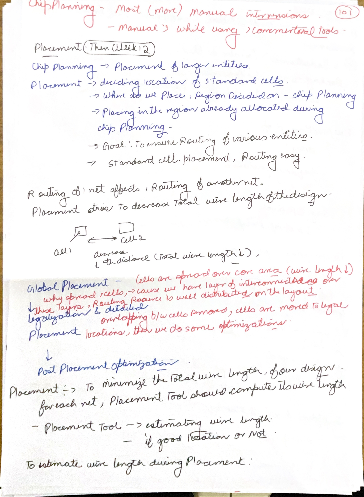](#day-09-index)

*Source: Scan D, PDF page 22.*

Placement chooses standard-cell locations in the regions already established by floorplanning. It seeks useful proximity between connected cells while distributing them so pins and nets remain accessible. Simply placing every connected cluster as tightly as possible can create a region with more pins/wires than its routing layers can accommodate.

Global placement optimizes approximate positions and density. Legalization converts those positions into legal row/site locations with compatible orientations and no prohibited overlap. Detailed placement improves a legal arrangement through local moves or swaps. Post-placement optimization changes cells or inserts buffers using better location-based timing and wire estimates.

Each change affects the next stage. A timing repair can add cells and increase local density; spreading cells to reduce congestion can lengthen a critical path. Evaluate routability, timing, area and power together. Before actual routing, a placement-based wire estimate is still an estimate, rather than the extracted resistance/capacitance of a completed geometry.

### D-23: HPWL is a bounding-box estimate, not a routed tree

[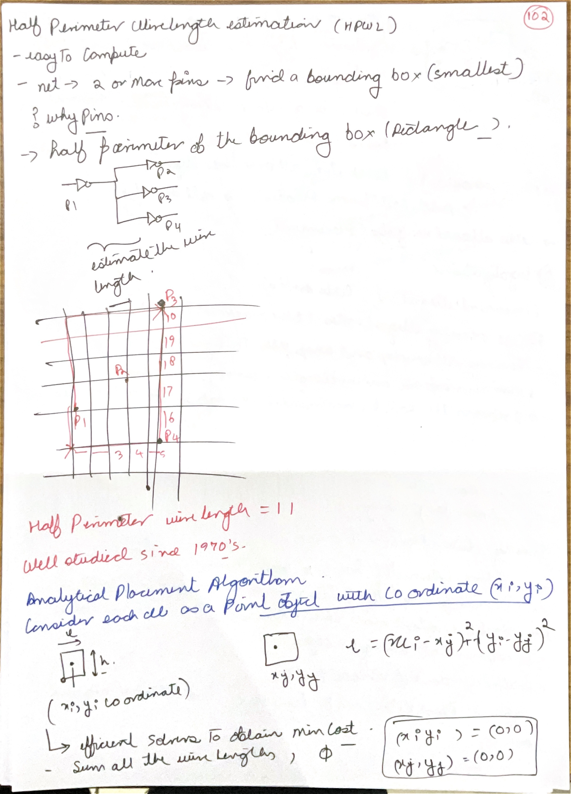](#day-09-index)

*Source: Scan D, PDF page 23.*

Half-perimeter wire length (HPWL) estimates net length from its pin bounding box. For all pins of one net, find minimum/maximum x and y coordinates. The bounding rectangle's half perimeter is:

$$
HPWL=(x_{max}-x_{min})+(y_{max}-y_{min}).
$$

The lecture's corresponding grid illustration counts 11 unit intervals around two adjacent sides, matching the handwritten total 11. These are drawing-grid units, not an asserted physical length in µm. Pins inside the box do not change its extrema. A new pin outside the box can increase the estimate.

For a separate explicit example, pins (1,1), (4,3), (6,7) and (6,2) have width 5 and height 6, giving HPWL=11 units. The final route can be longer because it must branch to all pins, avoid obstacles, change layers and satisfy design rules. HPWL gives a fast placement cost/lower-bound style estimate; it does not specify the exact connecting geometry.

The quadratic expression at the bottom is squared Euclidean separation, $(x_i-x_j)^2+(y_i-y_j)^2$. It is a smooth analytical optimization cost, not literal Manhattan wire length. With only attractive wire-length terms and no fixed pins or density constraints, connected movable cells tend to collapse together. Any common location can minimize such a translation-invariant objective; (0,0) is one example, not a special physical optimum. Density/fixed-object constraints prevent that collapse.

### D-24: Density and legality complete the placement objective

[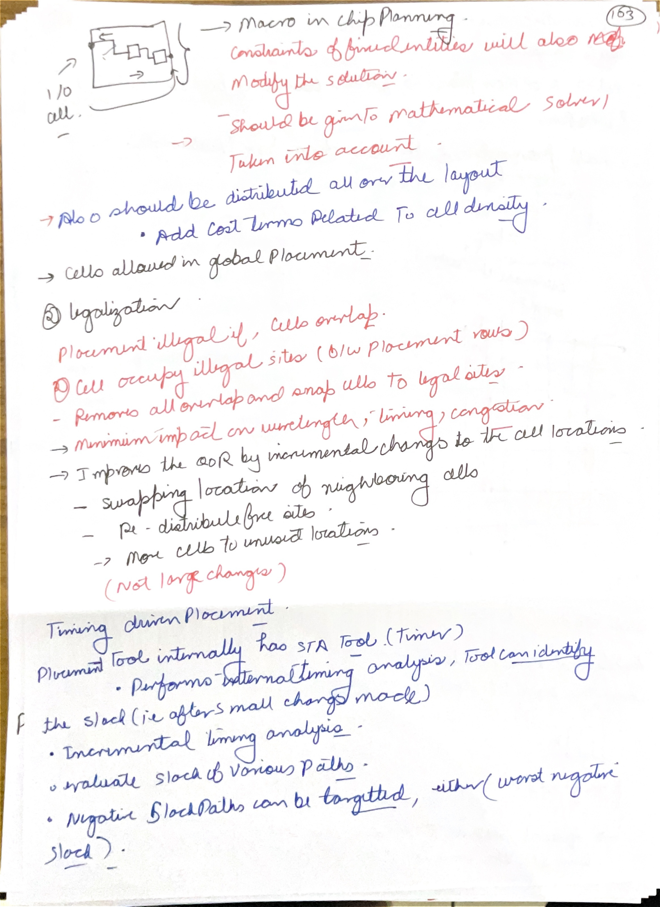](#day-09-index)

*Source: Scan D, PDF page 24.*

An analytical placer balances a wire-related cost with a density/spreading term. Macros and blockages remove or constrain available regions. Global placement can temporarily contain overlaps while it searches; that freedom does not make the final layout legal. Legalization must account for actual cell dimensions, rows, sites and orientations.

Legalization tries to remove conflicts without excessive displacement from the optimized positions. Detailed placement can then swap compatible cells or improve local ordering. Any move changes connected wire estimates and may change timing. Re-evaluate the affected nets and retain the constraints imposed by fixed macros and restricted regions.

Timing-driven placement assigns greater importance to nets or paths that threaten timing, using slack or criticality rather than treating all net lengths identically. A criticality weight steers an optimization objective; it does not directly guarantee a specified number of ps of improvement. Excessive clustering of critical cells can worsen local congestion and ultimately produce longer detoured routes.

### E-01: Reorder scan chains and reserve spare cells deliberately

[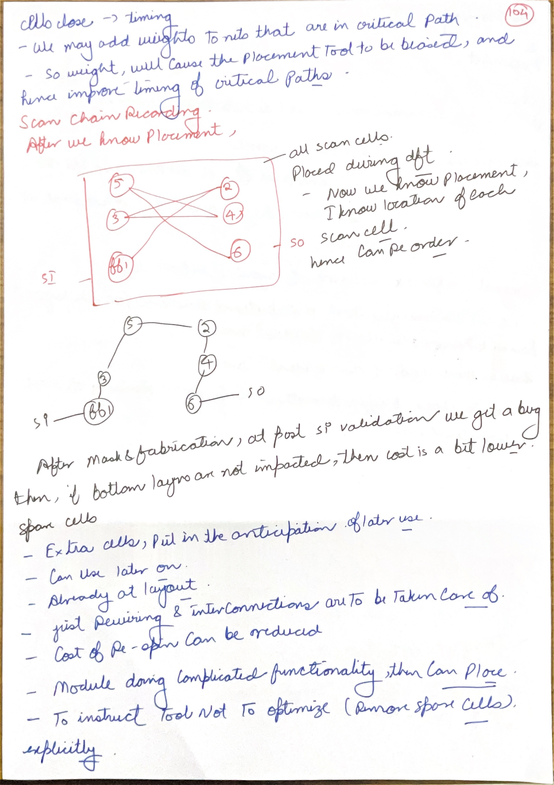](#day-09-index)

*Source: Scan E, PDF page 1.*

The scan-chain drawing illustrates reconnecting the serial order around physical proximity. Normal functional connectivity need not change, but the scan shift relationship does. Update the chain description and pattern bit order, then recheck scan integrity and shift timing. A geographically shorter chain can still have hold problems if adjacent cells' clocks differ.

Spare cells are intentionally placed unused cells with legal supply/tie connections, reserved for later engineering changes. Spreading them through likely change regions can make an ECO feasible without moving much of the existing design. Protecting their intended availability prevents routine optimization from deleting them prematurely.

A spare-cell ECO can sometimes change only selected interconnect masks because the needed transistors already exist in the layout. That does not mean an already fabricated chip can be rewired in software. It can reduce the scope of a manufacturing revision, subject to the changed masks, routing access and available spare-cell functions.

After scan or functional ECO changes, retain the correct netlist/reference and regenerate the analyses that depend on changed connectivity or geometry. A short scan wire or unused spare gate is useful only as part of a verified design state.

#### Reorder the scan bits as well as the wires

Let the original serial chain be SI→A→B→C→SO, and let a captured response have QA,QB,QC=1,1,0. Reading the existing SO value before each shift gives bits C,B,A: 0,1,1. If physical optimization changes the chain to SI→A→C→B→SO, the same captured register values now emerge B,C,A: 1,0,1.

To load the same desired state, the original chain likewise requires serial inputs 0,1,1, while the new chain requires 1,0,1. The last-loaded bit lands at A in both cases. This is a permutation of scan positions, not a change in the functional identities of A, B and C.

A tester that compares the old 011 expectation against the new 101 output reports a failure on a good response. Pattern generation and chain descriptions must use the implemented order. Multi-chain designs also need correct chain endpoints, lengths and any compression mapping. After the bit mapping is correct, verify shift-mode setup/hold with the actual clocks; a shorter physical connection does not establish that timing.

[Back to day index](#day-09-index)

## Lesson 50: Chip Planning and Placement

Week 11 tutorial · [Lecture video](https://www.youtube.com/watch?v=NWgkBBXXFKg) · [Back to day index](#day-09-index)

<!-- wrapup-frame-50 -->

[](#day-09-index)

*Lecture: [10:01 — A generated power grid still needs electrical analysis](https://www.youtube.com/watch?v=NWgkBBXXFKg&t=601s).*

The tutorial GUI shows power-grid geometry on the GCD floorplan. Its visible warnings include a checkpoint-write issue and an IR view without populated data. A drawn grid is a topology to analyze, while a usable checkpoint/report requires successful generation and the correct analysis inputs.

### Tutorial: Understand the checkpoints before executing the next stage

The tutorial uses a GCD design and Nangate45 example flow. It loads technology/cell libraries and a mapped design, initializes the floorplan and routing tracks, places pins/macros, builds the power grid, performs global placement and then legalizes/detailed-places cells. Its helper procedures and Tcl variables belong to the supplied flow scripts; they are not all built-in commands of every OpenROAD version.

The PDN screenshot shows geometric supply conductors after `pdngen`. It should be read as a generated grid, not proof of acceptable voltage drop. A warning that a report has no populated IR data means the required analysis has not produced that data yet. Similarly, a failure to write a checkpoint path must be resolved before relying on that file as the saved result.

Placement-based parasitic estimation uses locations plus technology RC assumptions. It is better informed than an early generic wire load, but actual routes may detour or use different layers. The tutorial then repairs electrical limits and produces timing reports, followed by legal placement checks. Resizing/buffering can create new cells or change footprints, requiring the legalizer to run again.

| Checkpoint | What should be available | What it establishes |
|---|---|---|
| Floorplan | Die/core, rows, tracks, macros/pins | Space and access conventions |
| PDN | Connected power geometry | Supply topology to analyze |
| Global placement | Cell positions and density/congestion estimates | Candidate physical arrangement |
| Legal/detailed placement | Legal sites/orientations and reports | A valid placement for CTS/routing |

Density in a placer and core utilization in a floorplan are related but not interchangeable parameters. Read their definitions in the [OpenROAD placement documentation](https://openroad.readthedocs.io/en/latest/main/src/gpl/README.html) and the supplied script. A successful command log, matching checkpoint and report are stronger evidence than a visually busy GUI alone.

[Back to day index](#day-09-index)

## Lesson 51: Clock Tree Synthesis

Week 12 · [Lecture video](https://www.youtube.com/watch?v=BQHczZr4ONA) · [Back to day index](#day-09-index)

<!-- wrapup-frame-51 -->

[](#day-09-index)

*Lecture: [10:20 — Identify the clock boundary before measuring skew](https://www.youtube.com/watch?v=BQHczZr4ONA&t=620s).*

The diagram labels the generator, declared source and consuming register clock pins. Follow the clock buffers separately from the orange combinational data logic. E-02–E-07 distinguish source-to-sink latency, signed pair skew and global skew range, then connect them to setup and hold.

### E-02: Replace the ideal-clock assumption with a physical network

[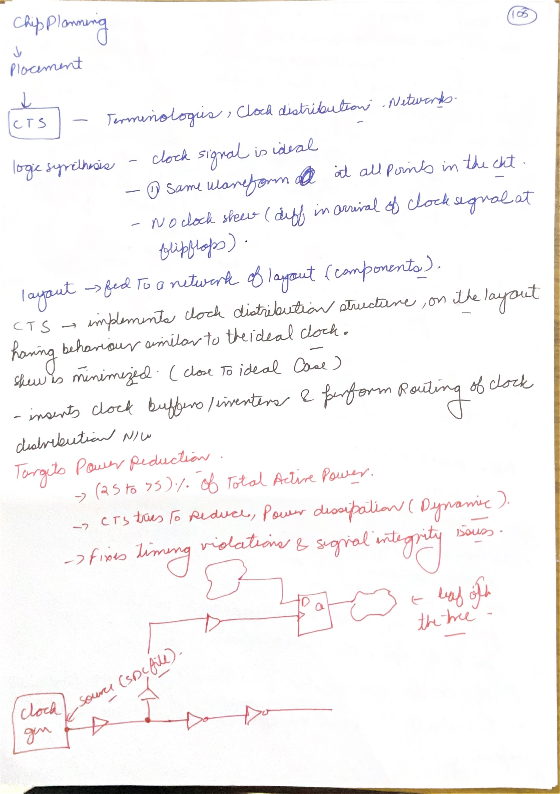](#day-09-index)

*Source: Scan E, PDF page 2.*

An ideal clock has the assumed edge waveform at every receiving clock pin without distribution delay or variation. A physical clock source must charge the input capacitances of many registers through real buffers and metal. Different distances, loads and cell delays produce different arrivals and slews. CTS constructs a distribution network intended to meet the required timing and electrical behavior across those sinks.

The goals include controlling skew, clock insertion delay, slew and load, while limiting area and power and respecting placement/routing constraints. A single huge buffer driving every flop is usually a poor answer: it sees immense capacitance, and distant sinks receive degraded waveforms. A branching buffered structure distributes drive nearer the loads.

Clock source means the declared starting point of the distributed clock, for example a port or a generated-clock output. Clock sinks are the consuming pins, such as register clock pins. **Insertion delay/latency** measures source-to-sink delay under the stated source boundary. **Skew** compares arrival times at two sinks. Two sinks can both have 500 ps latency and zero mutual skew; low skew does not imply low latency.

The handwritten clock-power percentage is a broad motivation. The course slide gives approximately 25–70% as an example range for active power, rather than a universal 25–75% rule. Actual fractions depend on the design and activity. Clock nets switch frequently, so reducing capacitance and unnecessary clock events matters, but a numerical clock-power claim needs its own analyzed design.

### E-03: Why an extra buffer can reduce wire delay

[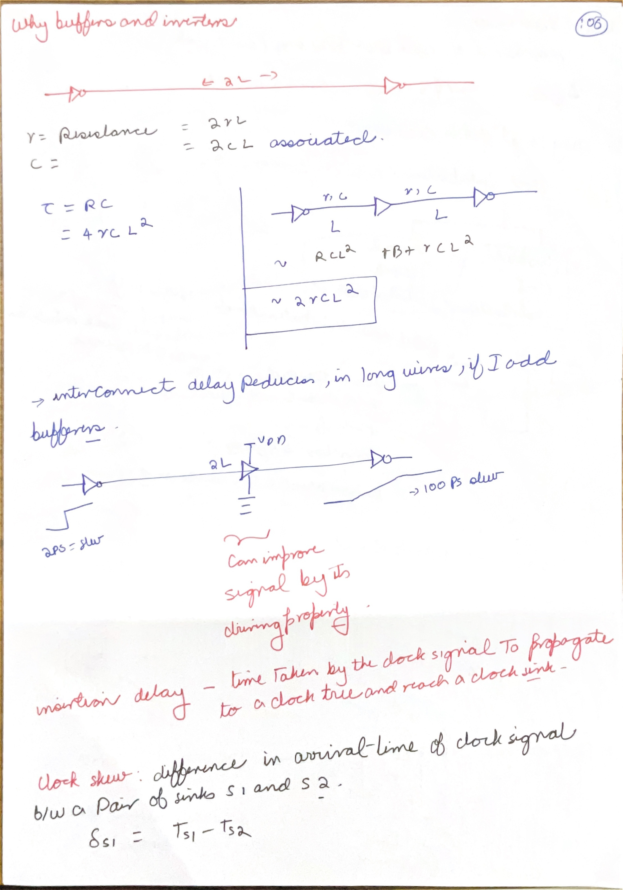](#day-09-index)

*Source: Scan E, PDF page 3.*

[](#day-09-index)

*Lecture: [12:17 — clock-wire buffers](https://www.youtube.com/watch?v=BQHczZr4ONA&t=737s).*

For a uniform wire with resistance per length r and capacitance per length c, resistance grows as rL and capacitance as cL. The wire's own distributed RC delay therefore grows approximately as $krcL^2$, where k depends on the delay model/measurement. The key is quadratic length dependence, not a universal numerical coefficient.

For the page's unbuffered wire of total length 2L, the wire contribution is about $4krcL^2$. Insert a suitable repeater halfway. Its input isolates the first segment from directly charging the second segment's full wire capacitance, and the repeater actively drives the second segment. The two segment contributions total approximately $2krcL^2$, plus repeater delay and loading effects. The saved wire delay can exceed the added cell delay.

For a teaching estimate, take each length-L wire contribution as 80 ps and the added buffer contribution as 30 ps. The unbuffered 2L wire contributes about 320 ps; the two buffered segments contribute 80+30+80=190 ps. The improvement is 130 ps. This calculation omits the original driver's resistance, input-pin/load details and transition dependence; it explains the mechanism, not a library-accurate answer.

More buffers are not always better. For n equal segments, a simplified wire term decreases approximately as $K/n$, while total repeater delay grows roughly as $(n-1)t_b$. Additional stages also consume energy, area and routing resources. An optimum balances these effects. Inverters can act as repeaters too, but overall clock polarity and active-edge relationships must remain correct.

The source writes a signed difference between sink arrivals. Throughout these explanations, define $S=C-L$: capture-clock arrival minus launch-clock arrival. A positive S means the capture edge arrives later. Keeping one sign convention prevents accidentally reversing the setup/hold effect.

### E-04: Global skew and balanced trees

[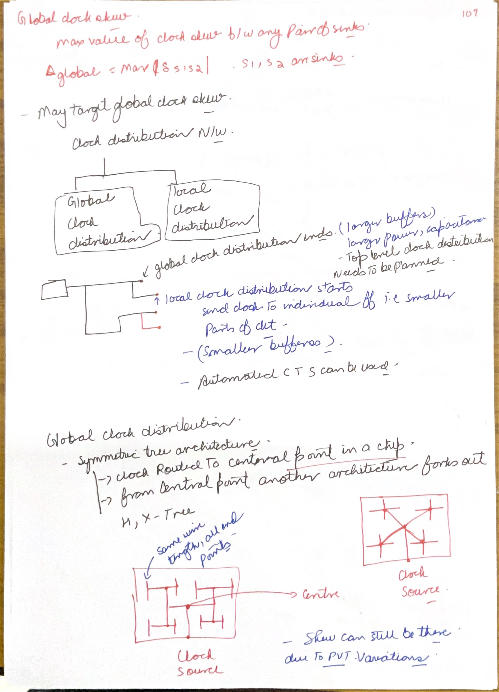](#day-09-index)

*Source: Scan E, PDF page 4.*

For a set of sink arrivals, global skew is the maximum pairwise absolute difference, equivalently latest arrival minus earliest arrival. With arrivals 80,95,110 and 100 ps, global skew is 30 ps. A specific data path from the 110 ps sink to the 80 ps sink has signed S=-30 ps under our capture-minus-launch convention. That path's setup/hold effect needs the sign; a global range does not supply it.

A global clock network can distribute the source to larger regions, followed by local trees feeding nearby sinks. An ideal H-tree recursively uses symmetric branch geometry; an X-tree uses a different symmetric arrangement. Equal geometrical path length helps balance wire delay, but equal length alone does not guarantee equal electrical delay. Sink capacitance, branch loads, buffer sizing, layer/via choices, blockages and variation all matter.

Hard macros may consume a clock at a boundary pin and have internal clock latency described in their timing model. Balancing only to that pin may not be the intended balance point. Define the clock boundary and included delays before comparing sink numbers.

CTS operates on the actual placement and available resources. A perfectly symmetric drawing can be impossible around real macros. The implementation can trade modest skew against reduced power/latency or improved routability, while checking timing across the relevant launch/capture pairs. Also consider rise/fall behavior and pulse width: matching rising arrivals does not automatically guarantee an acceptable falling edge or duty cycle.

### E-05: Clock meshes improve robustness at an electrical cost

[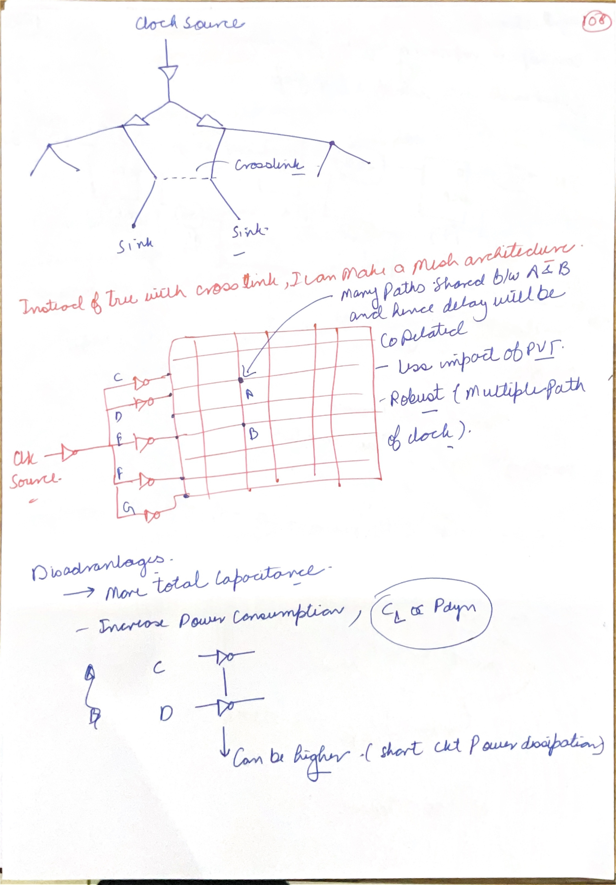](#day-09-index)

*Source: Scan E, PDF page 5.*

A pure tree has one topological path from its root to each sink. Crosslinks or a mesh add connections between distribution regions, allowing electrical behavior to be less dependent on one isolated branch. Local variations can be averaged across the connected network, improving skew robustness under a suitable design.

The mesh adds substantial wire capacitance, driving demand and potentially multiple coordinated drivers. Those outputs must be designed to work together; shorting arbitrary unrelated clock or signal drivers is not a valid mesh construction. Driver waveforms, phase matching and current behavior require the appropriate analysis.

A denser mesh offers more connections but increases capacitance and dynamic power. Trees can be more power-efficient, while meshes can offer lower sensitivity to variation; many practical architectures combine structures. There is no architecture that simultaneously minimizes every metric for every chip.

As an illustrative power comparison, adding 1 pF of clock capacitance at 1 V and 1 GHz costs about 1 mW of external switching power for one rising event per cycle, before driver internal power. If the same added network is replicated across many clock regions, the cost scales. Clock gating should be placed and analyzed in a way compatible with the selected distribution architecture.

### E-06: Recompute the 3.33-to-4 GHz useful-skew example

[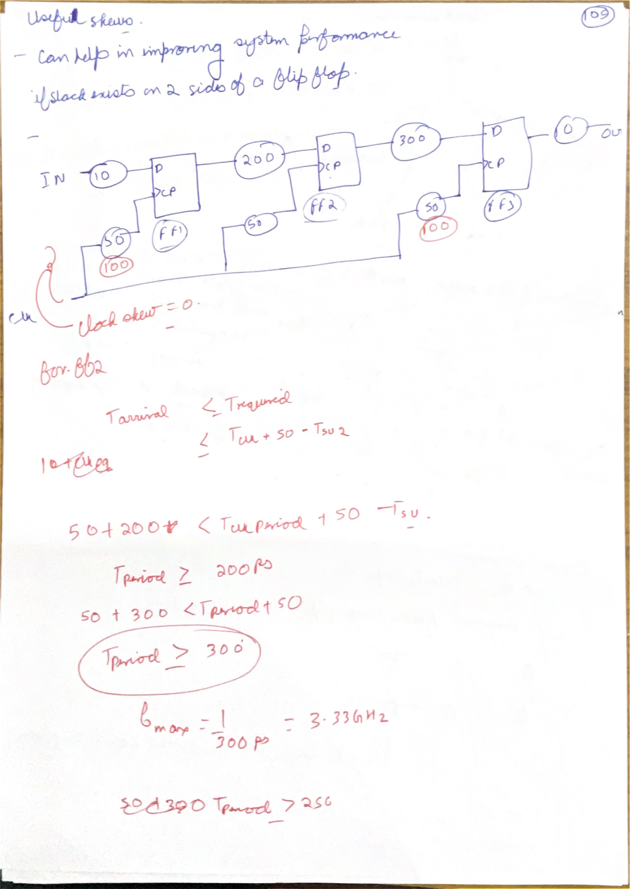](#day-09-index)

*Source: Scan E, PDF page 6.*

[](#day-09-index)

*Lecture: [39:57 — useful-skew illustration](https://www.youtube.com/watch?v=BQHczZr4ONA&t=2397s).*

The internal data delays are 200 ps from FF1 to FF2 and 300 ps from FF2 to FF3. Initially all three clock arrivals are 50 ps. The lecture's ideal arithmetic neglects clock-to-Q, setup, uncertainty and minimum-delay/hold restrictions. Keep those assumptions visible.

For FF1→FF2, latest data arrives at 50+200=250 ps, and the next capture edge is T+50. Thus T≥200 ps. For FF2→FF3, arrival is 50+300=350 ps and capture is T+50, giving T≥300 ps. The stricter constraint determines T=300 ps at the ideal boundary, and $f_{max}=1/(300\,ps)\approx3.33$ GHz.

Now delay FF1 and FF3's clocks to 100 ps while FF2 remains at 50 ps. On the first path, data arrives at 100+200=300 ps while capture occurs at T+50, so T≥250 ps. On the second path, data arrives at 50+300=350 ps while capture occurs at T+100, also giving T≥250 ps. The new ideal boundary is 250 ps, or 4 GHz.

| Path | Clock launch/capture (ps) | Data arrival (ps) | Next capture (ps) | Ideal minimum T (ps) |
|---|---|---:|---|---:|
| FF1→FF2, original | 50 / 50 | 250 | T+50 | 200 |
| FF2→FF3, original | 50 / 50 | 350 | T+50 | 300 |
| FF1→FF2, modified | 100 / 50 | 300 | T+50 | 250 |
| FF2→FF3, modified | 50 / 100 | 350 | T+100 | 250 |

The shorter stage gives up 50 ps of setup margin; the longer stage receives 50 ps. No data logic became faster. Clock scheduling redistributed the available time between these adjacent transfers. The modified clock arrivals have 50 ps global skew, so this is an example of intentionally useful nonzero skew.

For these two inequalities with FF1/FF3 clock arrivals held equal, adding them yields $2T\geq200+300$, establishing the ideal lower bound T≥250 ps. If both paths also have 20 ps clock-to-Q, 15 ps setup and 10 ps setup uncertainty, their equal overhead is 45 ps and the corresponding bound becomes 295 ps, about 3.39 GHz. Those added values are an independent teaching extension, not values from the video.

Also check the external input-to-FF1 and FF3-to-output constraints and every other connected path. The 10 ps input/output labels in the slide are not automatically unconstrained resources. A clock change that improves these two internal stages can tighten a different boundary requirement. Implementation adds variation and guard margins, so a mathematical equality is not a robust operating target by itself.

### E-07: Useful skew transfers margin and can create hold failures

[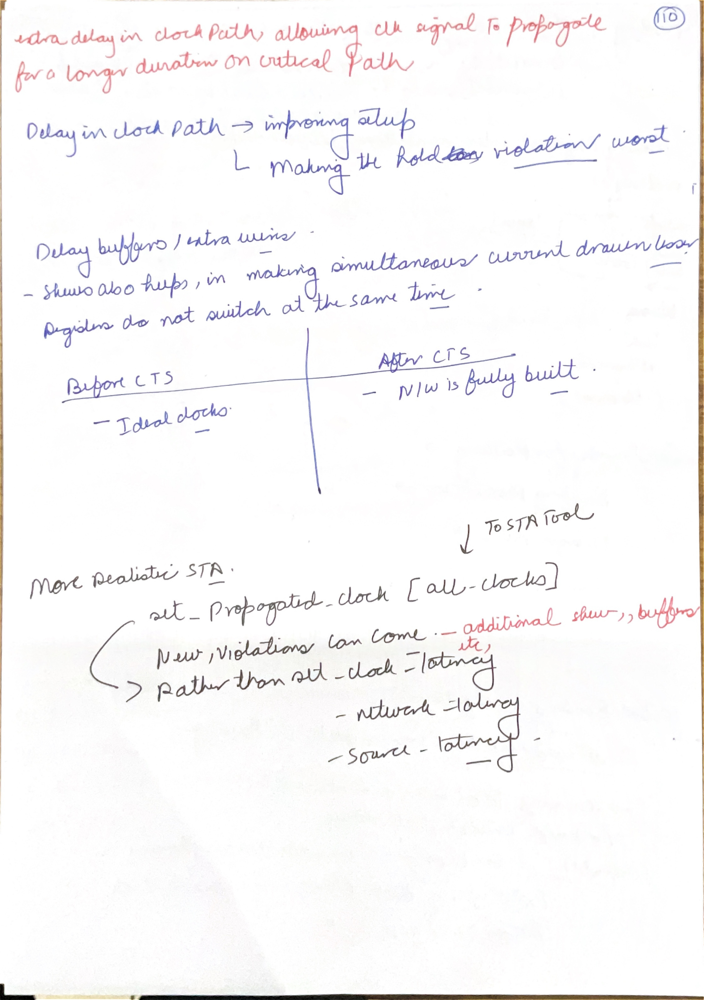](#day-09-index)

*Source: Scan E, PDF page 7.*

For a same-clock register path, let L and C be launch/capture arrivals, $t_{cq,max/min}$ the clock-to-Q limits, $d_{max/min}$ the data-path delays, $t_{su}/t_h$ the receiving requirements and U the corresponding uncertainty. The setup inequality is:

$$
L+t_{cq,max}+d_{max}\leq T+C-t_{su}-U_{su}.
$$

With S=C−L, its slack is $T+S-t_{cq,max}-d_{max}-t_{su}-U_{su}$. Positive skew adds setup margin. The same-edge hold inequality is:

$$
L+t_{cq,min}+d_{min}\geq C+t_h+U_h.
$$

Its slack is $t_{cq,min}+d_{min}-S-t_h-U_h$. The same positive skew removes hold margin. That paired derivation explains why delaying capture is not an unconditional improvement.

For an illustrative short path, take L=50 ps, C=100 ps, tCQmin=15 ps, dmin=20 ps, hold=10 ps and hold uncertainty=5 ps. Earliest data arrives at 85 ps; the hold threshold is 115 ps; slack is -30 ps. Before adding capture skew, with C=50, slack would have been +20 ps. A minimum-delay repair needs at least 30 ps of additional effective delay in this simplified case, plus practical margin, and must not consume unacceptable setup slack.

After CTS, propagated-clock analysis calculates clock delay and slew through the inserted cells/interconnect model. Replace superseded ideal network-latency estimates so the new network is not counted twice. Preserve real source latency and justified uncertainty. In variation analysis, setup can pair a late launch clock with an early capture clock, while hold can pair an early launch with a late capture clock; one nominal skew number does not certify all corners.

Distributing clock arrivals can also spread switching current in time and sometimes help supply droop, but this is a scenario-dependent benefit rather than an automatic result. CTS/timing repair should satisfy the complete set of paths, electrical checks and modes. The [OpenROAD resizer documentation](https://openroad.readthedocs.io/en/latest/main/src/rsz/README.html) describes timing repair after CTS with propagated clocks and the need to protect setup while repairing hold.

#### A clock schedule must satisfy the whole path graph

Useful skew is shared between paths because every register has one clock arrival. For three registers A,B,C, write $S_{AB}=L_B-L_A$, $S_{BC}=L_C-L_B$ and $S_{CA}=L_A-L_C$. Their sum is zero. You cannot independently assign +50 ps to all three paths around this cycle: the sum would be +150 ps and no clock arrivals could realize it.

For arrivals LA=0, LB=50, LC=100 ps, the skews are +50, +50 and -100 ps. The first two paths gain setup time; the returning path loses it. If that returning path has 100 ps of spare setup margin, it reaches equality before uncertainty or further variation is added. Its hold relationship changes in the opposite direction.

More generally, each path contributes setup and hold bounds on a difference of clock arrivals. For the stated same-clock model, setup requires $S\geq t_{cq,max}+d_{max}+t_{su}+U_{su}-T$, while hold requires $S\leq t_{cq,min}+d_{min}-t_h-U_h$. A feasible schedule must satisfy all such bounds together across modes and corners. This is the reason to optimize clock arrivals as a connected problem and then analyze the implemented clock network.

[Back to day index](#day-09-index)

## Lesson 52: Routing

Week 12 · [Lecture video](https://www.youtube.com/watch?v=nsYhC5btQko) · [Back to day index](#day-09-index)

<!-- wrapup-frame-52 -->

[](#day-09-index)

*Lecture: [26:38 — A graph edge represents a limited physical resource](https://www.youtube.com/watch?v=nsYhC5btQko&t=1598s).*

The frame connects three-dimensional layer graphs through via edges and compares USE(e) with CAP(e). Power/clock reservations and obstructions reduce what remains available to signal nets. E-10 distinguishes overflow from congestion and E-12 explains why detailed pin/via rules can still fail after a feasible coarse plan.

### E-08: Global routing plans; detailed routing creates geometry

[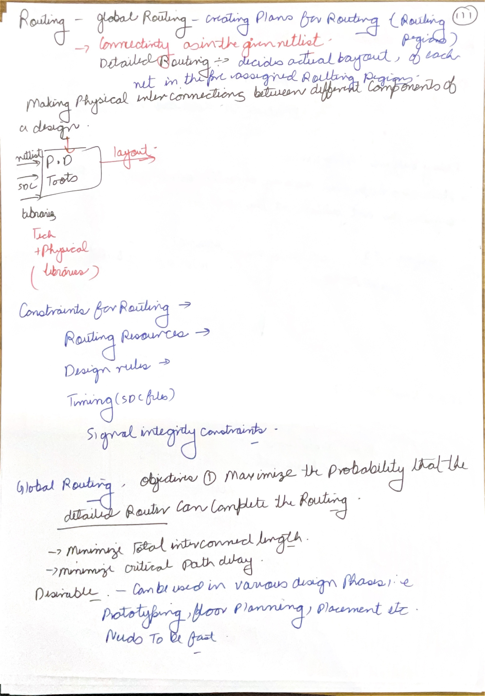](#day-09-index)

*Source: Scan E, PDF page 8.*

Placement gives pin locations but does not connect them with legal metal. Routing must connect each net's intended pins while separating different nets and satisfying layer, width, spacing, via, timing and signal-integrity requirements. Routing one net consumes resources that other nets need, so nets cannot generally be solved as isolated shortest-path problems.

Global routing uses a coarse representation to choose approximate paths, layer assignments and routing guides. It estimates demand versus available resources and can be run early to diagnose a floorplan or placement. Detailed routing chooses exact wire/via geometry, resolves pin access and checks detailed rules within and around those guides.

A global guide is therefore a region/plan for a net, not its final GDS wire polygon. A route can have no coarse overflow and still fail detailed routing because a pin has no legal via-access point or local spacing/enclosure rules cannot be satisfied. Conversely, a congested estimate can suggest spreading cells, moving a macro, reallocating layers or adjusting routes before expensive detailed work.

Timing and power estimates improve as geometric knowledge improves. A globally estimated route might be short, while its legal detailed implementation requires detours and extra vias. Use the model appropriate to the stage and label estimated parasitics separately from extracted final-route parasitics.

### E-09: Turn the routing space into a layer-aware graph

[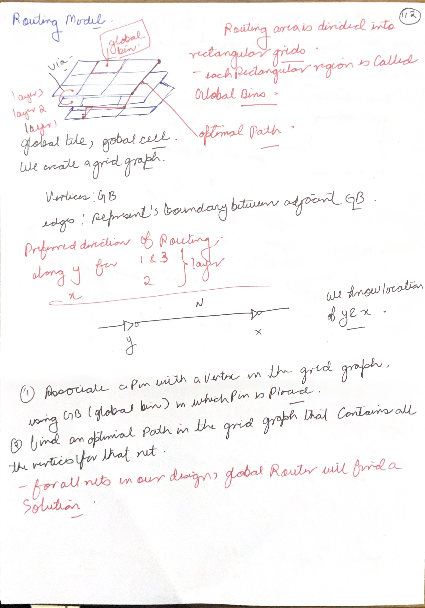](#day-09-index)

*Source: Scan E, PDF page 9.*

The global-routing grid partitions the core into bins, commonly called GCells. A graph vertex represents a region on a routing layer; neighbor edges represent crossing between regions. Layer-specific edges reflect preferred routing directions and allowed resources. Vertical edges connect routing layers through via opportunities. Exact graph construction varies by router.

Map the net's pins into this graph, then find connected routes through vertices/edges. A two-pin net can use one path. A multi-pin net needs a connected tree or equivalent network joining all its terminals; it is not necessarily one simple path that visits every pin. Steiner branching points can reduce total connecting length without being original pins.

For pins at (0,0), (4,0) and (2,3) in an unobstructed Manhattan plane, a branch at (2,0) connects them with length 2+2+3=7 units. Connecting the two upper/lower pairs separately with duplicate segments would cost more unless shared wire is recognized. Obstacles, layers and rules can change the legal optimum.

The coarse graph hides exact track coordinates and many local rules to keep planning fast. That abstraction is useful only if capacities, blockages and layer permissions represent the real technology sufficiently well. A graph edge through a physically blocked region must not be treated as freely available routing space.

### E-10: Count demand, capacity, overflow and congestion separately

[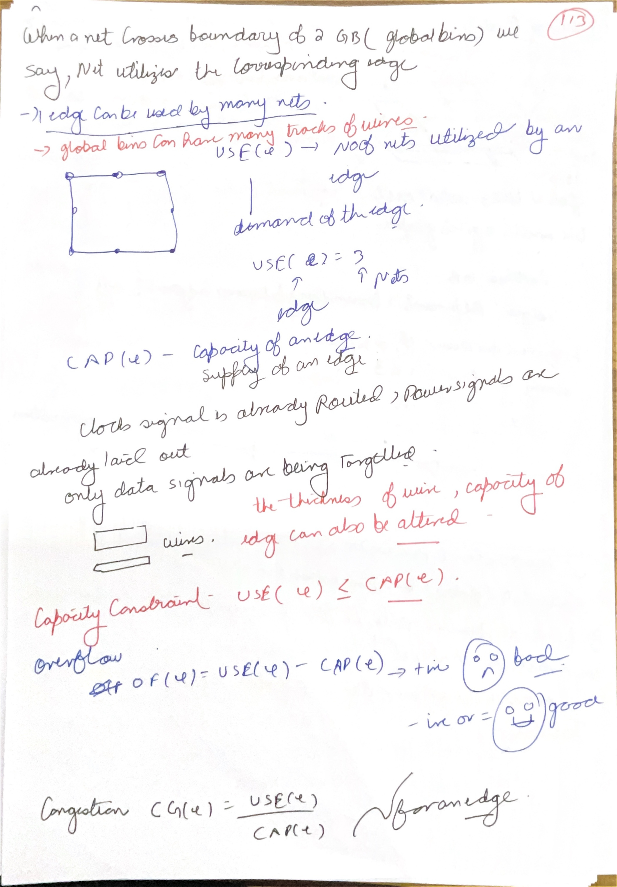](#day-09-index)

*Source: Scan E, PDF page 10.*

Demand or USE(e) describes the resources consumed at a graph edge. Capacity or CAP(e) describes available routing resources there. For simple equal-width nets, a count of crossing nets can approximate demand. Wide wires, spacing requirements or nondefault rules may consume more than one ordinary track, so demand should be expressed in compatible resource units.

Capacity depends on track pitch, layer direction, blockages, macro obstructions and resources already reserved for power or clock wiring. Wider routing can reduce resistance but use additional tracks. The layer's thickness comes from the process; the capacity calculation does not let a router freely choose a different physical thickness for each signal.

$$
overflow(e)=\max(0,USE(e)-CAP(e)).
$$

For positive capacity, congestion ratio is USE/CAP. With capacity 6 and demand 4, overflow is zero and congestion is 0.667. At demand 5, overflow stays zero while congestion rises to 0.833. At demand 8, overflow is 2 and congestion is 1.333. These quantities answer different questions: overflow measures an excess; congestion measures occupancy relative to supply.

| Edge | Demand | Capacity | Overflow | Congestion |
|---|---:|---:|---:|---:|
| A | 4 | 6 | 0 | 0.667 |
| B | 5 | 6 | 0 | 0.833 |
| C | 8 | 6 | 2 | 1.333 |

The total overflow in this example is 2, while maximum congestion is 1.333; summing the congestion ratios would not produce total overflow. For zero capacity, the ratio is not an ordinary finite division. A positive demand on a zero-capacity edge is infeasible and should be handled explicitly, rather than concealed by a divide-by-zero workaround.

The [OpenROAD global-router documentation](https://openroad.readthedocs.io/en/latest/main/src/grt/README.html) describes routing-layer and resource adjustments. Those adjustments configure the model; artificially increasing capacity cannot create missing physical tracks.

### E-11: Feasibility can require detours, and grid size changes accuracy

[](#day-09-index)

*Source: Scan E, PDF page 11.*

If the shortest route crosses an overloaded edge, the router may choose a longer path around it. Removing overflow can improve feasibility while worsening wire length, delay or via count. The placement and timing-repair loops must account for those effects rather than assuming all nets retain their geometric shortest length.

For example, a six-unit path with one overloaded edge may be replaced by a ten-unit path with enough resources. That four-unit increase can add resistance/capacitance and slow the net. Whether the longer path meets timing depends on its layers, widths, drivers and loads. A critical net can receive priority, but some other net may then need to detour.

Larger GCells produce fewer vertices and a faster coarse problem but can hide narrow local congestion and pin-access issues. Smaller cells improve spatial resolution at greater runtime/memory cost. This is an accuracy/runtime tradeoff, not a statement that the largest or smallest grid always yields the best detailed route.

Zero global overflow is a useful milestone. It remains conditional on the coarse capacity model and is not proof of a completed legal route. When detailed failures concentrate around a macro corner, inspect the local geometry and available access rather than relying only on the chip-wide average congestion.

### E-12: Track pitch must leave room for both wires and vias

[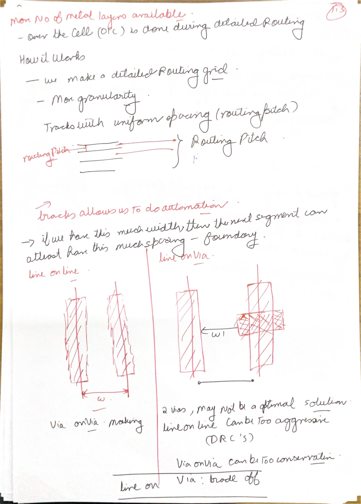](#day-09-index)

*Source: Scan E, PDF page 12.*

[](#day-09-index)

*Lecture: [46:46 — detailed-routing grid](https://www.youtube.com/watch?v=nsYhC5btQko&t=2806s).*

Routing pitch is center-to-center track spacing. For equal-width wires in a simple rule set, pitch is approximately wire width plus edge-to-edge spacing. Pitch is not the same as the spacing between metal edges. Actual technologies include width-dependent spacing, end-of-line rules, cut rules and other constraints.

A via needs metal enclosure and cut spacing. Two legal minimum-width parallel wires may leave no room for a legal via landing between or beside them. Choosing pitch solely from line-on-line spacing can therefore be too aggressive. Choosing it for worst-case via-on-via placement everywhere can waste tracks where adjacent vias are not needed. The lecture's line-on-via compromise explains one simplified design approach.

Detailed routing also needs legal access to each pin. A pin polygon can be visible and correctly located yet have no legal track/via connection because nearby obstructions or cut-spacing rules eliminate candidate points. Pin-access analysis is therefore an implementation task, rather than an automatic consequence of a pin lying in the correct GCell.

Preferred-direction routing is a useful layer convention, not a universal prohibition on every short wrong-way segment. Rules and router configuration govern what is allowed. Likewise, over-the-cell routing is layer/obstruction-dependent: a legal upper-metal route may pass over a cell even though some lower layers are blocked. Verify the complete geometry, including vias and local access, rather than only the drawn centerlines.

#### Calculate line-on-line and line-on-via pitch separately

Use illustrative dimensions, not PDK rules: a wire is 40 nm wide, a via's metal landing is 70 nm wide, and required edge spacing between the compared metal shapes is 40 nm. With shapes centered on adjacent tracks, pitch must include the two half-widths plus the gap:

| Adjacent shapes | Required center-to-center pitch |
|---|---:|
| Wire and wire | 20 + 20 + 40 = 80 nm |
| Wire and via landing | 20 + 35 + 40 = 95 nm |
| Via landing and via landing | 35 + 35 + 40 = 110 nm |

At 80 nm pitch, a wire beside a via landing has only 80-20-35=25 nm of metal edge spacing, violating the assumed 40 nm rule. At 95 nm, that combination is legal under this one rule, but two adjacent via landings still have only 25 nm spacing. A line-on-via compromise therefore needs additional restrictions on where adjacent vias can occur.

Real via legality also includes cut spacing, enclosure on both connected layers, end-of-line and other rules. This table explains the geometry behind the lecture's comparison; it does not substitute for those rules. A global route can have zero track overflow and still fail here because aggregate capacity does not encode every local landing arrangement.

### E-13: Post-route repair changes the circuit and must be analyzed again

[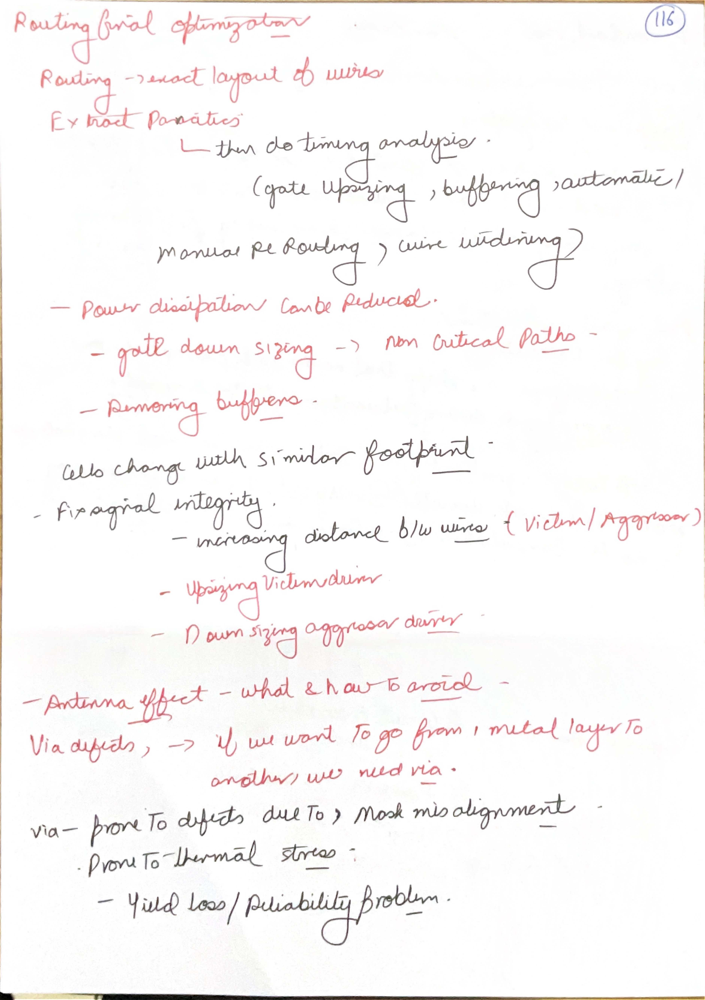](#day-09-index)

*Source: Scan E, PDF page 13.*

After detailed routing, actual wire parasitics can reveal setup, hold, slew, capacitance or noise violations that earlier estimates missed. Repairs can resize a cell, insert buffers, change routing, adjust spacing or use a permitted wider/higher-layer wire. Each action affects more than one metric.

Upsizing a victim driver can reduce its sensitivity to coupled noise and improve output transition, but increases its input load and often power. Increasing spacing can reduce coupling while forcing detours elsewhere. A buffer can divide a long RC network but creates new cells/nets and pin-access demand. Wider wire can reduce resistance while increasing capacitance and resource use.

Power recovery may downsize a noncritical cell or remove an unnecessary buffer. Check maximum and minimum timing, electrical limits and modes after that recovery. Hold repair generally aims to delay an early data transition; setup repair aims to deliver a late transition sooner. A change that helps one can harm the other. Lowering clock frequency addresses a next-edge setup budget, not the same-edge hold requirement.

Use updated parasitics for changed geometry. A cached SPEF from before rerouting does not represent the repaired net. Recheck placement legality and detailed rules for added/moved cells and wires, then update timing/noise/power reports. The engineering unit is a consistent netlist/layout/parasitic checkpoint, not one attractive slack number saved from a different iteration.

### E-14: Redundant vias and metal fill protect different aspects of fabrication

[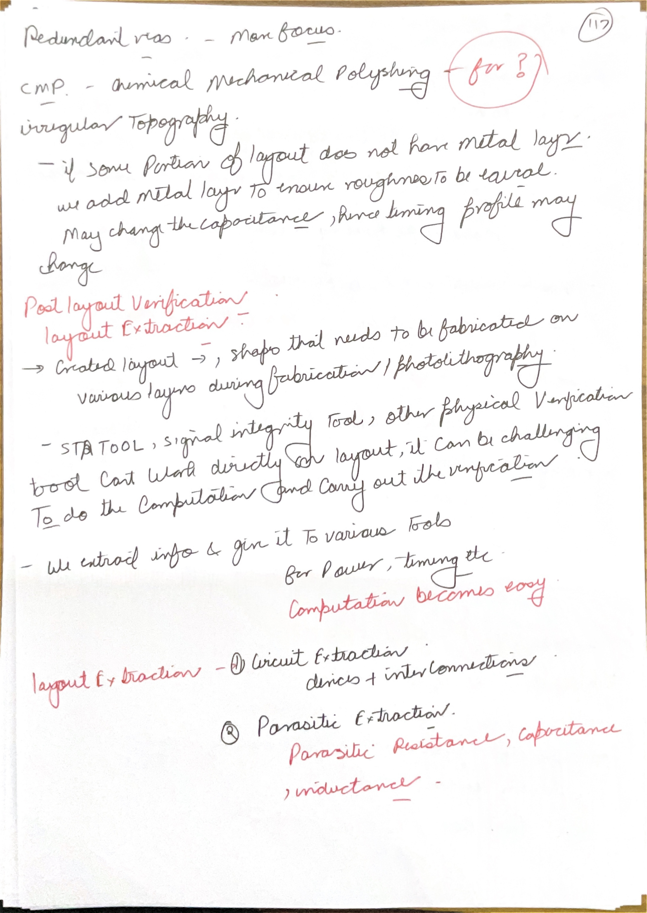](#day-09-index)

*Source: Scan E, PDF page 14. The lower extraction introduction continues in Lesson 53.*

A redundant via adds another legal conductive connection between the same layers/nets. It can reduce sensitivity to a single via failure and improve current distribution. The geometry must still satisfy cut spacing, enclosure and neighboring-net rules. A pair of adjacent vias does not provide two entirely independent reliability events: common process defects or current crowding can affect both.

If two failures were independent with probability p, both failing would have probability $p^2$. This simple illustration explains why redundancy can help; it is not a process-qualified reliability number. Via-array current sharing and electromigration also require the actual physical model.

Metal fill adds permitted dummy shapes to meet density/uniformity requirements for processes such as CMP. It does not replace all empty space with a new continuous conducting sheet. Shapes, exclusions, layer densities and connectivity/floating behavior follow the foundry's rules and fill flow.

Fill changes the electrostatic environment and can add ground/coupling capacitance near signal wires. Therefore a pre-fill parasitic/timing result may no longer represent the final manufacturing geometry. Re-extract or apply the flow's validated fill-aware treatment, then repeat the required analyses. The lower part of the page begins layout/circuit extraction because the completed geometry is the input to the next verification stage.

[Back to day index](#day-09-index)

## Lesson 53: Post-layout Verification and Signoff

Week 12 · [Lecture video](https://www.youtube.com/watch?v=EKt-Ev3c_bE) · [Back to day index](#day-09-index)

<!-- wrapup-frame-53 -->

[](#day-09-index)

*Lecture: [26:41 — LVS compares two independently formed circuit descriptions](https://www.youtube.com/watch?v=EKt-Ev3c_bE&t=1601s).*

Merged layout and an extraction deck produce the layout netlist; the design database and library models produce the source netlist. The comparison reports mismatches that must be repaired in the design. E-18 explains why this connectivity check is separate from geometry and timing closure.

### E-15: Circuit extraction and parasitic extraction answer different questions

[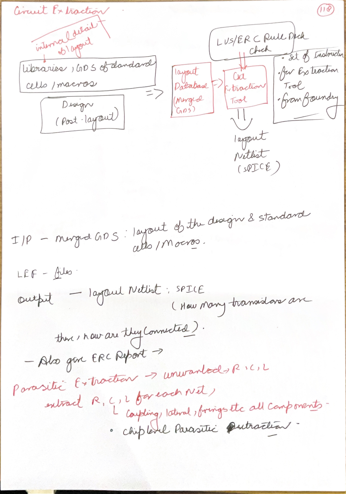](#day-09-index)

*Source: Scan E, PDF page 15.*

Circuit extraction determines what devices and connections the layout actually forms. Foundry rules identify layer combinations representing transistors or other devices and infer connectivity. Its extracted netlist can be expressed in SPICE and used for LVS/ERC. It answers “what circuit did this geometry make?”

Parasitic extraction quantifies additional resistance and capacitance associated with the geometry. A wire is not one perfect zero-resistance node: it may be segmented into a resistor network with grounded and coupling capacitances. Inductance is included when relevant and supported by the intended analysis; many ordinary digital timing flows primarily use RC models.

Detailed standard-cell and macro layouts must be present for transistor/device-level extraction. Implementation LEF is an abstract view of outlines, pins and obstructions; it cannot reconstruct all omitted transistor geometry. Merge/reference the correct complete GDS/OASIS views according to the signoff flow. Missing or mismatched views can make the extracted result incomplete even if the placement database looks normal.

SPEF commonly transfers net parasitics to a timing/power analyzer. It does not replace Liberty's cell timing behavior or supply a complete transistor-level functional model by itself. A SPICE extracted circuit can serve a different analysis boundary. File format and purpose should be chosen deliberately rather than treating every extracted file as interchangeable.

#### Preserve the RC topology when estimating a receiver delay

Consider an extracted two-section RC tree: the source reaches node 1 through R1=100 Ω; node 1 has C1=20 fF to ground; R2=200 Ω then reaches node 2, whose total capacitance C2=30 fF includes the receiver load. For this passive RC tree and an ideal source, the Elmore first moment at node 2 is:

$$
\tau_2=R_1(C_1+C_2)+R_2C_2=5\ \mathrm{ps}+6\ \mathrm{ps}=11\ \mathrm{ps}.
$$

R1 charges both capacitors, while R2 charges only the downstream one. Multiplying total resistance by total capacitance gives 300 Ω×50 fF=15 ps and wrongly makes R2 charge C1 too. At node 1, its own first moment is R1(C1+C2)=5 ps; the downstream capacitor still loads that upstream segment.

The first moment is a useful response measure, not an exact 50% threshold delay for every multi-pole waveform. Driver resistance, coupling, branches and waveform-dependent cell behavior require the relevant timing model. Extraction should preserve enough connectivity and capacitance placement to make that analysis possible. A valid logical netlist and one total wire-capacitance number cannot capture all receiver-specific RC effects.

### E-16: Characterized patterns make full-chip extraction practical

[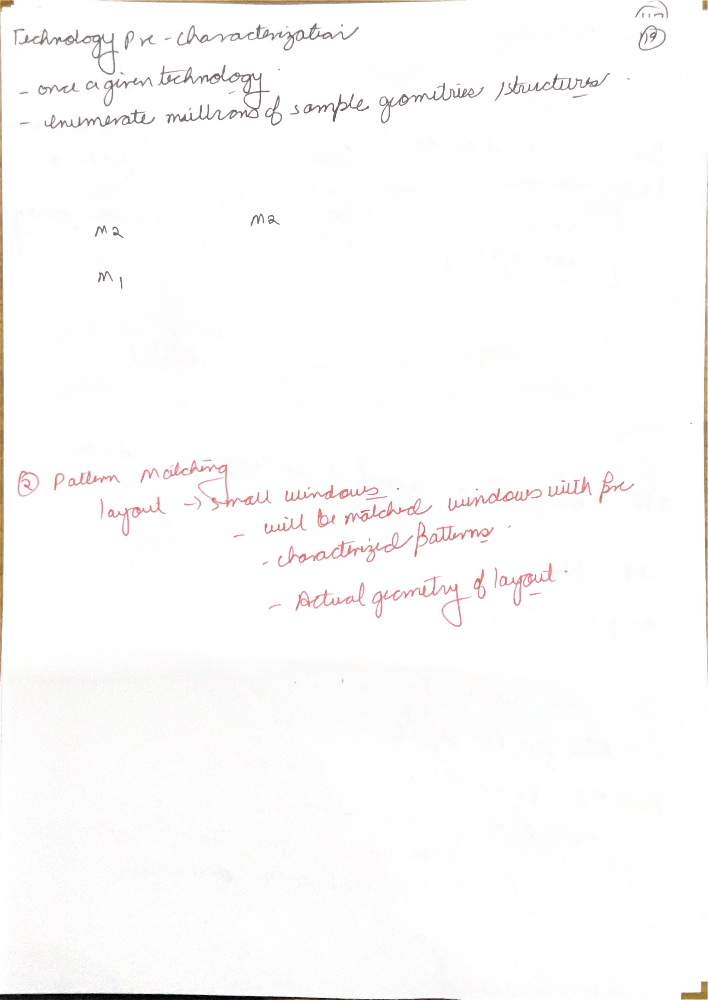](#day-09-index)

*Source: Scan E, PDF page 16.*

Solving the full three-dimensional field problem for every shape on a large chip would be expensive. A practical approach characterizes representative conductor/dielectric configurations and uses geometry matching, interpolation and appropriate models to estimate the layout's parasitics efficiently.

The characterization needs layer materials/thicknesses, conductor dimensions and neighboring geometry. A wire with another metal directly above it has a different capacitive environment from an otherwise similar isolated wire. Lateral gaps, overlap, fringing, via arrangements and dielectric properties all contribute. A table indexed only by wire length would miss many of these relationships.

Pattern matching maps actual geometry into the modeled configurations. Results are reliable only within the technology/model assumptions and the applicable range. Blind extrapolation to unsupported widths or process layers can produce misleading accuracy. Corners may provide different RC values, which must match the timing scenario being analyzed.

The [OpenRCX documentation](https://openroad.readthedocs.io/en/latest/main/src/rcx/README.html) describes rule/model-based parasitic extraction and SPEF output. A tool having an extraction command is not enough; the appropriate extraction model and final geometry are required. Inspect annotation coverage so a successful read command does not conceal nets without valid parasitics.

### E-17: DRC checks geometry; ERC checks electrical construction

[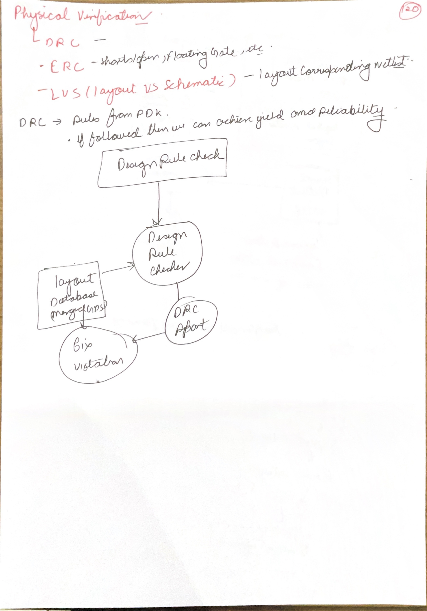](#day-09-index)

*Source: Scan E, PDF page 17.*

Design-rule checking compares layout geometry with a technology's rule deck. Examples include minimum width/spacing, via enclosure, cut spacing, density and manufacturing-specific restrictions. Reports identify the violated rule and affected location so the shape can be corrected. A generic ruler measurement cannot replace the complete deck, especially when rules depend on neighboring patterns.

Electrical-rule checking examines connectivity and electrical construction: for example floating gates, inappropriate well/substrate connections or invalid voltage-domain connections under the deck's definitions. It overlaps with extracted connectivity information but asks different questions from geometric spacing alone. A legal-looking wire can connect the wrong electrical nodes.

DRC-clean means the checked geometry satisfies the implemented rules and approved waiver conditions. It does not guarantee every fabricated chip will be defect-free or that the design is logically correct. ERC-clean similarly does not prove all dynamic behavior or software-visible functionality. Both results need the correct technology, run configuration and complete layout views.

When a rule report is fixed, rerun the relevant check on the modified geometry. If the fix moves a route or changes coupling, timing/parasitics may need updates too. A signoff package must identify the actual checked layout revision; a clean report from yesterday's different GDS is not evidence for today's changed file.

### E-18: LVS and signoff must refer to the same final design

[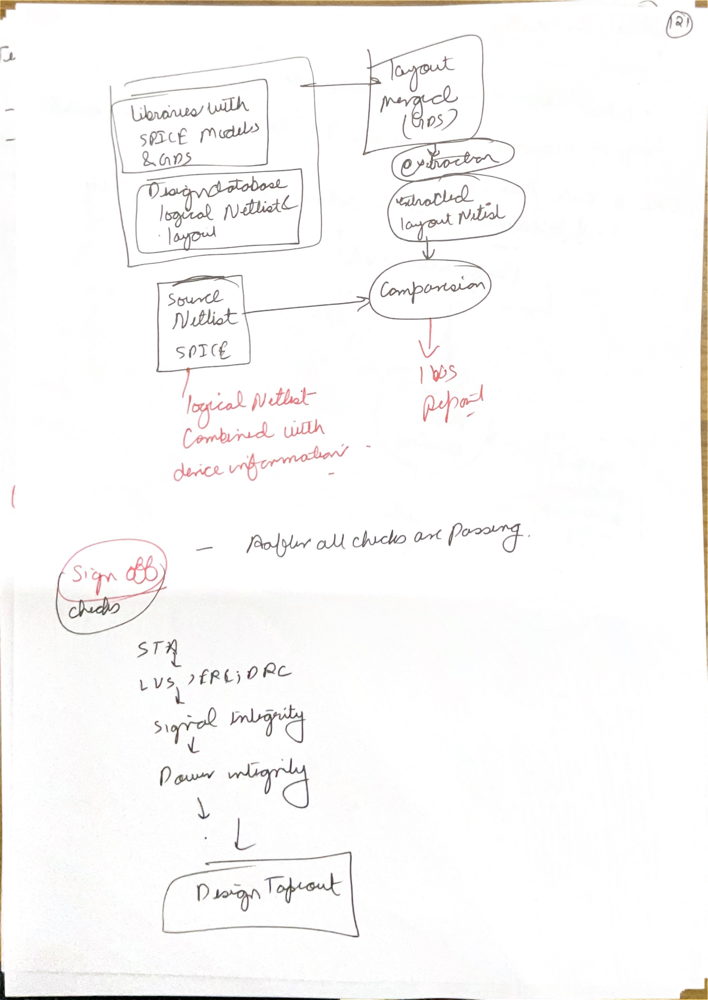](#day-09-index)

*Source: Scan E, PDF page 18.*

LVS compares the circuit extracted from layout with the intended reference circuit. The source/reference netlist may need cell/macro SPICE models, pin mapping, hierarchy handling and permitted black-box rules so both sides describe comparable devices/connections. Name differences alone need not imply a mismatch, but shorts, opens, missing devices or incorrect parameters can.

A disconnected wire gap can satisfy geometric spacing rules while making LVS fail because the reference connection is absent. Conversely, layout can match the intended circuit while a critical path fails setup. DRC, LVS and STA therefore provide complementary evidence.

The lecture's LVS frame shows two paths into comparison: merged GDS plus the extraction deck produce the layout netlist; the design/library reference produces the source netlist. The repair loop returns to the design, rather than editing the report to declare a match.

| Signoff check | Main question | Essential context |
|---|---|---|
| DRC | Is the geometry permitted? | Final layout and foundry deck |
| ERC | Are required electrical connections/conditions valid? | Extracted circuit, domains and deck |
| LVS | Does layout implement the intended circuit? | Complete views and correct reference |
| STA | Do timing relationships pass? | Modes/corners, constraints, clocks, libraries, parasitics |
| Power / IR / EM | Are energy, supply drop and reliability acceptable? | Activity/current scenarios and technology models |

Timing signoff covers setup, hold and the relevant recovery/removal, pulse-width, clock-gating and electrical checks across required modes/corners. Include justified variation, clock behavior and coupling/noise treatment. A single nominal worst-slack report cannot establish closure in every operating condition.

The final netlist, placement/routing, merged layout, extraction and reports must be mutually consistent. After a change, regenerate what depends on it and complete the necessary checks on the final revision. This is the practical meaning of signoff: the design is accepted against specified criteria with identifiable evidence, rather than merely reaching the last item in a script.

### E-19: ECOs change the evidence; tapeout releases a verified layout

[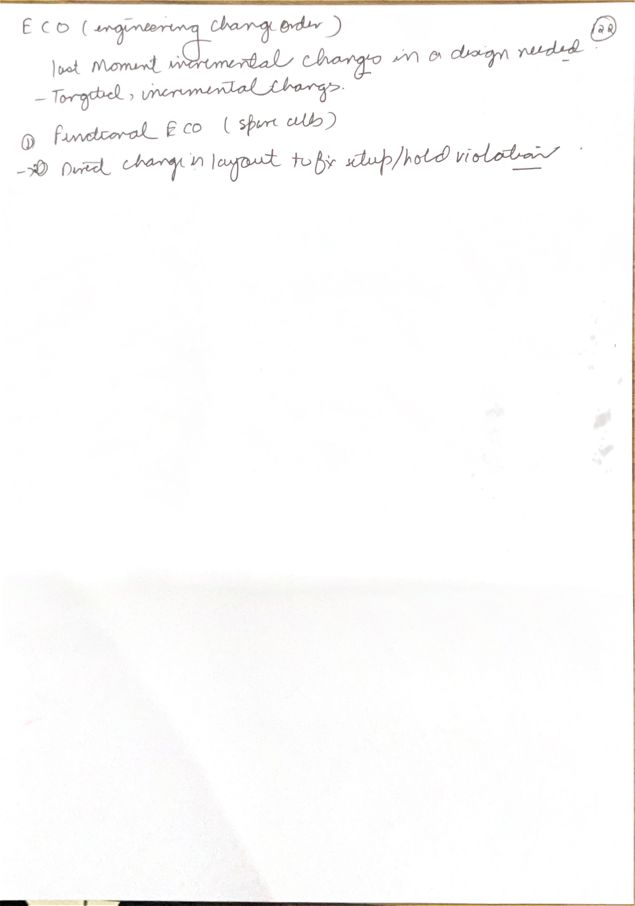](#day-09-index)

*Source: Scan E, PDF page 19.*

A timing ECO may add delay to a too-fast hold path, buffer a long net, resize a cell or modify a route while preserving the intended logical behavior. A functional ECO changes the function to meet a revised requirement. Its verification reference must therefore reflect that approved new requirement; requiring equality to the obsolete function would be the wrong proof obligation.

Spare cells can make some functional revisions possible through local interconnect changes. Their availability, location, functions and pin access limit what can be achieved. An incremental change can save implementation effort, but it still changes connectivity/geometry and may affect timing, power, noise, DRC and LVS.

For a hold repair, for example, inserting a delay buffer changes the netlist and wire topology. Check hold improvement and remaining setup margin, legalize the added cell, route it, re-extract and verify the final connection. An equivalence check supports preserved function; it does not establish geometric legality or timing. Retain the matching post-ECO reference when doing LVS.

Tapeout supplies the accepted manufacturing data and required collateral after the agreed signoff process. It is not synonymous with a successful RTL compile or a displayed routed layout. The layout, top cell, layer mapping, library/macro versions and release checks must correspond to the intended final design. These notes explain the flow and its obligations; they do not certify the course example as a production tapeout.

#### Check both sides of a hold-repair budget

Suppose a routed path has hold slack -30 ps and setup slack +70 ps. Compare three hypothetical delay cells by their **effective path** minimum and maximum added delays after loading and routing effects are included:

| Candidate | Added minimum delay | Added maximum delay | New hold slack | New setup slack |
|---|---:|---:|---:|---:|
| A | 20 ps | 35 ps | -10 ps | +35 ps |
| B | 35 ps | 55 ps | +5 ps | +15 ps |
| C | 45 ps | 80 ps | +15 ps | -10 ps |

A is too small for hold; C consumes too much setup budget; B satisfies this simplified pair with limited margin. The relevant delays are not one typical number from a cell label. Other paths sharing the driver, new pin load, placement, routing and corners can change the result.

After insertion, the proof chain needs a matching logical netlist and physical design: legalize the cell, connect its supplies, route the changed nets, re-extract, and rerun the required timing and physical/equivalence checks. A pre-ECO LVS pass no longer verifies the changed layout against the changed reference. A post-ECO timing pass using old parasitics similarly leaves the new geometry untested. Every pass should identify the design revision and analysis inputs it validates.

[Back to day index](#day-09-index)

## Lesson 54: Clock Tree Synthesis and Routing

Week 12 tutorial · [Lecture video](https://www.youtube.com/watch?v=78O_COvyqAw) · [Back to day index](#day-09-index)

<!-- wrapup-frame-54 -->

[](#day-09-index)

*Lecture: [8:20 — The script records routing evidence and checkpoints](https://www.youtube.com/watch?v=78O_COvyqAw&t=500s).*

The tutorial editor shows detailed-routing options, a DRC report path, antenna checks and written database/DEF files, followed by extraction. Each output belongs to a particular design revision. The tutorial explanation below connects those files to the later routed GUI and the required parasitic/timing checks.

### Tutorial: Follow the complete post-placement data chain

The tutorial continues the GCD/Nangate45 example. Its CTS script repairs clock inverters as appropriate to the flow, inserts a buffered tree, repairs source-to-root clock wiring, legalizes inserted cells and revisits timing. The clock viewer shows a root feeding regional buffers and then register sinks; its flylines show connectivity, not all final detailed wires.

Once the clock network exists, use propagated clocks and update parasitic estimates before setup/hold repair. The video's broad statement about downsizing/high-VT cells should be read as one class of delay/power transformations. Setup and hold have opposite delay needs: setup repair can require stronger drive, buffering or other speed improvements; hold repair can add delay. Every repair must preserve the other required checks.

The following **illustrative fragment** assumes a loaded, legally placed Nangate45 design, matching libraries, clock constraints and platform RC/routing settings. It explains stage order; it is not a self-contained implementation script or a newly executed local result.

```tcl
clock_tree_synthesis -buf_list {BUF_X4} -root_buf BUF_X4
set_propagated_clock [all_clocks]
estimate_parasitics -placement
repair_timing -setup
repair_timing -hold
detailed_placement
global_route -guide_file routes.guide
detailed_route -output_drc route-drc.rpt
```

Use buffer names that actually exist in the chosen technology, and follow the flow's placement/repair checkpoints. Current commands/options are documented by [TritonCTS](https://openroad.readthedocs.io/en/latest/main/src/cts/README.html), [global routing](https://openroad.readthedocs.io/en/latest/main/src/grt/README.html) and [detailed routing](https://openroad.readthedocs.io/en/latest/main/src/drt/README.html). Historical helper procedures/flags can differ from current versions.

The course routing script establishes pin-access layers, writes global guides, checks/repairs antenna issues as required, inserts compatible fillers, performs detailed routing and writes checkpoints. Filler cells address physical continuity requirements of the cell-row architecture; their presence does not mean the logic function gains extra gates. The flow must handle filler/antenna-repair ordering correctly for its tool/version.

Parasitic extraction then uses a technology extraction model to write the appropriate parasitic file, commonly SPEF. If no extraction model is available and the script falls back to global-route estimates, label the result as estimated. That fallback does not become final-layout extraction just because it appears at the end of the script.

[](#day-09-index)

*Lecture: [11:34 — routed-layout display](https://www.youtube.com/watch?v=78O_COvyqAw&t=694s).*

Use the GUI to distinguish instances, signal routes, clock routes, power/ground and fillers. Congestion/power-density heatmaps display the selected metric and scale; color is not a universal pass/fail rule. The final reports should identify setup/hold slack, total negative slack, electrical violations, clock properties, parasitic coverage and power assumptions. Physical-verification results remain separate obligations.

### Final-week recall and a connected design story

Follow one register-to-register transfer across the stages. Placement chooses the registers' and logic cells' locations and estimates the wire. CTS creates L and C, changing its setup/hold comparison. Routing creates exact wire and via geometry. Extraction computes its RC network and coupling environment. STA evaluates the appropriate launch/capture edges using those models. DRC/ERC/LVS evaluate geometry and intended electrical construction; power/IR/EM check the required operating scenarios. An ECO can send the design back through several of these checks.

To explain this flow without memorized labels, answer these five prompts: why does a midpoint clock buffer help a long wire; why can a later capture clock pass setup and fail hold; why does zero global overflow not prove legal detailed routing; why can a layout be DRC-clean but LVS-wrong; and why must fill or rerouting precede the final parasitic/timing evidence? The page-specific derivations above supply the mechanisms and assumptions for each answer.

[Back to day index](#day-09-index)
