# Day 03: Simulation, RTL synthesis and two-level optimization

Lessons 13–18. Six-lesson study blocks; Day 06 remains partial through Constraints I.

## Day 03 index

- [Lesson 13: Functional Verification using Simulation](#lesson-13-functional-verification-using-simulation)

- [Lesson 14: High-level synthesis using Bambu - Tutorial 3](#lesson-14-high-level-synthesis-using-bambu---tutorial-3)

- [Lesson 15: RTL Synthesis - Part I](#lesson-15-rtl-synthesis---part-i)

- [Lesson 16: RTL Synthesis - Part II](#lesson-16-rtl-synthesis---part-ii)

- [Lesson 17: Logic Optimization - Part I](#lesson-17-logic-optimization---part-i)

- [Lesson 18: Simulation-based Verification using Icarus](#lesson-18-simulation-based-verification-using-icarus)


[Master index](README.md) · [Handwritten page index](Resources/Handwritten%20Index.md) · [Glossary](Resources/Glossary.md)


Figures link to the day index. Source page identifiers refer to the original scans.


## Lesson 13: Functional Verification using Simulation


Week 3 · [Lecture video](https://www.youtube.com/watch?v=3EmADY-fSaw&t=1350s) · [Back to day index](#day-03-index)


[](#day-03-index)  
[](#day-03-index)


*Lecture: [22:30](https://www.youtube.com/watch?v=3EmADY-fSaw&t=1350s) · Source: A-01.*

[](#day-03-index)

*Lecture: [22:30](https://www.youtube.com/watch?v=3EmADY-fSaw&t=1350s).*


### Verification environment and coverage

| Concept | Technical interpretation |
|---|---|
| A simulator evaluates a testbench and a design under test; coverage reports what was exercised. | A-01 separates DUT, simulator, testbench and VCD. Keep code coverage separate from the functional scenarios required by the specification. |
| Evaluation and update events can occur repeatedly at one simulation time. | A-02 and A-03 describe event scheduling. The order inside one sequential block is defined; an order between independent active processes generally is not. |

### A-01: Testbench, DUT, waveform and coverage

[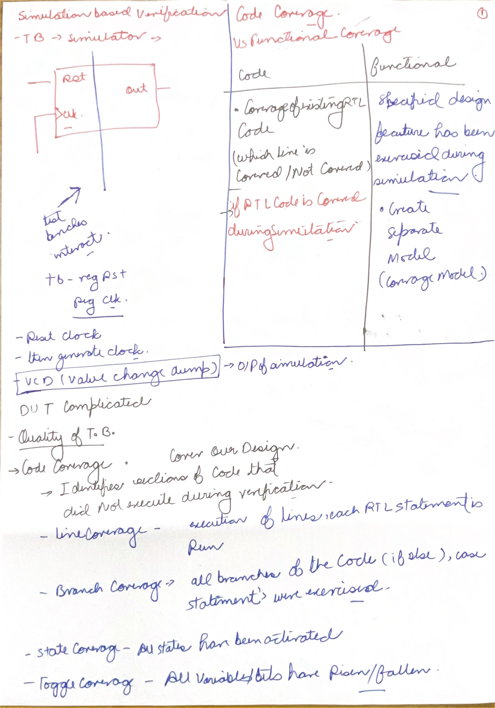](#day-03-index)

*Source: Scan A, PDF page 1.*

A testbench supplies stimulus and checks responses against intended behavior. The design under test (DUT) is the implementation being checked. The simulator executes both according to Verilog semantics. A waveform is a record of signal values; it is evidence to inspect, rather than a substitute for a checker. These distinctions matter when an output looks plausible but is one clock cycle late.

The upper sketch places the DUT inside a simulation environment, with clock and reset supplied by the testbench. Reset establishes a known starting condition; clock edges determine when sequential state may change. For a counter, a useful checker verifies the reset value, the increment after each enabled edge, and retention when enable is low. Merely observing that the counter changes misses these separate requirements.

**VCD means Value Change Dump.** `$dumpfile` chooses the output file and `$dumpvars` selects the hierarchy whose value changes are recorded. The file contains timestamps and value changes, not an assertion that those values are correct. GTKWave is a viewer; it does not compile the RTL or generate stimulus.

The coverage list distinguishes line, branch, state and toggle coverage. Statement coverage asks whether code executed. Branch coverage asks whether control alternatives executed. FSM coverage can distinguish visited states from traversed transitions; visiting both endpoint states does not imply the connecting transition occurred. Toggle coverage records changes of bits, commonly in both directions. These measures expose unexercised implementation behavior.

Functional coverage starts from the specification: for example, overflow while enable is active, reset during operation, or a particular arbitration conflict. An implemented feature that is missing altogether cannot necessarily appear as an uncovered source line. Thus 100% code coverage does not establish specification completeness. A passing test and a coverage increase answer different questions: correctness of a checked case, and extent of exercised behavior.

**Recall check:** explain how a test could execute every line of an adder while never checking carry-out. The branch-free implementation may have complete statement coverage even though the checker ignores an essential output.

#### From a requirement to a checker

Each requirement needs a distinguishable stimulus and expected observation. A skipped increment and a double increment can cancel in a final-value check, so checking each edge identifies the first divergence. The following counter has an enable; Lesson 18's counter increments unconditionally.

| Requirement | Stimulus and observation | Error exposed |
|---|---|---|
| Reset establishes zero | Assert reset after a nonzero count; observe after the specified reset response. | A missing reset or incorrect reset value. |
| Enable permits one increment | Sample a known count, apply one enabled rising edge, and compare with the width-limited expected sum. | A skipped or double increment. |
| Disable preserves state | Hold enable low across several rising edges and compare every observed count with the initial count. | An unintended increment or retention failure. |
| Overflow wraps correctly | Start at the largest representable count and apply one enabled edge. | A missing wrap, saturation, or lost-width assumption. |

### A-02: Evaluation, updates, event queues and races

[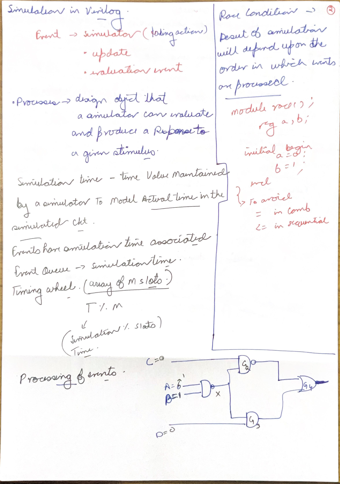](#day-03-index)

*Source: Scan A, PDF page 2.*

The gate diagram illustrates why a simulator does more than evaluate every gate once. If an input changes, processes sensitive to it become eligible to run. Their evaluation may produce updates on intermediate nets. Those updates can activate downstream processes, continuing until no runnable event remains at the current time. A chain of zero-delay logic can settle through several event iterations without advancing simulated time.

The time-wheel drawing assigns future events to slots using a time index such as `T % m`. This is an implementation illustration of an event queue, not a Verilog language guarantee that every simulator uses that exact data structure. The required behavior is to preserve the specified simulation-time and event-region semantics. Wall-clock runtime on the computer is a separate quantity from simulated circuit time.

A race occurs when a result depends on an unspecified ordering of eligible processes. Consider two independent blocks triggered by the same rising edge: one changes the DUT input using a blocking assignment and the other samples that input. Either old or new data may be observed depending on execution order. Nonblocking assignments are the normal choice for clocked state, but that guideline alone does not repair a testbench that drives inputs ambiguously at a sampling edge.

For a small teaching testbench, drive on the falling edge and check after the next rising edge has completed its nonblocking updates. That separates stimulus from sampling. In a richer SystemVerilog environment, clocking blocks provide explicit drive/sample scheduling. Neither technique changes the physical propagation delay of the designed gates; both make simulation intent unambiguous.

### A-03: Classic Verilog stratified event queue

[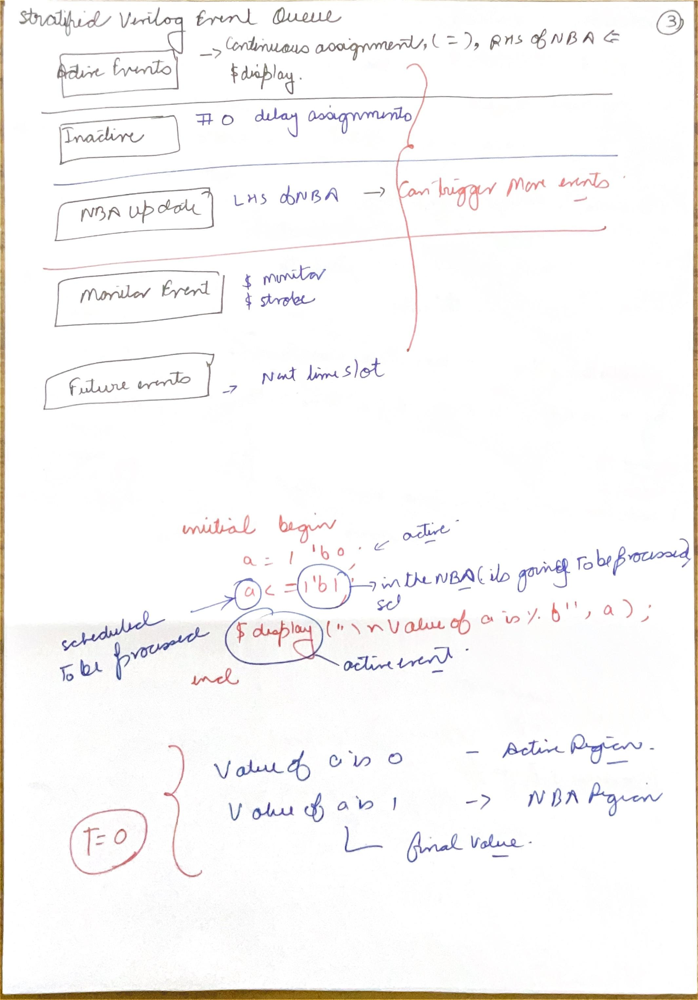](#day-03-index)

*Source: Scan A, PDF page 3.*

Read the regions from the perspective of one time slot. Active events include execution of ordinary procedural statements, blocking updates, continuous-assignment evaluation, and evaluation of right-hand sides of nonblocking assignments. A procedural `#0` defers continuation to the inactive region. Nonblocking-assignment updates then apply the scheduled left-hand-side values. `$strobe` and `$monitor` observe settled values in the classic monitor region. Future-time events become current only after the current slot is exhausted.

```verilog
`timescale 1ns/1ps
module queue_demo;
  reg a;
  initial begin
    a = 1'b0;
    a <= 1'b1;
    $display("active a=%b", a);
    $strobe("settled a=%b", a);
    #1 $finish;
  end
endmodule
```

The blocking statement immediately makes `a=0`. The nonblocking statement evaluates `1` now but schedules the update. `$display` therefore sees `0`; `$strobe` sees `1` after the update. The output ordering is not explained by an invented gate delay: both observations belong to the same simulation time.

Applying a nonblocking update can awaken another active process. Consequently the drawing should not be read as a pipeline that passes through every region exactly once. The scheduler can return to eligible events while finishing that time slot. Also, these are the classic Verilog regions used in this lecture; SystemVerilog has additional regions for assertions, programs and related constructs. Do not present this five-part sketch as the complete SystemVerilog scheduling model.

The [Sutherland Verilog reference guide](https://sutherland-hdl.com/pdfs/verilog_2001_ref_guide.pdf) provides the procedural-assignment and system-task terminology used here.


[Back to day index](#day-03-index)


## Lesson 14: High-level synthesis using Bambu - Tutorial 3


Week 3 · [Lecture video](https://www.youtube.com/watch?v=Ubupdoq8Nio&t=250s) · [Back to day index](#day-03-index)


[](#day-03-index)


*Lecture: [Lecture at 4:10](https://www.youtube.com/watch?v=Ubupdoq8Nio&t=250s).*


### From C behavior to scheduled hardware

This tutorial demonstrates **Bambu**, a high-level synthesis (HLS) tool. The input is a supported C description and a chosen top function. The output is RTL plus supporting implementation or verification artifacts. HLS must turn software operations into a hardware architecture: allocate operators, schedule operations into clock steps, bind operations to resources, and generate a controller and datapath. C statements alone do not specify a unique number of adders, registers or cycles.

For a behavior `return (a+b)*c`, the addition depends on `a` and `b`; multiplication depends on the addition result. A serial schedule can place the operations in different cycles, registering the intermediate result. A sufficiently relaxed clock target may allow both in one combinational path. Pipelining can increase throughput while retaining multiple cycles of latency. These are different architectural outcomes for the same arithmetic behavior.

The course handout describes installation and a small application. Commands in a historical installation demonstration are evidence of that setup, rather than a current universal install procedure. Consult the [Bambu project documentation](https://panda.dei.polimi.it/) before reproducing the environment. 

### What to inspect in the tutorial output

Inspect the chosen top function, input/output widths, signedness, handshake signals and latency. Then compare an RTL simulation against the C behavior for representative values, including boundaries. A compiled C executable that produces the expected answer checks the software description; it does not alone verify the generated RTL interface or cycle timing. Keep the expected numerical result separate from the cycle in which it becomes valid.

### Trace the actual tutorial function

The installation frame shows preparation of the software environment. The handout then supplies this branch-ordered top function:

```c
long func(int j, int k, int c, int d) {
  int i = 0;
  if (c > 2) {
    i = j - k;
  } else if (d < 5) {
    i = j + k;
  } else {
    i = 12;
  }
  return i;
}
```

For j=10 and k=3, c=3 chooses subtraction and returns 7, even if d=4 also satisfies the second comparison. With c=2 and d=4, the first branch is false and addition returns 13. With c=2 and d=5, both tests are false and the constant branch returns 12. An RTL implementation must preserve this priority and the comparison boundaries. The function's arithmetic assumes that the int operations remain within their defined range; returning long does not automatically widen an earlier int addition.

The handout's surrounding main routine declares local inputs without initializing them. It is not a valid numerical reference test as written. Supply defined input values when verifying the function rather than treating an arbitrary software output as expected hardware behavior. The top function itself, together with its supported type interpretation, is what the HLS invocation targets.

```sh
./bambu-0.9.7.AppImage hls_example.c --top-fname=func
```

This invocation reproduces the historical course version. The handout explains the AppImage, executable permission and FUSE dependency. Check current official requirements before installing. Examine whether the generated arithmetic is shared and whether the branch controller and result-valid timing preserve the intended interface.


[Back to day index](#day-03-index)


## Lesson 15: RTL Synthesis - Part I


Week 4 · [Lecture video](https://www.youtube.com/watch?v=cnpWgZLgB4I&t=1200s) · [Back to day index](#day-03-index)


[](#day-03-index)  
[](#day-03-index)


*Lecture: [20:00](https://www.youtube.com/watch?v=cnpWgZLgB4I&t=1200s) · Source: A-06.*

[](#day-03-index)

*Lecture: [20:00](https://www.youtube.com/watch?v=cnpWgZLgB4I&t=1200s).*


### Reading RTL as an implementable description

| Concept | Technical interpretation |
|---|---|
| Parsing builds a syntax representation; elaboration resolves an actual design hierarchy. | A-04 and A-05 contain two kinds of tree. A syntax tree is not the same as a tree of instantiated modules. |
| Supported RTL constructs infer combinational logic or state elements. | A-06 and A-07 explain muxes, flip-flops and latches. The inferred structure depends on assignment coverage and event controls. |

### A-04: Parsing, syntax trees and elaboration

[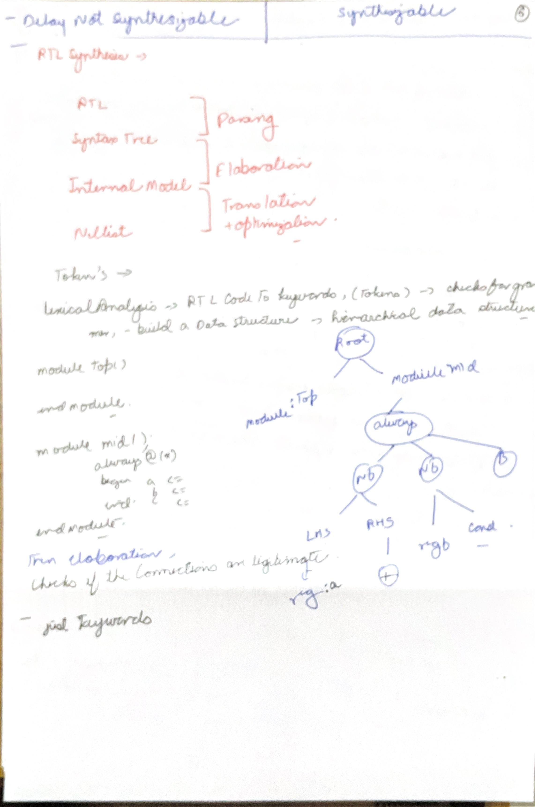](#day-03-index)

*Source: Scan A, PDF page 4.*

The flow begins with text, but synthesis must acquire meaning before it can construct hardware. Lexical analysis recognizes tokens such as identifiers, operators and keywords. Parsing checks that those tokens follow the language grammar and creates a structured representation. In an expression `y = (a & b) | c`, the expression tree records an OR with an AND as one child; parentheses establish the grouping.

Elaboration then resolves module instances, parameter values, generate constructs and connections. A module definition can be reused by several instances. The syntax tree describes how the source is written; the instance hierarchy describes which configured blocks are present in the selected top-level design. They are related structures with different purposes. A clean parse does not imply that elaboration can find every referenced module.

The internal representation may contain word-level operators, muxes and registers. Translation lowers procedural constructs into that representation; optimization simplifies it; mapping chooses concrete library cells. Avoid treating “internal model” as already being a final technology-specific netlist. The lecture deliberately separates those stages because their checks differ: syntax, resolved design structure, inferred behavior, and available cell implementations.

### A-05: Port direction, instances and parameterized counters

[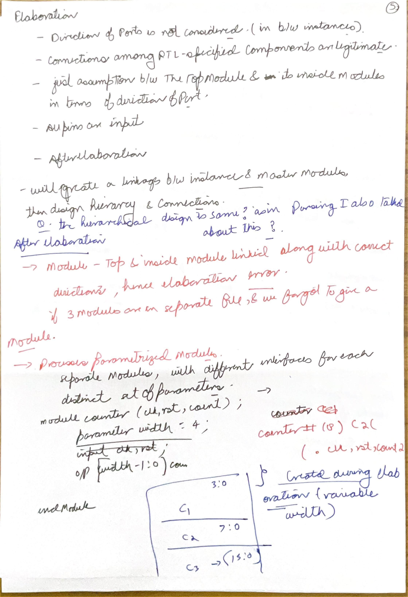](#day-03-index)

*Source: Scan A, PDF page 5.*

The handwritten statement that all pins are treated as inputs is not a rule to apply to an elaborated Verilog module. A module has declared input, output and inout ports, and elaboration resolves the instance connections against those declarations. A parser may temporarily use an unresolved internal node, but that does not override the source port directions or make a driven output into an input.

For the parameterized counter example, one source module may have a default width of four while three instances override it to 4, 8 and 16. Elaboration produces three configured instances with correspondingly sized state and ports. This is a structural compile-time choice. It does not mean one physical counter changes width while running.

Named connections associate `.clk(clock_signal)` with the formal port `clk`. Positional connections instead rely on the declared port order and are easier to misread when an interface changes. Resolve the top module, check missing definitions, compare parameter overrides, and inspect width mismatches before reasoning about the inferred netlist. These checks identify connection mistakes that Boolean minimization cannot fix.

**Recall check:** explain why a module can parse correctly yet fail when a referenced submodule definition is absent. Parsing recognizes the instance syntax; elaboration needs the definition to determine its ports and implementation.

For an unsigned W-bit counter incremented at each enabled edge, the representable states are $0$ through $2^W-1$ and the next value is $(q+1)\operatorname{mod} 2^W$. Widths 4, 8 and 16 therefore wrap after 16, 256 and 65,536 increments respectively when starting at zero. Parameter overrides change both the register width and this behavior. Comparing differently parameterized instances without adjusting the reference model can produce a correct simulation mismatch: the models implement different modulus values.

### A-06: Synthesis support, muxes and wildcard cases

[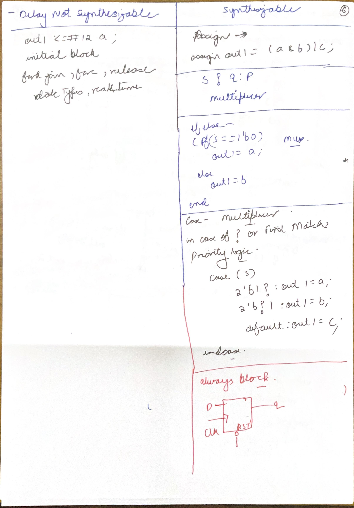](#day-03-index)

*Source: Scan A, PDF page 6.*

The screenshot emphasizes two boundaries: some constructs describe simulation behavior without a usual ASIC circuit mapping, and tools support particular synthesizable subsets. Delays such as `#12`, `force/release`, and concurrent testbench control usually belong to simulation. An `initial` block is not universally nonsynthesizable: some FPGA flows support initialization. Interpret the note in the ASIC RTL context of the course, and confirm the selected tool and target when a construct is borderline.

A continuous Boolean expression such as `assign y = (a & b) | c;` describes combinational logic. `assign y = s ? q : p;` describes selection between operands. Complete assignments in an `always @*` block similarly permit combinational inference: every path must assign every intended output.

The wildcard case example needs a language correction. In a plain `case`, `?` represents a `z` value; it is not a wildcard for arbitrary 0 or 1. Use `casez` for `?` wildcard positions, and remember that when patterns overlap, the first matching branch wins.

```verilog
always @* begin
  y = 1'b0;
  casez ({a,b})
    2'b1?: y = c;
    2'b?1: y = d;
    default: y = 1'b0;
  endcase
end
```

For `{a,b}=11`, both patterns match and the first branch selects `c`. Therefore this is priority behavior, rather than two independent conditions with equal priority. `casex` also ignores unknown `x` values and can conceal a simulation bug; avoid using it casually to make an RTL decision “more flexible.”

For binary inputs, the complete selection is: 00 produces zero, 01 selects d, and both 10 and 11 select c. Its Boolean function is $y=ac+\overline{a}bd$. The complement on a suppresses the lower-priority choice when a is one. Replacing it with $ac+bd$ changes the result at $a=b=1,c=0,d=1$: the priority case yields zero while the modified expression yields one. This equation is derived for 0/1 inputs; it does not replace the language's four-state wildcard semantics.

### A-07: Blocking chains, pipelines and latch inference

[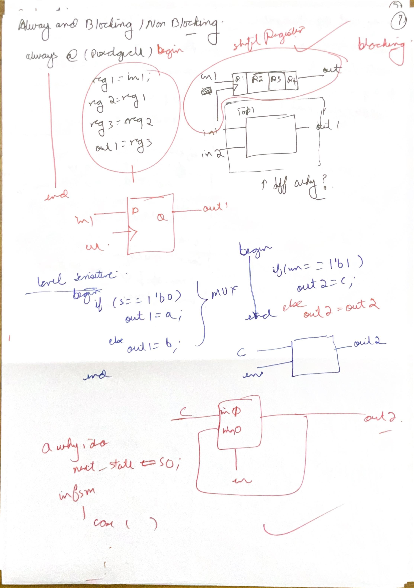](#day-03-index)

*Source: Scan A, PDF page 7.*

The two clocked chains distinguish procedural evaluation from physical storage. With blocking assignments `r1=in; r2=r1; r3=r2; out=r3;` inside one rising-edge process, each following statement sees the value just written. If only `out` is observable and the intermediate variables have no independent use, synthesis can reduce the chain to one input-to-output register. Four assignment statements do not necessarily mean four flip-flops.

With nonblocking assignments, all right-hand sides are evaluated using the values before their scheduled updates. `r1<=in; r2<=r1; r3<=r2; out<=r3;` therefore implements a four-stage pipeline. A sample captured into `r1` at edge 1 reaches `out` at edge 4. Reset and enable behavior must also be included when tracing the actual design.

For combinational code, a missing assignment creates a different issue. `if (en) q=d;` requires `q` to retain its previous value when `en=0`. That retention is state and typically infers a latch in an `always @*` process. `else q=q;` explicitly expresses the same retention; it does not repair the latch. Supply a meaningful default or complete branches when combinational behavior is intended.

An edge-triggered block with an asynchronous reset event, for example `@(posedge clk or negedge rst_n)`, can infer a flip-flop with asynchronous active-low reset when the coding pattern and library support it. A synchronous reset is evaluated only on the clock event. The reset bubble in the sketch denotes active-low polarity, rather than a delay.

The practical rule is to use blocking assignments for combinational temporaries and nonblocking assignments for sequential state, while checking the entire process for completeness, reset intent and races. The [Yosys synthesis overview](https://yosyshq.readthedocs.io/projects/yosys/en/v0.66/using_yosys/synthesis/) explains how processes are lowered into cells.


[Back to day index](#day-03-index)


## Lesson 16: RTL Synthesis - Part II


Week 4 · [Lecture video](https://www.youtube.com/watch?v=7BEKV6FRrOg&t=1200s) · [Back to day index](#day-03-index)


[](#day-03-index)  
[](#day-03-index)


*Lecture: [20:00](https://www.youtube.com/watch?v=7BEKV6FRrOg&t=1200s) · Source: A-09.*

[](#day-03-index)

*Lecture: [20:00](https://www.youtube.com/watch?v=7BEKV6FRrOg&t=1200s).*


### Word-level operators and structural choices

The lecture moves from individual RTL constructs to transformations that affect the datapath. The screenshot's duplicated adders compute both alternatives before selection. The A-08 through A-10 pages show why a tool may choose sharing, speculation, constant folding or common-expression reuse instead of a literal statement-by-statement implementation.

### A-08: Loop unrolling, functions and resource sharing

[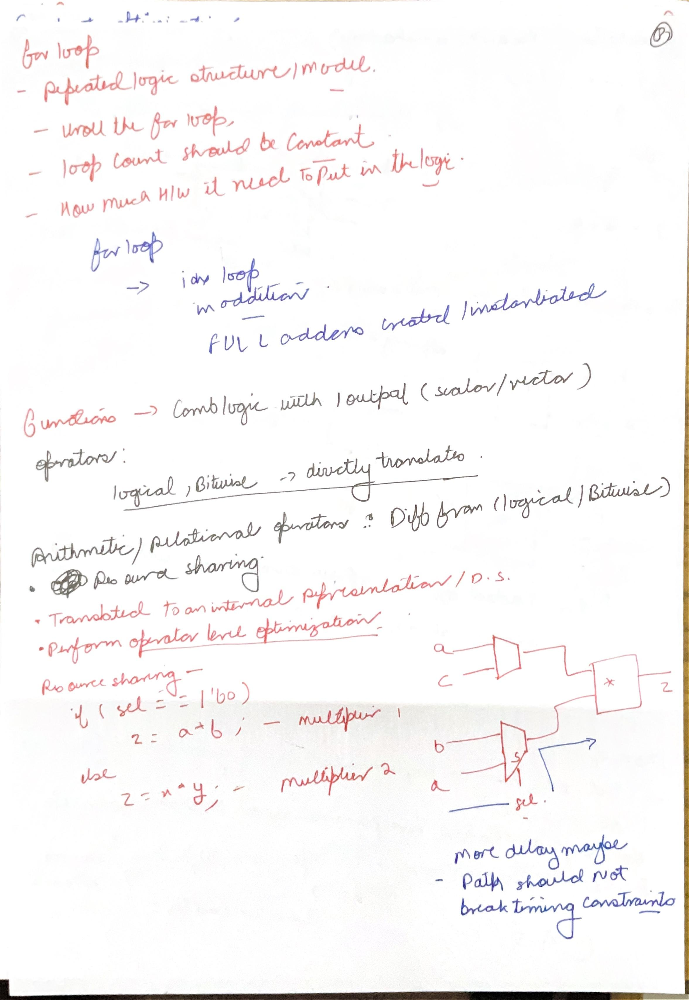](#day-03-index)

*Source: Scan A, PDF page 8.*

A bounded elaboration-time loop can describe repeated hardware. Four iterations that connect each carry output to the next carry input create a four-bit ripple chain of full adders. The loop does not imply that one full adder executes four times in a clock cycle. Conversely, a variable runtime loop or data-dependent termination requires an explicitly supported architectural interpretation; it is not automatically the same construct.

A synthesizable function is often inlined as combinational logic at its use sites. For the three-input majority function, `ab + ac + bc` asserts the output when at least two inputs are one. Sharing logic between call sites is an optimization decision, rather than an intrinsic hardware property of writing a function.

Keep operators precise: `~` is bitwise complement and `!` is logical negation. `~4'b1010` is `4'b0101`; `!4'b1010` is the one-bit value zero. Bitwise AND `&` combines corresponding bits; logical AND `&&` tests whether operands are logically nonzero. The page's list should not classify `!` as a bitwise operator.

Resource sharing can replace two mutually exclusive 8-by-8 multipliers with operand muxes feeding one multiplier. This reduces duplicated arithmetic hardware but inserts selection on the input paths. A late select signal can become critical through the mux and multiplier. Area savings are plausible; total power savings require switching activity, capacitance and clocking analysis. They do not follow solely from counting fewer multiplier symbols.

### A-09: Speculation and the late select path

[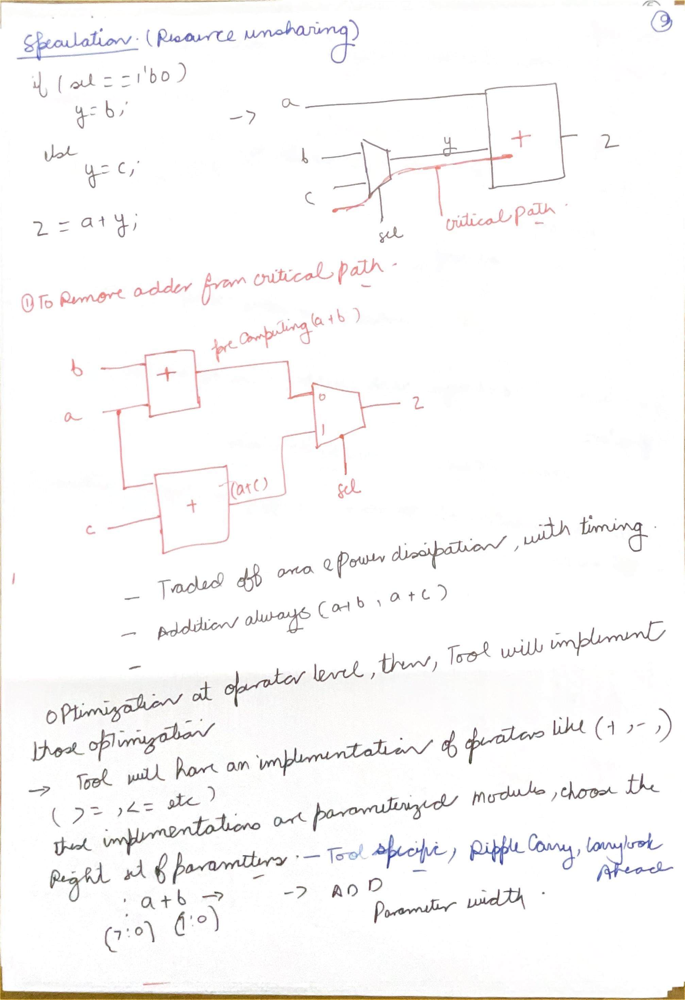](#day-03-index)

*Source: Scan A, PDF page 9.*

The visible operation is `z = a + (sel ? c : b)`. The shared architecture selects an operand and then adds. The speculative architecture computes `a+b` and `a+c` in parallel and selects the finished sum. It uses two adders and a wider output mux, so it trades arithmetic resources for a shorter path from a late select signal.

If select arrives at 7 ns, operands at 0 ns, mux delay is 1 ns and adder delay is 3 ns, the shared result arrives at 11 ns: select at 7, selected operand at 8, sum at 11. The speculative sums are ready at 3 ns, so the output is ready at `max(3,7)+1=8 ns`. If operands instead arrive at 8 ns and select at 0, both alternatives still require an adder and an output mux, and this transformation may offer no benefit. These are teaching delays, not library measurements.

The nine-bit sum in the lecture diagram preserves carry for two unsigned eight-bit operands. Declaring an eight-bit destination truncates that carry. A structurally correct transformation must retain the original width and signedness semantics. Compare equivalent expressions at the same precision before evaluating their timing.

Finally, the adder symbol is an internal word-level operator. Its ripple, carry-lookahead or other implementation is selected later under tool and library constraints. The picture alone cannot justify a numerical gate delay or guarantee the final area.

If every data operand arrives at time $t_D$, select arrives at $t_S$, and the illustrative mux and adder delays are $d_M$ and $d_A$, the shared path arrives at $\max(t_D,t_S)+d_M+d_A$. The speculative path arrives at $\max(t_D+d_A,t_S)+d_M$. When $t_S\ge t_D+d_A$, speculation removes the adder delay from the select-to-result path, saving $d_A$. When select arrives before the operands, both expressions reduce to $t_D+d_A+d_M$. This derives the late-select benefit and the early-select limit from dependency order rather than from operator count.

### A-10: Compiler-style optimization and arithmetic limits

[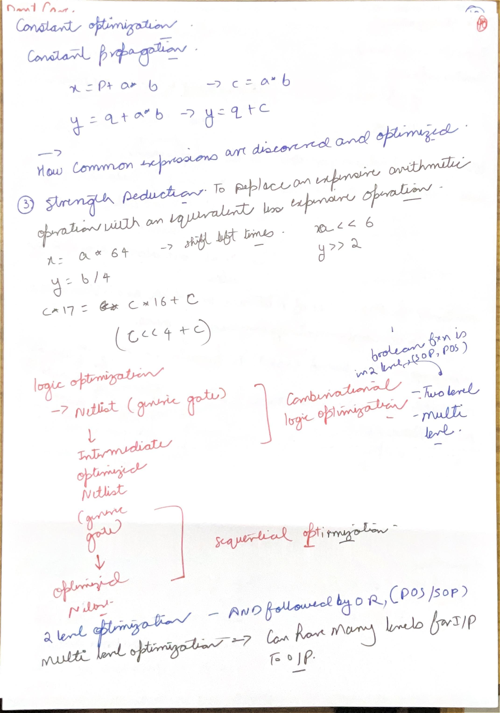](#day-03-index)

*Source: Scan A, PDF page 10.*

The top sketch reuses `a*b` in `x=p+(a*b)` and `y=q+(a*b)`. This is **common subexpression elimination**: compute one identical expression and distribute the result. Constant propagation is different: replace a known variable value at its uses. Constant folding evaluates an operation whose operands are already constant. The handwritten “constant propagation” label should not merge all three mechanisms.

The lecture's arithmetic gives `a=8*8=64`, `b=(a*1024)/32=2048`, and `c=b+32+b+32=4160`. Once the constants are established and expression widths preserve these values, the tool can remove the runtime arithmetic. If a destination were only eight bits wide, 4160 would be reduced modulo 256 to 64. Constant reasoning must respect the actual Verilog widths, signedness and expression-sizing rules.

Strength reduction replaces some expensive operations with simpler ones: unsigned multiplication by 64 can become a six-bit left shift, division by four a two-bit right shift, and multiplication by 17 a shift by four plus the original operand. Preserve sufficient intermediate width. For a signed negative value, division truncating toward zero is not generally identical to an arithmetic right shift that rounds toward negative infinity: `-3/2=-1`, whereas a sign-preserving right shift yields `-2` in two's-complement arithmetic.

Common-expression reuse increases fanout on the shared result and may increase wire load. A logical operator count is an early estimate, not final physical area or delay. The [Yosys optimization passes](https://yosyshq.readthedocs.io/projects/yosys/en/v0.66/using_yosys/synthesis/) describe constant folding, expression merging and cleanup at several representations.


[Back to day index](#day-03-index)


## Lesson 17: Logic Optimization - Part I


Week 4 · [Lecture video](https://www.youtube.com/watch?v=xL6VvlsKrjk&t=1350s) · [Back to day index](#day-03-index)


[](#day-03-index)  
[](#day-03-index)


*Lecture: [22:30](https://www.youtube.com/watch?v=xL6VvlsKrjk&t=1350s) · Source: A-11.*

[](#day-03-index)

*Lecture: [22:30](https://www.youtube.com/watch?v=xL6VvlsKrjk&t=1350s).*


### Two-level representations and exact covers

Use Boolean notation here: juxtaposition is AND, `+` is OR, and a prime mark is complement. This convention differs from arithmetic addition and multiplication in the previous lesson. A two-level SOP representation is an OR of product terms. A POS representation is an AND of sum terms; input inversions are normally counted separately from the two main logic levels.

### A-11: Literals, cubes, minterms and maxterms

[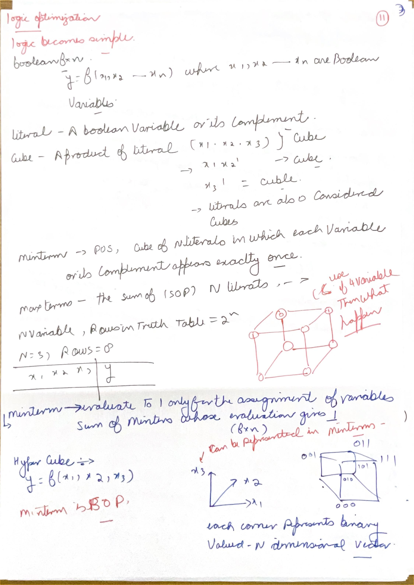](#day-03-index)

*Source: Scan A, PDF page 11.*

A literal is a variable or its complement. A product term fixes some Boolean variables; geometrically it is a cube in an n-dimensional Boolean space. If a cube fixes k of n variables, it contains `2^(n-k)` assignments. For three variables, `AB` fixes A and B while C remains free, so it covers 110 and 111. A term fixing all n variables covers one point.

The minterm/maxterm labels in the page need reversing: a **minterm is a product containing every variable**, and it is one at exactly one assignment. For ABC=010, the minterm is `A'BC'`. A **maxterm is a sum containing every variable**, and it is zero at exactly one assignment. For the same 010 assignment, the maxterm is `A+B'+C`. Notice the opposite polarity rule.

Canonical SOP is the sum of the minterms where the function is one. Canonical POS is the product of the maxterms where it is zero. “Canonical” means the representation is determined once variable order and function values are fixed; it does not mean that the representation is minimized. A truth table of n inputs contains `2^n` rows, whether or not a compact expression exists.

**Worked check:** with A as the most significant bit, index 6 is 110 and minterm 6 is `ABC'`. Maxterm 6 is `A'+B'+C`, which evaluates to zero at 110. Substituting the indexed values verifies both definitions without relying on a memorized label.

### A-12: ON-set, OFF-set, dont-cares and implicants

[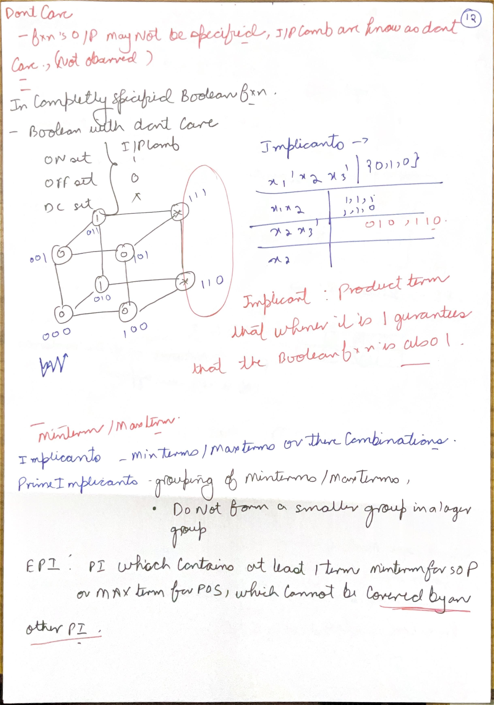](#day-03-index)

*Source: Scan A, PDF page 12.*

An incompletely specified function divides assignments into ON-set, OFF-set and don't-care set. ON assignments require one; OFF assignments require zero. A don't-care assignment permits either value for optimization. It must be genuinely unspecified or impossible under justified assumptions, rather than an input that happened not to appear in a simulation.

The cube example has ON points 010 and 011, with 110 and 111 available as don't-cares. The term B covers all four points, contains the required ON points and avoids every OFF point in this example. Thus it can replace the more restrictive `A'B`. Assigning the don't-care points to one is allowed because the required behavior is preserved. A different OFF-set could make that same expansion invalid.

An implicant is a product term whose covered points lie within ON plus permitted don't-cares, with useful coverage of the ON-set. A prime implicant cannot be expanded further by dropping a literal without entering the OFF-set. An essential prime implicant covers an ON minterm that no other prime implicant covers. “Essential” describes unique coverage, not simply a large or visually prominent group.

For SOP minimization, group ones and usable don't-cares. For POS minimization, reason about zeros, equivalently minimizing an SOP for the complemented function and then complementing. Avoid calling a maxterm a product implicant; the terms belong to different representations.

### A-13: The prime implicants of AB + ABC + BC

[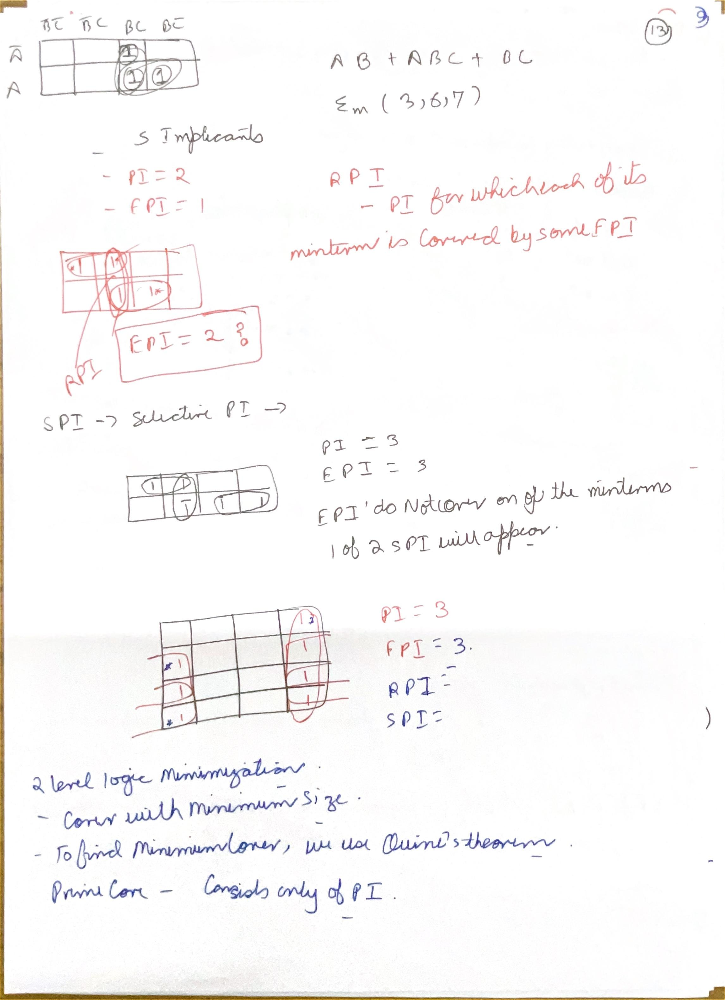](#day-03-index)

*Source: Scan A, PDF page 13.*

The clearly labeled example is `f=AB+ABC+BC`. Absorption gives `AB+ABC=AB`, so `f=AB+BC`. With ABC bit order, its ON-set is {3,6,7}. The three single-point implicants are `A'BC`, `ABC'`, `ABC`; the two two-point implicants are BC covering {3,7}, and AB covering {6,7}. These five nonempty implicant cubes account for the handwritten total of five.

Only AB and BC are prime. **Both are essential**, correcting the handwritten essential-count value of one. Minterm 6 is covered only by AB among the primes, and minterm 3 only by BC. Minterm 7 is shared; that does not remove either unique-coverage obligation. The minimum SOP is therefore AB+BC with two terms and four literal occurrences. ABC is redundant after those two terms are present.

The smaller K-map sketches below do not consistently display variable labels and complete ON/OFF/DC identities. Their handwritten totals cannot be verified from an unlabeled pattern alone. Keep the sketches as practice material, but first restore Gray-code row/column order and explicitly mark the function before asserting a prime count. Adjacency includes edge wraparound, not diagonal proximity.

The PI/EPI/RPI/SPI shorthand in the notes separates being prime from being needed in a cover:

| Term | Meaning in cover selection | What to do |
|---|---|---|
| PI: Prime Implicant | A legal cube that cannot expand without entering the OFF-set. | Consider it as a candidate column. |
| EPI: Essential Prime Implicant | Covers an ON minterm that no other PI covers. | Include it in every prime cover of this function. |
| RPI: Redundant Prime Implicant | In the essentials-first classification, all its ON points are already covered by the selected EPIs. | Omit it at this stage. |
| SPI: Selective Prime Implicant | A remaining nonessential PI that can cover a still-uncovered ON point. | Select enough of these candidates to finish the residual cover. |

Redundancy also depends on the selected cover as it evolves. “Nonessential” does not mean “unnecessary”: several SPIs may be alternatives, but at least one may be required. In the AB+BC example both primes are essential, so no residual choice remains. The absorbed term ABC is redundant, but it is **not an RPI**, because it was never prime. For a residual-choice example, use the restored lecture chart below.

### A-14: Coverage charts, minimal covers and minimum cost

[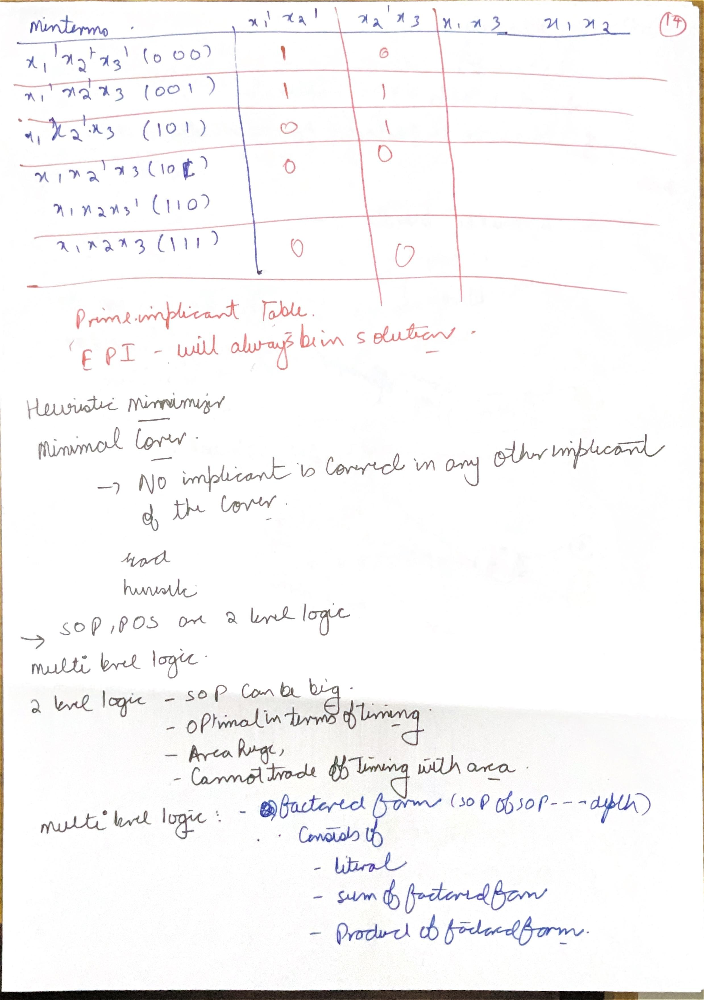](#day-03-index)

*Source: Scan A, PDF page 14.*

A coverage chart makes the unique-coverage reasoning explicit. Put required ON minterms in rows, prime implicants in columns, and mark a cell when that cube covers the row. For the preceding verified example, the complete chart is:

| ON minterm | AB | BC |
|---|---|---|
| 3 = 011 | No | Yes |
| 6 = 110 | Yes | No |
| 7 = 111 | Yes | Yes |

Rows 3 and 6 force both columns. That is a proof of essentiality. The longer handwritten chart belongs to a **different lecture example**. Its empty cells and overwritten row are not enough to infer the function. The course's Logic Optimization I lecture-material slide 18 supplies the complete ON-set `{0,1,5,6,7}`, with x1 as the most significant bit and no don't-cares. The remaining assignments `{2,3,4}` form the OFF-set. Restoring the chart from that source gives:

| Required ON minterm | x1'x2' | x2'x3 | x1x3 | x1x2 |
|---|---|---|---|---|
| 0 = 000 | 1 | 0 | 0 | 0 |
| 1 = 001 | 1 | 1 | 0 | 0 |
| 5 = 101 | 0 | 1 | 1 | 0 |
| 6 = 110 | 0 | 0 | 0 | 1 |
| 7 = 111 | 0 | 0 | 1 | 1 |

First check legality: for example, x2'x3 covers 001 and 101, both ON, and no OFF assignment. Do this for each proposed cube before selecting columns. Then rows 000 and 110 force the EPIs x1'x2' and x1x2. They cover rows 000, 001, 110 and 111, leaving only 101. Either SPI x2'x3 or x1x3 covers that remaining row. The two minimum prime covers are therefore `x1'x2'+x1x2+x2'x3` and `x1'x2'+x1x2+x1x3`. Each has three terms and six literal occurrences. Two forced terms plus an uncovered row prove that two terms cannot suffice; either three-term solution reaches the lower bound. There is no RPI at the initial essentials-only stage in this chart.

Source for the restored chart: [Logic Optimization I lecture](https://www.youtube.com/watch?v=xL6VvlsKrjk), lecture-material slide 18. For a different chart, establish ON/OFF/DC identities, generate legal prime columns, fill every mark, select essentials, solve the remaining coverage problem and finally verify every required ON and OFF assignment.

Distinguish **minimal** from **minimum**. A minimal cover has no whole selected term that can be removed while preserving the required coverage. A minimum cover has the best stated cost among all legal covers. Several irredundant covers can have different term or literal counts. “No cube is contained in one other cube” is a weaker condition: several other cubes together may make a selected cube removable.

The statement labeled **Quine's theorem** on A-13 says that a minimum cover can be chosen entirely from prime implicants. For the conventional term/literal objective, expand each nonprime term to a containing legal prime: required coverage is retained, no OFF point is introduced, and literal count does not increase. The optimization cost must still be specified: terms first, literals, or a mapped-cell cost need not rank implementations identically. The lecture's transition to multilevel optimization follows from this limitation; two nominal logic levels do not guarantee the lowest physical delay under fan-in and wire-load constraints.

The **heuristic minimizer** heading is about finding a good cover without exhaustively proving global optimality. The lecture's slide 20 gives four operations. **Expand** drops literals while avoiding OFF points and can subsume other terms. **Reduce** temporarily shrinks a term while other terms preserve the required ON coverage, opening different later expansion choices. **Reshape** changes a pair of terms together, expanding one and reducing another while retaining a legal cover. **Irredundant** removes terms whose deletion leaves all required ON points covered. Each step must preserve the specified function, including justified don't-cares. Stopping when this sequence finds no improvement is a local search result; it is not a proof that no cheaper cover exists. The course introduces ESPRESSO as a practical two-level heuristic minimizer, which is different from a guarantee of an exact minimum.


[Back to day index](#day-03-index)


## Lesson 18: Simulation-based Verification using Icarus


Week 4 · [Lecture video](https://www.youtube.com/watch?v=9Wzz--APeLU&t=650s) · [Back to day index](#day-03-index)


[](#day-03-index)


*Lecture: [Lecture at 10:50](https://www.youtube.com/watch?v=9Wzz--APeLU&t=650s).*


### Compile, execute and inspect a Verilog simulation

Icarus Verilog compiles supported Verilog into a simulation program; `vvp` executes it. GTKWave reads the waveform produced by that execution. The tutorial uses a counter and testbench. Compilation checks the source and elaborated structure, execution generates behavior, and the checker or waveform comparison assesses the tested behavior. These are distinct pieces of evidence.

```verilog
`timescale 1ns/1ps
module counter(input clk, input rst_n, output reg [3:0] q);
  always @(posedge clk or negedge rst_n)
    if (!rst_n) q <= 4'd0;
    else q <= q + 4'd1;
endmodule

module tb;
  reg clk = 0;
  reg rst_n = 1;
  wire [3:0] q;
  integer expected;
  counter dut(clk, rst_n, q);
  always #5 clk = ~clk;
  initial begin
    $dumpfile("counter.vcd");
    $dumpvars(0, tb);
    expected = 0;
    #1 rst_n = 0;
    #1;
    if (q !== 4'd0) $fatal(1, "reset failed");
    @(negedge clk) rst_n = 1;
    repeat (18) begin
      @(posedge clk);
      #1;
      expected = (expected + 1) % 16;
      if (q !== expected[3:0]) $fatal(1, "count mismatch");
    end
    $display("PASS: reset, count and wrap");
    $finish;
  end
endmodule
```

```sh
iverilog -g2012 -s tb -o counter_sim counter.v
vvp counter_sim
gtkwave counter.vcd
```

This is an authored teaching example. `-g2012` enables the language support used by `$fatal`; `-s tb` selects the testbench top. The testbench generates an explicit falling reset transition at 1 ns, checks reset at 2 ns, releases reset on a falling clock edge and waits one nanosecond after each rising edge before checking the scheduled state update. Initializing reset low without an explicit transition can leave an event-controlled reset process untriggered in a simulator; the pulse makes the stimulus unambiguous. The VCD makes a failing cycle inspectable. The explicit expected-value comparison catches an error even if the waveform viewer is never opened.

The wrap occurs when 15 increments to zero in a four-bit register. The comparison uses case inequality `!==`, so an unknown output fails rather than quietly producing an unknown condition. A successful run would establish these tested cases; it would not prove every possible reset sequence. See the [Icarus project documentation](https://steveicarus.github.io/iverilog/) for compilation and runtime details. Local tool execution status is recorded separately in the resources index.

The expected values at computing edges 14 through 18 are 14, 15, 0, 1 and 2. Edge 16 tests the modulus boundary; the next two observations check that counting resumes from zero. A checker that merely compares the first and last values would lose this localization. Reset deassertion on a falling clock edge also provides a half-period separation from the next rising sampling edge in this teaching testbench, reducing stimulus/sampling ambiguity without claiming a physical reset-recovery analysis.


[Back to day index](#day-03-index)
