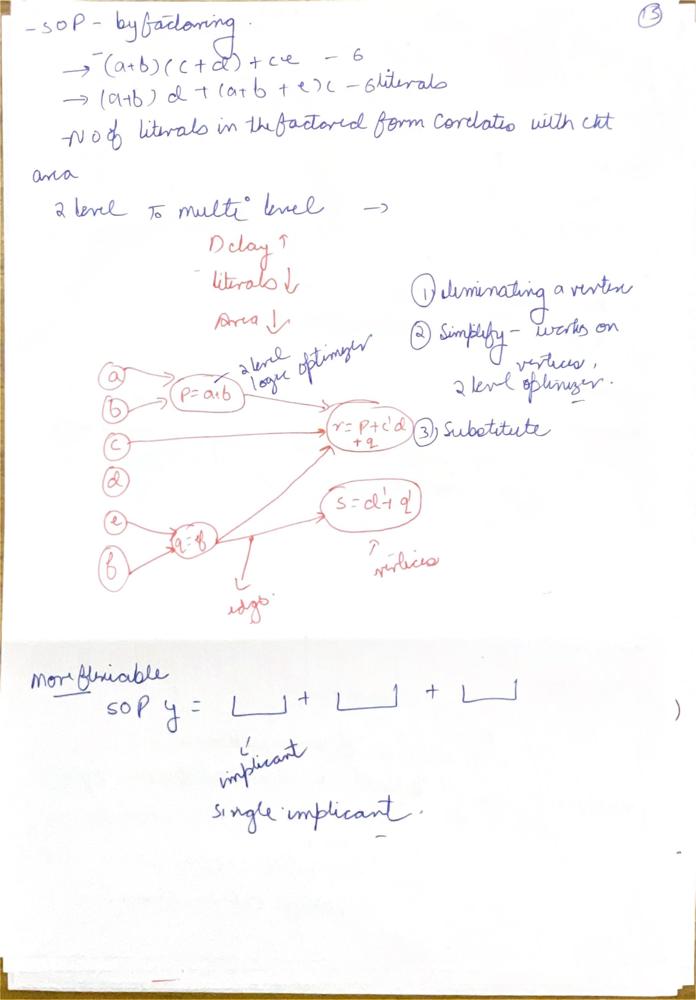
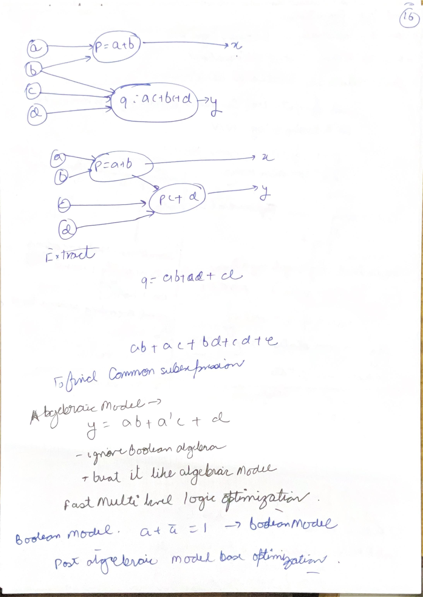
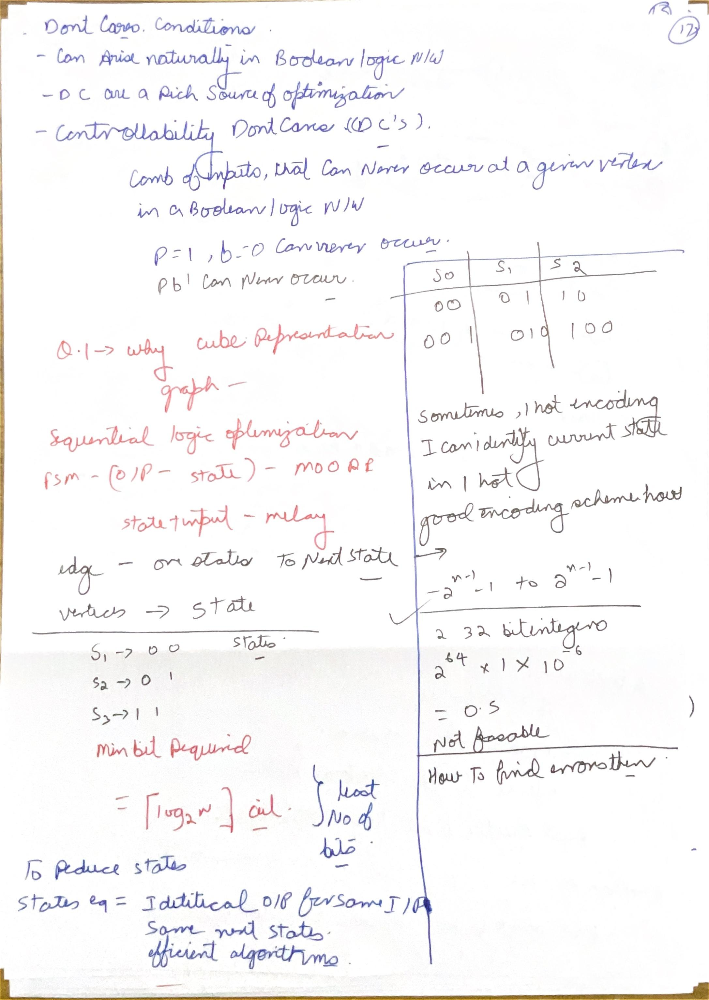
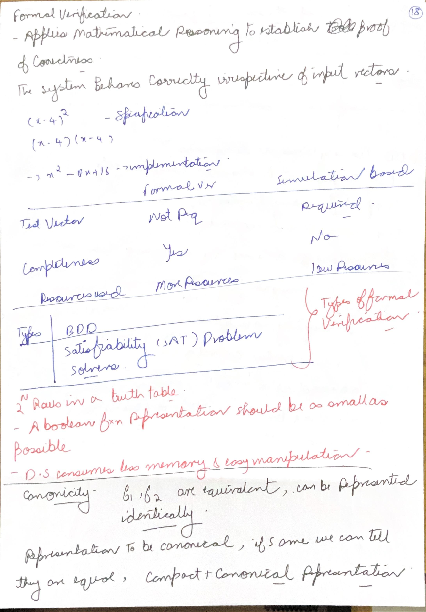
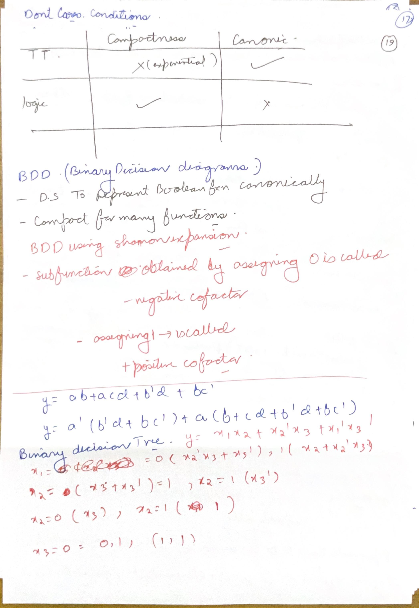
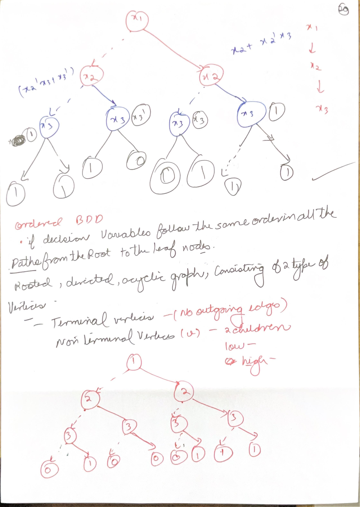
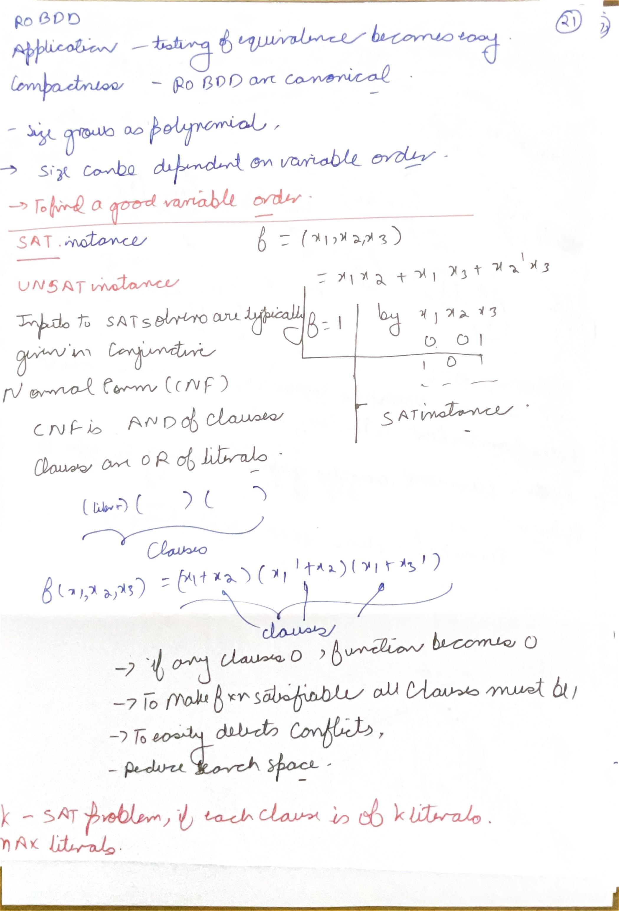

# Day 04: Multilevel optimization and formal verification

Lessons 19–24. Six-lesson study blocks; Day 06 remains partial through Constraints I.

## Day 04 index

- [Lesson 19: Logic Optimization - Part II](#lesson-19-logic-optimization---part-ii)

- [Lesson 20: Logic Optimization - Part III](#lesson-20-logic-optimization---part-iii)

- [Lesson 21: Formal Verification - I](#lesson-21-formal-verification---i)

- [Lesson 22: Logic Synthesis using Yosys](#lesson-22-logic-synthesis-using-yosys)

- [Lesson 23: Formal Verification - II](#lesson-23-formal-verification---ii)

- [Lesson 24: Formal Verification - III](#lesson-24-formal-verification---iii)


[Master index](README.md) · [Handwritten page index](Resources/Handwritten%20Index.md) · [Glossary](Resources/Glossary.md)


Figures link to the day index. Source page identifiers refer to the original scans.


## Lesson 19: Logic Optimization - Part II


Week 5 · [Lecture video](https://www.youtube.com/watch?v=x747bipwDeQ&t=1351s) · [Back to day index](#day-04-index)


[](#day-04-index)  
[](#day-04-index)


*Lecture: [22:31](https://www.youtube.com/watch?v=x747bipwDeQ&t=1351s) · Source: A-15.*

[](#day-04-index)

*Lecture: [22:31](https://www.youtube.com/watch?v=x747bipwDeQ&t=1351s).*


### Factored forms, networks and Boolean simplification

| Concept | Technical interpretation |
|---|---|
| Multilevel networks permit changes to both topology and local functions. | A-15 and A-16 show elimination, substitution and extraction. Literal count is an early cost estimate; mapped delay and fanout still matter. |
| Local dependencies create don't-cares. | The top of A-17 belongs to this lesson: an impossible combination at an internal node differs from an unobservable internal value. |

### A-15: Factoring and Boolean-network structure

[](#day-04-index)

*Source: Scan A, PDF page 15.*

The page begins with `ac+ad+bc+bd+ce`, which has ten literal occurrences. Factoring yields `(a+b)(c+d)+ce`, with six. The alternative `(a+b)d+(a+b+e)c` is also equivalent, but it has seven literal occurrences as written, correcting the second handwritten count of six. Count occurrences, not distinct variable names: a appears twice in that second expression.

The factored representation describes nested AND/OR operations. A Boolean network goes further by naming reusable local functions and their dependencies. In the course example, `p=a+b`, `q=ef`, `r=p+c'd+q`, `s=d'+q'`, with outputs `x=r` and `y=s`. The complement on q in s matters; the handwritten sketch should not silently turn `q'` into q. An edge into a vertex means that its local function depends on the source signal. A combinational network is a directed acyclic graph; reconverging fanout is allowed, whereas a combinational cycle needs separate treatment.

Elimination substitutes a node's expression at every use and removes the node. If `p=a+b` is eliminated from `r=p+c'd+q`, the new local function contains `a+b+c'd+q`. This can expose a simplification but can also duplicate a shared expression at several consumers. Simplification reduces an individual local Boolean expression. Neither transformation should change the required output function.

Literal totals and counts of graph stages are useful estimates during optimization. A physical implementation also depends on cell choices, input arrival times, fanout capacitance and routing. Factoring may reduce duplicated logic yet add a dependency stage; it is not correct to conclude that every factored circuit is necessarily slower or faster.

### A-16: Substitution, extraction and the algebraic model

[](#day-04-index)

*Source: Scan A, PDF page 16.*

The substitution example has `p=a+b` and `q=ac+bc+d`. Factor the q expression: `(a+b)c+d`. Replacing the repeated divisor with the existing node gives `q=pc+d`. A new edge p-to-q expresses that dependency. The local literal count decreases, but q now depends on when p becomes available and on p's added load.

Extraction creates a new node for a common subexpression that was not already named. For instance, if two outputs contain `ab`, create `p=ab` and replace both occurrences by p. Substitution uses an existing useful function; extraction introduces a shared one. Choosing a divisor that occurs widely can reduce area, but excessive sharing can create high fanout or an inconvenient critical path.

The algebraic model treats local SOP expressions much like polynomials, initially treating a variable and its complement as separate symbols. It enables efficient divisor searches. Boolean-specific rules still matter later: `a+a=a`, `a a'=0`, and `a+a'=1`. Ordinary polynomial arithmetic does not implement all these identities automatically.

The lecture expresses a division as `f=Qd+R`, where d is a useful divisor, Q its quotient and R the remainder. The point is to find a representation cheaper under the chosen estimate, rather than perform numerical division of signal values. Repeated transformations interact, so their order can affect the final network. Verify functional equivalence after an optimization sequence instead of using a lower literal total as proof of correctness.

### A-17, upper section: controllability and observability dont-cares

The upper A-17 section concerns network-level don't-cares. If `p=ab`, the internal combination p=1 and b=0 is impossible. A local function `q=pb+bc` may therefore become `q=p+bc` without changing realizable behavior. Substituting `p=ab` into both expressions proves the equality at the network level. The larger local truth table differs only on an impossible internal combination.

An observability don't-care has a different cause. In the lecture example, `x=pc` and `p=ab+bc+ac`. When c=0, x=0 regardless of p, so p's value is unobservable at that output. When c=1, p reduces to a+b. Replacing p by a+b preserves x for both values of c. Other fanout consumers of p must also be checked before adopting that replacement. An internal value is not globally unobservable merely because one consumer masks it.

For a concrete fanout counterexample, suppose another output is $y=p$. At $a=1,b=0,c=0$, the original p is zero but the replacement a+b is one. Output x remains zero because c masks p, while y changes from zero to one. The replacement is therefore valid for the isolated x cone and invalid for this two-output network. A local don't-care is a property of the allowed input space and all relevant observations, not permission to change a node without inspecting its consumers.

The acronym SDC in this optimization context can mean **satisfiability don't-care**. Later SDC files mean **Synopsys Design Constraints**. Keep those meanings distinct in a discussion of synthesis and timing.

**Cube representations and dependency graphs.** A Boolean cube compresses many assignments into one product term: fixed literals constrain coordinates and omitted variables remain free. In three-variable space, AB contains 110 and 111; dropping A expands it to B, a four-point face containing 010, 011, 110 and 111. That expansion is legal only if none of the new points is OFF. Cube adjacency means differing in one Boolean coordinate, which explains K-map Gray ordering and wraparound. A Boolean-network graph answers a different question: its vertices are local functions and its edges are signal dependencies. The cube graph represents assignments; the network graph represents computation. Connect this margin note to [Day 03's cube and don't-care derivation](Day%2003.md#a-11-literals-cubes-minterms-and-maxterms).


[Back to day index](#day-04-index)


## Lesson 20: Logic Optimization - Part III


Week 5 · [Lecture video](https://www.youtube.com/watch?v=HNqmpCD2-pY&t=1400s) · [Back to day index](#day-04-index)


[](#day-04-index)  
[](#day-04-index)


*Lecture: [23:20](https://www.youtube.com/watch?v=HNqmpCD2-pY&t=1400s) · Source: A-17.*

[](#day-04-index)

*Lecture: [23:20](https://www.youtube.com/watch?v=HNqmpCD2-pY&t=1400s).*


### Sequential optimization preserves behavior over time

### A-17: FSMs, state equivalence and encoding

[](#day-04-index)

*Source: Scan A, PDF page 17.*

The middle of the page changes from combinational don't-cares to a finite state machine (FSM). A state summarizes the history needed to determine future behavior. The transition function maps current state and current input to the next state. A Moore output depends on state; a Mealy output depends on state and current input. In a state diagram, vertices are states and directed edges are transitions. Place Moore outputs in states and Mealy outputs on input-labeled edges.

Two states are equivalent only if they produce the same required output behavior for every allowed future input sequence. For a Moore machine, equal current outputs are a necessary starting condition but not sufficient. If one input causes successors with different future behavior, the two states cannot be merged. Partition refinement repeatedly separates states whose corresponding successors lie in different equivalence classes.

Three states require at least `ceil(log2(3))=2` bits, as in the 00, 01 and 11 encoding. Code 10 is unused, and its handling must match the design's reset and invalid-state assumptions. A one-hot encoding such as 001, 010, 100 uses three state bits. It may simplify decoding and reduce combinational levels, but the extra flip-flops and clock load can increase area and power. Changing encoding changes next-state equations; changing the names of state labels alone does not.

The other small table uses 00, 01 and 10 instead. That is also a possible encoding, leaving 11 unused. Choose one consistent mapping when deriving transition and output equations. A one-hot state's asserted bit can identify the state directly, explaining the “identify current state” remark; this advantage assumes the state remains a legal one-hot pattern. Reset and behavior for illegal zero-hot or multi-hot patterns still require a design decision.

The bottom exponential calculation belongs to the motivation for formal methods. At one million tested assignments per second, `2^64` combinations would take roughly 584,542 years, not zero seconds. This is an illustrative exhaustive combinational-input count. An FSM with 64 state bits has up to `2^64` encoded states, but reachability and input sequences determine which behaviors actually need consideration. Do not multiply unrelated quantities and call the result a verification time.

**Recall check:** why does merging four states to three not necessarily remove a binary state flip-flop? Both counts still require two bits. State minimization can simplify the logic even when the minimum bit count remains unchanged.

#### Worked Moore-state partition refinement

Consider four states with the following output and transitions. The output is observed in the state reached after each input.

| State | Output | Next state for input 0 | Next state for input 1 |
|---|---|---|---|
| A | 0 | A | C |
| B | 0 | B | D |
| C | 1 | C | A |
| D | 1 | D | C |

Equal present outputs give the initial partition $\lbrace A,B\rbrace,\lbrace C,D\rbrace$. States C and D split first: for input 1, C enters the output-zero class while D remains in the output-one class. With C and D separated, A and B then split because their input-1 successors are C and D. The stable partition contains four singleton classes. Thus identical current outputs did not justify either proposed merge.

The input sequence 11 gives a distinguishing trace for A and B. Starting from A, the reached states are C then A, with outputs 1 then 0. Starting from B, they are D then C, with outputs 1 then 1. The first input alone does not distinguish the states; the second does. Refinement encodes this future-behavior obligation without enumerating every possible-length input sequence.

#### Margin notes: signed integers and finding errors

The signed-range sketch on the right is a numeric representation reminder, separate from FSM encoding. An n-bit unsigned number spans `0` through `2^n-1`; an n-bit two's-complement signed number spans `-2^(n-1)` through `2^(n-1)-1`. There is **no extra minus one at the negative end**. For eight bits the range is -128 to 127; a traditional Verilog 32-bit integer ranges from -2147483648 to 2147483647. Both interpretations use the same number of bit patterns. Width and signedness affect arithmetic; neither determines which FSM states are reachable. See [Day 02's literal and signed-value examples](Day%2002.md#sized-literals-padding-truncation-and-signed-values).

The “how to find errors” question connects to the next formal-verification lesson. In simulation, define expected outputs or assertions, apply a reproducible reset/input sequence, and find the first mismatch in the waveform. Trace backward from that mismatch through the state and signals that caused it. In formal verification, state the property and assumptions; a counterexample gives a violating input/state sequence in that model. If a result conflicts with the intent, inspect the reset, allowed inputs, property and interpretation as well as the RTL. Merely obtaining a waveform or a solver result is not a diagnosis.


## Lesson 21: Formal Verification - I


Week 5 · [Lecture video](https://www.youtube.com/watch?v=Li-tGyilPOc&t=1091s) · [Back to day index](#day-04-index)


[](#day-04-index)  
[](#day-04-index)


*Lecture: [18:11](https://www.youtube.com/watch?v=Li-tGyilPOc&t=1091s) · Source: A-18.*

[](#day-04-index)

*Lecture: [18:11](https://www.youtube.com/watch?v=Li-tGyilPOc&t=1091s).*


### Formal reasoning and Boolean decision diagrams

The screenshot separates BDDs and SAT solvers as computational engines. Model checking and equivalence checking are verification tasks that can use such engines. A proof is meaningful only for its modeled behavior, initial states, assumptions and checked property. A timeout is an inconclusive result, not a successful verification.

### A-18: Proof scope, simulation and symbolic representation

[](#day-04-index)

*Source: Scan A, PDF page 18.*

The algebraic example is `(x-4)^2=x^2-8x+16`. Expanding the left side proves the polynomial identity for ordinary exact arithmetic; sampling a few x values merely tests instances. In hardware, an arithmetic statement must also specify bit width, signedness and overflow behavior. Expressions compared at a consistent modular width may preserve the identity, but differently sized intermediates can invalidate a naive transcription.

The handwritten table describes formal verification as complete and simulation as incomplete. Refine that claim: an unbounded proof can cover all behaviors of a specified model under its assumptions; a bounded check covers a stated bound; simulation covers the exercised traces. None proves an unwritten requirement. An assumption that prevents every interesting request can make “every request is granted” vacuously true. Check that assumptions describe the real environment and that meaningful scenarios remain possible.

Memory and computation depend on the problem, not a universal “formal high, simulation low” classification. Symbolic representations may make very large state sets manageable, while an unfortunate variable order can cause a BDD to grow exponentially. Simulation can also be expensive when many long traces are needed. The practical distinction is the scope of the evidence, not a guaranteed ranking of resource usage.

Truth tables provide a canonical explicit representation after variable order is fixed, but have `2^n` entries. Logic formulas may be compact but many different formulas represent one function. A reduced ordered BDD provides a canonical graph for a fixed variable order; both ordering and reduction are necessary for that statement. This leads directly to the next two pages.

### A-19: Shannon expansion and cofactors

[](#day-04-index)

*Source: Scan A, PDF page 19.*

Shannon expansion isolates one decision variable:

$$
f = \overline{x}f_{x=0} + x f_{x=1}
$$

The negative cofactor substitutes x=0; the positive cofactor substitutes x=1. After substitution, simplify the resulting function of the remaining variables. A decision node follows its low edge for zero and high edge for one. Recursing on additional variables constructs a binary decision tree before repeated subfunctions are merged.

The blue example is `y=ab+acd+b'd+bc'`. Expanding in a gives low cofactor `b'd+bc'`, high cofactor `b+cd+b'd+bc'`. The complete expression is `a'(b'd+bc')+a(b+cd+b'd+bc')`. The a prefactors select the correct cofactor; they are not additional independent conditions.

The red three-variable example used in the next drawing is `f=x1 x2 + x2' x3 + x1' x3'`. For x1=0, the cofactor is `x2'x3+x3'=x2'+x3'`. For x1=1, it is `x2+x2'x3=x2+x3`. These simplified cofactors explain why some lower decisions disappear. Naming “BDD” alone does not make an unreduced tree canonical or guarantee polynomial size.

**Recall check:** at x1=0 and x2=0, the function is one for either x3. The x3 decision under that branch is therefore unnecessary. This checks the first reduction without guessing the arrow polarity in the handwritten picture.

### A-20: Ordered graphs and reduction rules

[](#day-04-index)

*Source: Scan A, PDF page 20.*

The page shows the order x1, then x2, then x3 on every path. An ordered BDD must respect one common variable ordering; a reduced graph may skip variables on paths where the remaining function does not depend on them. Terminal vertices represent constants zero and one and have no outgoing edges. A nonterminal has a low and a high successor.

For the preceding f, the four cases of (x1,x2) are: 00 gives constant one; 01 gives x3'; 10 gives x3; 11 gives constant one. Thus the two constant subtrees can be replaced by the shared one terminal. An x3' node has low=1, high=0; an x3 node has low=0, high=1. They are different nodes and must not be merged merely because both test x3.

Apply two reductions: eliminate a node when low and high are identical, and merge nodes when they test the same variable and have identical corresponding successors. Share the terminals as well. The root's low x2 node has children 1 and x3'; its high x2 node has children x3 and 1, so those x2 nodes remain distinct. This produces five nonterminal nodes for the chosen order: one x1, two x2 and the two x3 variants.

The bottom sketch is a separate decision-tree exercise. Do not infer that its terminal pattern represents the same f unless its low/high paths produce the same truth table. An ordered tree and a reduced directed acyclic graph are related but different stages of representation.

The lecture's source reference is [Bryant's paper on graph-based Boolean-function algorithms](https://www.cs.cmu.edu/~bryant/pubdir/ieeetc86.pdf), which establishes the role of reduction and ordering in canonical representation.

#### Count the effect of variable order on the same function

Consider an additional binary example $g=(a\leftrightarrow b)\land(c\leftrightarrow d)$: both input pairs must agree. Use ordinary low/high edges without complemented-edge encoding, and exclude the two terminals from node counts.

| Variable order | Nonterminal nodes by tested variable | Total |
|---|---|---:|
| a, b, c, d | a: 1; b: 2; c: 1; d: 2 | 6 |
| a, c, b, d | a: 1; c: 2; b: 4; d: 2 | 9 |

For the first order, choosing a leaves either the requirement $b=0$ or $b=1$, explaining the two b nodes. A mismatch terminates at zero. Either successful match reaches the same remaining function $c\leftrightarrow d$, so the two successful branches share one c node and its two d alternatives. There is no need to remember a once its equality has been checked.

For the second order, both a and c are read before either equality is resolved. Their four combinations leave four distinct remaining functions: $\overline{b}\cdot \overline{d}$, $\overline{b}d$, $b\overline{d}$ and $bd$. Their b nodes cannot merge because their corresponding successors differ. The d tests can still be shared, giving two d nodes. The larger graph records unresolved information for longer; it represents the same truth table.

These counts are obtained by applying the two reduction rules, not by changing the Boolean function. They illustrate the order sensitivity described in [Bryant's original BDD paper](https://www.cs.cmu.edu/~bryant/pubdir/ieeetc86.pdf). A reduced graph is canonical for its chosen order, while its node count remains conditional on that order and representation convention.

### A-21, upper section: ROBDD limitations

**ROBDD means Reduced Ordered Binary Decision Diagram.** Its canonical form is conditional on a fixed variable order. In a shared BDD manager using that order, equality of canonical roots can establish function equality. Different orders can produce different graph sizes for the same function, so a visual comparison of diagrams built with different orders is not that equality test.

The handwritten phrase “size grows as polynomial” is not a universal bound. ROBDD size can be exponential in the number of inputs. Many useful functions have compact graphs under suitable orders; finding and maintaining useful orders is a practical challenge. This qualification matters when explaining why another formal engine such as SAT may be preferable for some designs.


[Back to day index](#day-04-index)


## Lesson 22: Logic Synthesis using Yosys


Week 5 · [Lecture video](https://www.youtube.com/watch?v=c-cFxuH-HbE&t=394s) · [Back to day index](#day-04-index)


[](#day-04-index)


*Lecture: [Lecture at 6:34](https://www.youtube.com/watch?v=c-cFxuH-HbE&t=394s).*


### A Yosys flow from RTL to mapped cells

The tutorial uses a mux feeding a flip-flop. Its example makes the distinction between RTL, internal cells and technology cells visible. `read_verilog` parses the source; `hierarchy` resolves the selected top; `proc` lowers processes; `techmap` lowers internal operators; `dfflibmap` maps sequential elements; `abc` maps combinational logic against a Liberty library. Mapping must find cells that implement the required function and state behavior.

```verilog
module top(input a, b, clk, select, output reg out);
  wire y;
  assign y = select ? b : a;
  always @(posedge clk) out <= y;
endmodule
```

```text
read_verilog top.v
hierarchy -check -top top
proc
opt
techmap
opt
dfflibmap -liberty toy.lib
abc -liberty toy.lib
clean
check
stat -liberty toy.lib
write_verilog -noattr mapped.v
```

Save the commands as `synth.ys` and invoke `yosys -s synth.ys` in a directory containing the RTL and the matching library. This is a Yosys command script; a filename ending in `.tcl` does not alone make a file a Tcl program. Yosys `script` reads its command language, while its Tcl interface uses a different execution mode. The historical handout uses a `.tcl` name for commands read through `script`, which explains the apparent mismatch.

Inspect the mapped output for a flip-flop with the intended edge behavior and a combinational mux implementation. A library may lack a dedicated mux and implement it with other cells. The register is uninitialized until clocked because this example has no reset; adding a reset changes its behavior and possible library mapping.

No SDC timing target is supplied by this simple tutorial script. Do not interpret a successful mapping or a smaller cell count as evidence of timing closure. `check` diagnoses structural issues but is not a proof that the netlist meets the functional specification. Refer to the [official Yosys synthesis documentation](https://yosyshq.readthedocs.io/projects/yosys/en/v0.66/using_yosys/synthesis/) when reproducing the flow with a current version.


[Back to day index](#day-04-index)


## Lesson 23: Formal Verification - II


Week 6 · [Lecture video](https://www.youtube.com/watch?v=wN6XP-aTlRs&t=901s) · [Back to day index](#day-04-index)


[](#day-04-index)  
[](#day-04-index)


*Lecture: [15:01](https://www.youtube.com/watch?v=wN6XP-aTlRs&t=901s) · Source: A-21.*

[](#day-04-index)

*Lecture: [15:01](https://www.youtube.com/watch?v=wN6XP-aTlRs&t=901s).*


### CNF, propagation and satisfiability

### A-21: SAT, UNSAT, CNF and ROBDD scope

[](#day-04-index)

*Source: Scan A, PDF page 21.*

The upper ROBDD statements are explained in Lesson 21. The lower half asks whether a Boolean function can evaluate to one for at least one assignment. A satisfying assignment establishes SAT; the absence of any satisfying assignment establishes UNSAT. For a verification miter, SAT can mean a counterexample exists. Always state what formula is being solved before calling SAT a “pass” or a “fail.”

The SOP example immediately above the CNF definition includes the term x2'x3. Both assignments written beside it, 001 and 101 in x1,x2,x3 order, make that term one and therefore make the OR of product terms one. One true product term is enough to satisfy an SOP. This witness check does not require guessing a faint complement mark in another term. In CNF, by contrast, every clause must be true.

**CNF means Conjunctive Normal Form:** AND of clauses, each clause an OR of literals. The example `(x1+x2)(x1'+x2)(x1+x3')` is SAT. Choose x1=0: the first clause requires x2=1, the second is already true, and the third requires x3=0. Therefore 010 satisfies all three clauses. A single satisfied clause is insufficient because the clauses are conjoined.

The lecture's propagation example is `(x1+x2)(x1'+x3)(x2'+x3')`. Decide x1=1. The second clause becomes the unit clause x3 and forces x3=1. The third then forces x2=0. The first remains satisfied. This repeated deduction is **Boolean Constraint Propagation (BCP)**. It avoids trying assignments inconsistent with an already forced literal.

For `(x1+x2)(x1'+x3)(x1'+x3')`, deciding x1=1 forces both x3=1 and x3=0, a conflict. Backtrack to x1=0; then x2=1 satisfies the first clause, and the remaining clauses are true regardless of x3. A conflict on one branch does not prove the whole formula UNSAT. UNSAT requires exhausting or otherwise proving the absence of every permitted solution.

**Worked UNSAT contrast:** `(x1+x2)(x1'+x2)(x2')` includes a unit clause forcing x2=0. The first clause then forces x1=1, while the second forces x1=0. Because x2 was forced by the formula rather than chosen as an optional branch, these conflicting implications rule out every assignment. The formula is UNSAT. Keep this distinction between a forced contradiction and a conflict after a speculative decision when reading a solver trace.

The course defines k-SAT with **at most k literals per clause**. Some texts use exactly k with appropriate conventions; state the convention. The course's 2-SAT case has polynomial algorithms, while general 3-SAT is NP-complete. This worst-case classification does not predict how long a particular circuit instance will take.

The DPLL name expands to Davis–Putnam–Logemann–Loveland. Its central pattern is decision, implication, conflict detection and backtracking. Modern improvements refine this search. The page's CNF explanation is useful because all-zero clauses expose conflicts immediately.

#### Derive all witnesses for the handwritten CNF

Return to $F=(x_1+x_2)(\overline{x_1}+x_2)(x_1+\overline{x_3})$. If $x_2=0$, the first clause forces $x_1=1$ while the second forces $x_1=0$. That branch conflicts. Resolving the first two clauses on $x_1$ gives the consequence $x_2$, expressing why every satisfying assignment must instead have $x_2=1$.

With $x_2=1$, both first clauses are satisfied. The remaining requirement is $x_1+\overline{x_3}$. Its only false assignment is $x_1=0,x_3=1$. The complete witness set in $x_1,x_2,x_3$ order is therefore $\lbrace 010,110,111\rbrace$.

| Stage | Consequence | Result interpretation |
|---|---|---|
| Try x2 = 0 | Simultaneously requires x1 = 1 and x1 = 0 | This decision branch has no witness |
| Set x2 = 1 | First two clauses become true | Continue with the remaining clause |
| Set x1 = 0 | Remaining clause forces x3 = 0 | Witness 010 |
| Set x1 = 1 | Remaining clause is true for either x3 | Witnesses 110 and 111 |

The decision conflict eliminates a subset of the search space; the surviving assignments establish SAT. If the formula additionally contained the unit clause $\overline{x_2}$, the derived requirement $x_2$ would contradict a requirement of the formula itself, establishing UNSAT. Compare these two scopes before interpreting a solver's conflict message or using its result as verification evidence.

#### Encoding one circuit gate as CNF

To require $z=a\land b$, introduce z as the gate-output variable and conjoin these clauses:

$$
(\overline{z}+a)(\overline{z}+b)(z+\overline{a}+\overline{b})
$$

When z is one, the first two clauses force both inputs to one. When both inputs are one, the last clause forces z to one. If either input is zero, its corresponding first or second clause forces z to zero. These three cases establish the gate relation for every binary assignment. Keeping only the first two clauses would encode one implication and incorrectly permit $a=b=1,z=0$.

A circuit CNF can repeat this construction with auxiliary variables for gate outputs and then constrain a property or miter output. The auxiliary variables represent internal consistency; their introduction does not provide additional independent input freedom once the gate relations are enforced. A satisfying assignment can then be interpreted as concrete input and internal signal values.


[Back to day index](#day-04-index)


## Lesson 24: Formal Verification - III


Week 6 · [Lecture video](https://www.youtube.com/watch?v=u494ozFC5pI&t=1840s) · [Back to day index](#day-04-index)


[](#day-04-index)


*Lecture: [Lecture at 30:40](https://www.youtube.com/watch?v=u494ozFC5pI&t=1840s).*


### Model, initial states and temporal properties

Model checking asks whether a property holds as a design evolves over time. Its inputs include the RTL or netlist model, initial-state/reset model, environmental assumptions and property. The lecture's examples use “always,” “eventually” and “never,” because a sequential requirement cannot always be represented by one combinational equality.

For an arbiter, “never grant two requesters simultaneously” is a safety property. A single cycle with two grants is a finite counterexample. “Every request eventually receives a grant” is a liveness property; its meaning depends on assumptions such as a requester retaining its request, clock progress and fairness. Restricting requests away would make a superficially passing property useless.

### Characteristic functions, image and reachability

A characteristic function represents membership of a set. If three state bits encode states 000 through 100, the subset {000,010,100} has membership function `x2'x1'x0' + x2'x1x0' + x2x1'x0'`. The variable x0 is zero in each member, but `x0'` alone also includes 110, an unused encoding. Such simplification is valid only if membership is explicitly restricted to the legal state universe. Treat unused encodings consistently.

The transition relation `T(s,i,s_next)` is true when the next-state function maps s and input i to s_next. The **image** of a set is the set reachable in one step; the **preimage** is the set from which that target set can be reached in one step. The captured slide is the image computation. Both operations support symbolic reasoning with BDDs.

Begin reachability with the initial set R0. Repeatedly compute one-step successors and union them with the reached set, stopping when no new state is found. For transitions 0→1, 1→2, 2→2 and an unreachable state 3→3, starting at 0 yields {0}, then {0,1}, then {0,1,2}, and then the same set. State 3 stays unreachable. A safety proof checks that no reached state lies in the bad-state set. A fixed point provides completeness for that finite modeled reachability calculation.

For a reached-set function $R(s)$, symbolic image computation is $\exists s,i\quad [R(s)\land T(s,i,s')]$, leaving a function of the next-state variables $s'$. The result is renamed into the current-state coordinates before union with R. Existentially removing the old state and input expresses that at least one allowed predecessor/input pair reaches the candidate successor. The fixed-point test is equality of sets, not merely equality of their cardinalities.

In the four-state example, a bad-state predicate selecting state 3 has empty intersection with the reached set and satisfies the modeled safety check. A predicate selecting state 2 instead fails, with the finite trace $0\to1\to2$. Changing the initial set to include 3 changes the conclusion immediately. Reset and initial-state assumptions are therefore part of the proof, rather than bookkeeping outside it.

### Bounded model checking and result interpretation

SAT-based bounded model checking (BMC) unfolds the transition relation across k cycles. The query conjoins the initial condition, every transition step and a bad-state condition within the bound. SAT returns values of states and inputs forming a counterexample. UNSAT means no such counterexample exists within that bounded query. It does not by itself prove an unbounded property.

A bug first appearing at cycle 20 is missed by a complete search only through cycle 10. Increasing the bound gives stronger evidence; an unbounded proof requires an appropriate completeness bound, induction or another complete method. Report the bound and assumptions with the result. The lecture contrasts BDD reachability with bounded SAT unfolding because the two approaches have different representation costs and stopping conditions.

Source: NPTEL Formal Verification III, lecture-material pages 4–16.


[Back to day index](#day-04-index)
