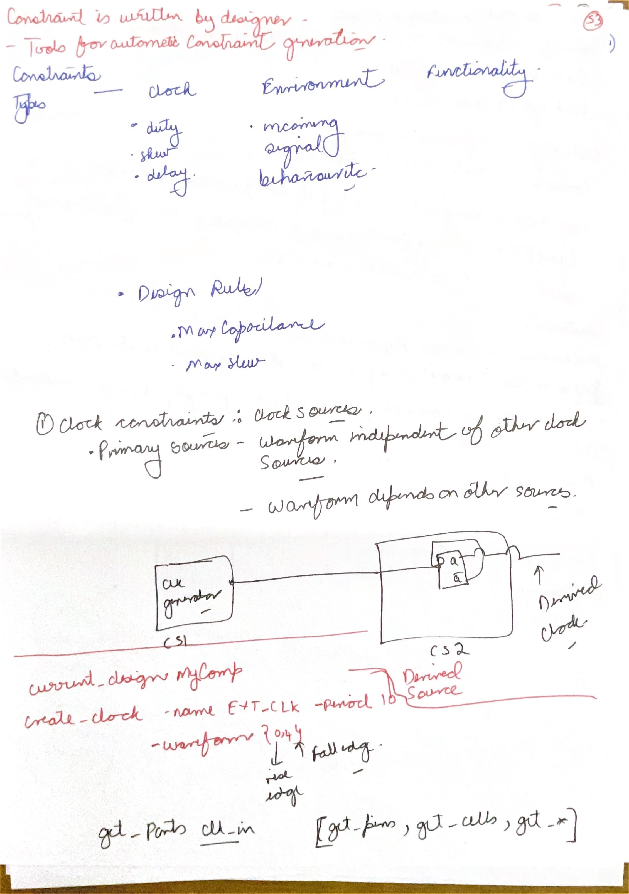
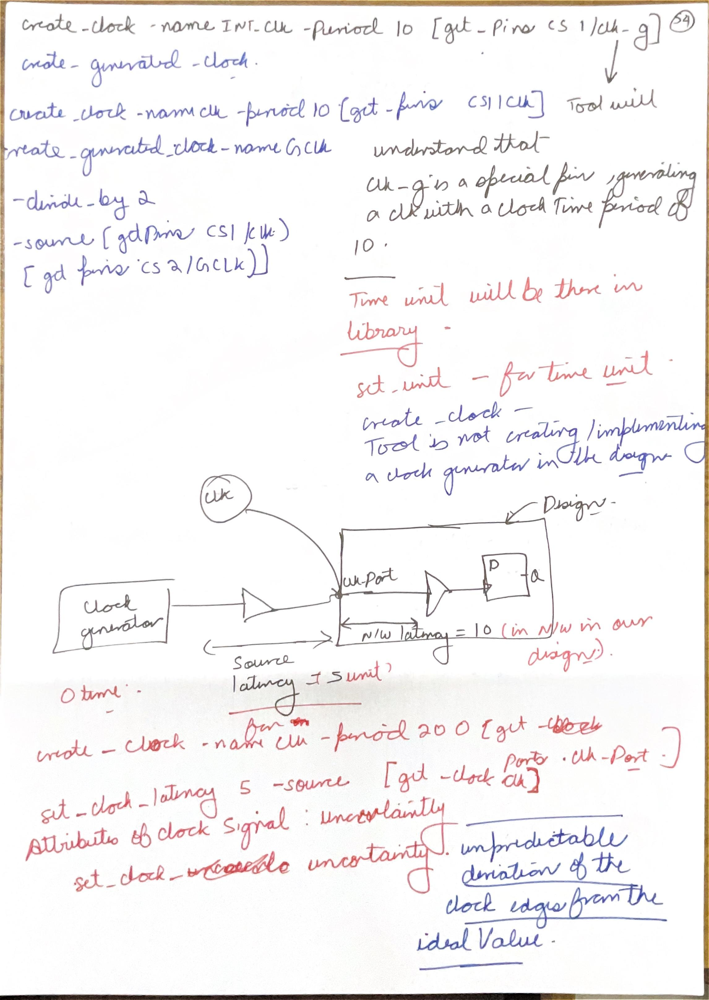
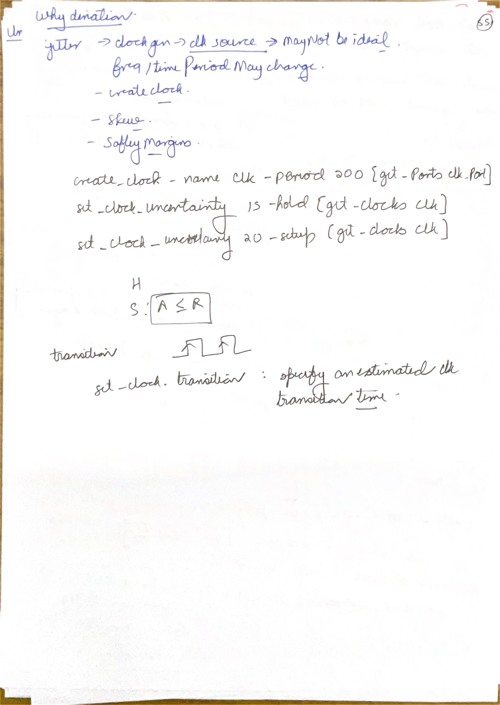

# Day 06: OpenSTA and clock constraints

Lessons 31–32. Six-lesson study blocks; Day 06 remains partial through Constraints I.

## Day 06 index

- [Lesson 31: Static Timing Analysis using OpenSTA](#lesson-31-static-timing-analysis-using-opensta)

- [Lesson 32: Constraints I](#lesson-32-constraints-i)


[Master index](README.md) · [Handwritten page index](Resources/Handwritten%20Index.md) · [Glossary](Resources/Glossary.md)


Figures link to the day index. Source page identifiers refer to the original scans.


## Lesson 31: Static Timing Analysis using OpenSTA


Week 7 · [Lecture video](https://www.youtube.com/watch?v=fKKuQGoirfM&t=500s) · [Back to day index](#day-06-index)


[](#day-06-index)


*Lecture: [Lecture at 8:20](https://www.youtube.com/watch?v=fKKuQGoirfM&t=500s).*


### Read a timing report as a calculation

OpenSTA is a static timing analyzer. The tutorial loads timing models and a netlist, establishes design and constraints, and reports paths. It analyzes permitted transitions using timing models rather than running one input-vector waveform. Its result is conditional on the supplied clock, environment, cell and wire assumptions.

```tcl
read_liberty toy.lib
read_verilog mapped.v
link_design top
read_sdc top.sdc
report_units
check_setup
report_checks -path_delay max -format full_clock_expanded
report_checks -path_delay min -format full_clock_expanded
```

This script assumes a matching mapped netlist, Liberty file and SDC file in its working directory. `link_design` resolves instantiated cell references. `report_units` identifies the numeric scale; `check_setup` diagnoses missing analysis requirements. The max-path report is read for setup, and the min-path report for hold. Consult the [OpenSTA commands](https://opensta.readthedocs.io/en/latest/Commands/) for options supported by the installed version. 

For each reported path, identify the startpoint, endpoint, launch/capture clocks and edges, clock-path contributions, clock-to-Q, every cell/net increment, data arrival, data required time, uncertainty and slack. Recompute the final subtraction. An increment is the contribution of one step; the path column is the accumulated arrival. A hold report's slack uses the earliest arrival minus the hold requirement, so its arithmetic differs from setup.

### A report-shaped example

Assume all numbers below are ns, with T=10, launch latency 1, capture latency 1.5, tCQ_max=0.8, data delay=5.2, setup=0.7 and setup uncertainty=0.3. Latest arrival is `1+0.8+5.2=7.0`; required arrival is `10+1.5-0.7-0.3=10.5`; setup slack is 3.5. For tCQ_min=0.2, d_min=0.4, hold=0.25 and hold uncertainty=0.1, earliest arrival is 1.6, required hold arrival is `1.5+0.25+0.1=1.85`, and hold slack is -0.25.

The same path therefore passes this setup check and fails this hold check. Reading only the worst max-path report would miss the violation. A lower clock frequency would increase setup margin but would leave this same-edge hold comparison unchanged.

| Setup-report contribution | Increment or operation (ns) | Accumulated time (ns) |
|---|---|---:|
| Launch clock at the register | +1.0 | 1.0 |
| Clock-to-Q | +0.8 | 1.8 |
| Data cells and nets | +5.2 | 7.0 arrival |
| Next capture edge plus capture latency | 10.0 + 1.5 | 11.5 |
| Setup requirement and uncertainty | -0.7 - 0.3 | 10.5 required |
| Setup slack | 10.5 - 7.0 | +3.5 |

The required-time calculation starts a separate clock-side accumulation; it is not another data-path increment added to 7.0. A report's labels determine which column and check each contribution belongs to. The hold calculation separately uses minimum clock-to-Q and data increments and forms arrival minus required time.

The absence of a path from a report can mean it is unconstrained, disconnected, excluded by a justified exception, or outside the selected reporting filter. It does not automatically mean it has no timing problem. Missing parasitics also change what the result represents: an early estimated-wire analysis should not be presented as extracted post-route signoff.


[Back to day index](#day-06-index)


## Lesson 32: Constraints I


Week 8 · [Lecture video](https://www.youtube.com/watch?v=rLhnmyGYsuQ&t=2300s) · [Back to day index](#day-06-index)


[](#day-06-index)  
[](#day-06-index)


*Lecture: [38:20](https://www.youtube.com/watch?v=rLhnmyGYsuQ&t=2300s) · Source: B-10.*

[](#day-06-index)

*Lecture: [38:20](https://www.youtube.com/watch?v=rLhnmyGYsuQ&t=2300s).*


### B-09: Constraint categories and primary-clock definitions

[](#day-06-index)

*Source: Scan B, PDF page 9.*

#### Requirements, analysis and the clock model

| Concept | Technical interpretation |
|---|---|
| Constraints describe the requirements under which synthesis and STA operate. | B-09 distinguishes clocks, environment, functionality and design rules. A standalone timing analyzer reports behavior; synthesis or physical optimization may modify the circuit. |
| Primary and generated clocks preserve different timing relationships. | B-10 records the source and target of a generated clock. A clock command defines a model; it does not build a clock generator. |
| Latency, transition and uncertainty have separate roles. | B-10 and B-11 distinguish clock arrival, waveform shape and margin. Setup and hold consume uncertainty on opposite sides of their inequalities. |

Constraints convey design requirements and environmental assumptions to tools. They may be written manually or generated from higher-level requirements, but consistency still needs review. A constraint that refers to a nonexistent port or the wrong clock describes the wrong analysis, even if the file parses successfully.

The four categories have distinct meanings. Clock constraints describe sources, periods, waveforms and clock properties. Environment constraints describe influences such as input drive or transition and output loading. Functionality constraints describe operational assumptions or mode choices. Design rules constrain properties such as maximum transition and capacitance. A timing slack can pass while a transition or capacitance rule fails; the rule checks are separate.

The clock-generator diagram distinguishes a primary clock from a derived clock. A primary clock waveform is specified independently. A generated clock derives its waveform relationship from an existing master clock. It can be divided, multiplied, inverted or otherwise related through supported definitions. Merely declaring two independent primary clocks with matching periods does not express a generated relationship.

```tcl
current_design MyComp
create_clock -name EXT_CLK -period 10 \
  -waveform {0 4} [get_ports clk_in]
```

The waveform has a rising edge at zero and falling edge at four in every ten-unit period, so its duty cycle is 40%. It is not a 4-unit period. Square brackets perform Tcl command substitution: `get_ports` returns the design objects to which the outer command applies. `get_pins`, `get_cells`, `get_nets` and `get_clocks` select different object kinds. Their spellings use underscores, correcting the hyphenated handwritten command forms.

The numbers are in the tool's active time units. Read the library and command-unit setup rather than assuming “10” always means 10 ns. Hierarchical pin names such as `CS1/clk_g` must match the linked design. The [OpenSTA command reference](https://opensta.readthedocs.io/en/latest/Commands/#create_clock) documents clock creation and object selection.

#### Waveform edges determine the available interval

For the specified waveform, rising edges occur at 0, 10 and 20 time units; falling edges occur at 4, 14 and 24. A rising-edge launch at zero followed by a falling-edge capture at four has four units of nominal setup separation. A falling-edge launch at four followed by a rising-edge capture at ten has six. Neither mixed-edge path automatically receives the full ten-unit period, and a 40% duty cycle does not produce two equal half-period budgets.

For the first pair, assume launch latency 0.2, capture latency 0.4, maximum clock-to-Q 0.3, data delay 2.5, setup 0.5 and setup uncertainty 0.2 in the same time unit. Arrival is $0.2+0.3+2.5=3.0$; required time is $4+0.4-0.5-0.2=3.7$; slack is +0.7. Substituting the period 10 for the actual capture edge would overstate the slack by six units. Edge selection comes before the usual arrival/deadline subtraction.

### B-10: Generated clocks, latency and model versus hardware

[](#day-06-index)

*Source: Scan B, PDF page 10.*

The top command declares an internal primary clock at an output pin of CS1; the following command describes a clock derived from a master. In the course example:

```tcl
create_clock -name CLK -period 10 [get_pins CS1/CLK]
create_generated_clock -name GCLK -divide_by 2 \
  -source [get_pins CS1/CLK] [get_pins CS2/GCLK]
```

GCLK has a period of 20 active time units, maintaining its relationship to the CLK source. `-source` names the master waveform reference point; the final object collection names the generated clock's target. The command does not instantiate a divider. A real divider must already be described or implemented, and the timing model must match its actual behavior.

#### A generated period is not every path's setup budget

Consider a phase-aligned divide-by-two implementation with master rising edges at 0, 10, 20 and 30, and generated rising edges at 0, 20 and 40. This is an explicit waveform assumption for the example. For a master-clocked source register feeding a generated-clocked destination, the master can launch new data at 10 before capture at 20. That edge pair has ten units of nominal separation, even though GCLK's period is twenty.

With clock-to-Q plus data delay 7 and setup requirement 1, under zero latency and uncertainty, the latest data from launch 10 arrives at 17 and must arrive by 19, leaving slack +2. Granting a twenty-unit budget would incorrectly add ten units of margin. A new master launch at 20 also coincides with the generated capture edge, requiring the corresponding earliest-data hold check. The generated-clock relationship supplies these related edges; the timing model and chosen divider phase must agree with the implemented clock behavior. The [generated-clock reference](https://opensta.readthedocs.io/en/latest/Commands/#create_generated_clock) specifies source and waveform relationships.

The lower drawing separates source latency from network latency. Source latency is the delay from the original clock source to the defined clock point; network latency is from that definition point through the clock distribution to a sequential clock pin. In the illustrated estimates, source is 5 and network is 10, giving 15 units from original source to the clock pin.

```tcl
create_clock -name clk -period 200 [get_ports clk_port]
set_clock_latency -source 5 [get_clocks clk]
set_clock_latency 10 [get_clocks clk]
```

These are ideal-clock latency estimates. Once a real clock network is propagated, its modeled delay replaces the corresponding network estimate under the tool's clock-analysis rules. Avoid adding an estimate again to an already propagated path. Common source latency may cancel in some same-clock register comparisons, but absolute source timing and inter-clock relationships still require correct modeling.

For a same-clock path with common source latency S and network contributions $N_L$ and $N_C$, launch and capture latencies are $L=S+N_L$ and $C=S+N_C$. Their skew is $C-L=N_C-N_L$. With $S=5$, $N_L=10$ and $N_C=12$, the absolute arrivals are 15 and 17 but the relative skew is two units. Raising S to eight changes those arrivals to 18 and 20 while leaving skew at two. This cancellation assumes a genuinely common source contribution; unrelated clocks, different modeled edge effects or distinct source paths cannot be collapsed by the same argument.

The handwritten “set_unit” is not a universal SDC command. Verify the selected analyzer's supported unit commands; for OpenSTA, inspect `report_units` and its documented command-unit controls. The important principle is that the library/header and active tool units give numeric meaning, rather than a guessed suffix absent from the SDC file.

### B-11: Jitter, skew, uncertainty and transition

[](#day-06-index)

*Lecture: [Clock uncertainty at 49:20](https://www.youtube.com/watch?v=rLhnmyGYsuQ&t=2960s). Jitter, skew estimates and explicit margins have different physical origins.*

[](#day-06-index)

*Source: Scan B, PDF page 11.*

Jitter describes variation of clock edge timing relative to its intended timing; skew is the difference in arrival of a related clock edge at different points. They are separate phenomena. Clock uncertainty is a timing margin that may model jitter and explicitly reserved effects. It does not shift the nominal waveform in the same way as latency.

The course uses a 200-unit period with different uncertainty for setup and hold:

```tcl
create_clock -name clk -period 200 [get_ports clk_port]
set_clock_uncertainty -hold 15 [get_clocks clk]
set_clock_uncertainty -setup 20 [get_clocks clk]
```

For the same-edge/next-edge relationships used in these notes, setup requires `L+tCQ_max+d_max≤T+C-tSU-Usetup`. Hold requires `L+tCQ_min+d_min≥C+tH+Uhold`. A positive uncertainty tightens both checks: it reduces the setup deadline and raises the earliest permitted hold arrival. The isolated A≤R box in the handwriting applies to setup; hold uses A≥R.

For zero latency and tCQ_max=10, d_max=150, tSU=10, setup uncertainty 20, the setup arrival is 160 and deadline 170, giving slack +10. Without the uncertainty, the slack would be +30. For tCQ_min=5, d_min=12, tH=3 and hold uncertainty 15, earliest arrival is 17 and the hold threshold is 18, giving slack -1. Both examples use the same arbitrary time unit as the 200-unit period.

The transition annotation specifies an estimated clock rise/fall duration, not a period or edge-location margin. A separate lecture example uses a 2000-unit period and transition 10. Keep that scale separate from the 200-unit uncertainty example. For an ideal clock model, the transition helps select library requirements; a propagated clock obtains transitions from its modeled distribution.

**Recall check:** changing `set_clock_transition` does not add a buffer to the netlist, and changing `set_clock_uncertainty` does not create physical jitter. They change the analysis model. Explain the actual source of any margin before treating its removal as a design improvement.

### Scope of Constraints I

The present scope covers OpenSTA and Constraints I, through course Lesson 32.

The Constraints I lecture-material deck covers the constraint categories and clock definitions/properties. Its agenda previews other timing requirements, but detailed I/O-delay and timing-exception notes belong to the next lecture. 


[Back to day index](#day-06-index)
